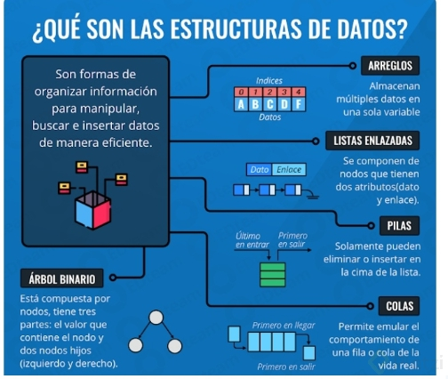
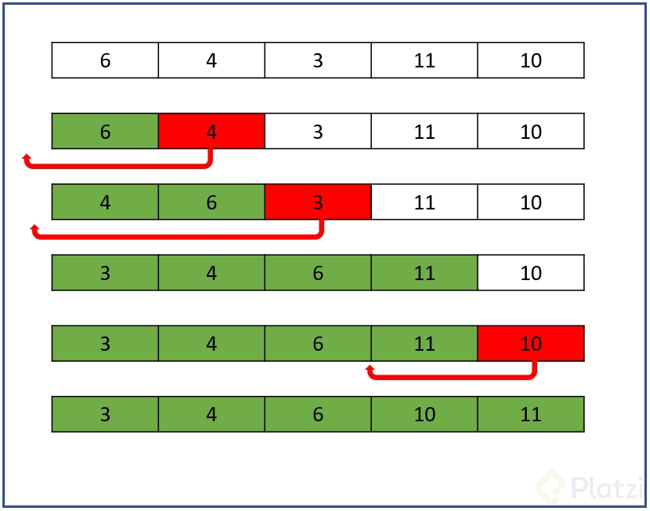
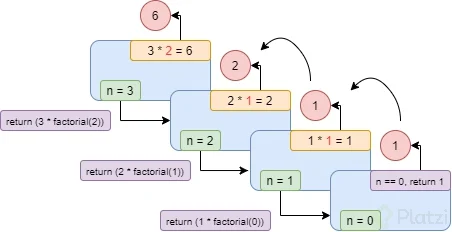

# Curso Práctico de Estructuras de Datos y Algoritmos

## Objetivos del curso

## Tabla de contenidos:

### 1. [Introducción a los algoritmos](#1-introducción-a-los-algoritmos)
### 2. [Algoritmos de ordenamiento](#2-algoritmos-de-ordenamiento)
### 3. [Recursividad](#3-recursividad)
### 4. [Divide and conquer and dynamic programming](#4-divide-and-conquer-and-dynamic-programming)
### 5. [Greedy Algorithms](#5-greedy-algorithms)
### 6. [Grafos y árboles](#6-grafos-y-árboles)
### 7. [¿Cómo comparar ALgoritmos?](#7-cómo-comparar-algoritmos)
### 8. [¿Qué sigue?](#8-qué-sigue)

# 1. Introducción a los algoritmos

## 1.1 ¿Qué entiende una computadora?

Las computadoras nacen de la necesidad humana de tener herramientas que le permitan eficientar procesos.
Los algoritmos son series de pasos que transforman variables de entrada (inputs) mediante una serie lógica 
de pasos en variables de salida (outputs).

La información digital es almacenada a través de código binario (0s y 1s) esto debido a que los procesadores de las computadoras
están compuestos principalmente de transistores, elementos electrónicos que permiten el flujo de la corriente, dejando pasar
o bloqueando el paso del mismo. A este dato binario (0/1) se le conoce en informática como Bit y es la unidad mínima de información
que puede ser manejada. El diferente acomodo de los transistores le permite a la computadora una amplia gama de habilidades, desde
el almacenaje de información hasta operaciones aritméticas. 

El sistema binario solo puede tener 2 posibles números para cada posición posible. Cada posición representa la potencia en 2 de es posición.
De tal modo que la posición 0 podría llegar a almacenar hasta 2**1 = 2 mientras que la posición 2 podría tener un valor de almacentamiento de 2**2 = 4.
El número en decimal sería entonces 2**n - 1


Ejemplo de conversión de un número binario a uno decimal:


Mientras que el proceso de conversión de decimal a binario se basa en hacer divisiones entre 2
y anotar el módulo de la división ` (si la división es perfecta entonces su residuo es 0 de otro modo es 1) 

**¿Cómo se almacenan los textos en una computadora?**

Cada letra es almacenada numéricamente mediante un código llamado ASCII de tal forma que por ejemplo la letra: t tiene asociado
el valor 84, a su vez este valor es convertido a binario y esa es la representación binaria de la letra t.
Un documento es la concatenación de varias letras, y ya sabemos que cada letra es a su vez un número en binario.

Las imágenes a su vez son matrices bidimensionales donde cada celda contiene la información númerica de los componentes de color de cada pixel.
Para ello se ocupan los colores primarios Red Green Blue RGB y cada uno de ellos puede obtener un valor entre 0 y 255. La 
mezcla de estos colores forma el color único de cada pixel dentro de una imagen. 


## 1.2 Lenguajes de programación

Un lenguaje de programación es una forma de comunicarnos con una computadora, tablet o celular e indicarle qué queremos hacer.
Un lenguaje de programación es un lenguaje formal (o artificial, es decir, un lenguaje con reglas gramaticales bien definidas) que le proporciona a una persona, en este caso el programador, la capacidad de escribir (o programar) una serie de instrucciones o secuencias de órdenes en forma de algoritmos con el fin de controlar el comportamiento físico o lógico de un sistema informático,


El lenguaje máquina es directamente el que entiende una computadora y es directamente comunicado a través del sistema binario.

El lenjuage ensamblador consiste de un set de instrucciones que nos daba el fabricante del circuito integrado. Cada instrucción tenía una forma
de ser leía por el hardware del chip. El lenguaje ensamblador es sumamente eficiente, puesto que es un puente directo al CPU, pero no es muy
eficiente de leer e interpretar por humanos. 


Existen distintos tipos de lenguaje: principalmente de bajo nivel y de alto nivel. La diferencia se encuentra en lo cerca o lejos que estemos del hardware de nuestro equipo. Esta cercanía tiene que ver con el control que tengamos sobre el dispositivo, placa o controlador.

Encontramos diferentes lenguajes como C, C++, Java, PHP, Python, C#, ASP, entre otros.

## 1.3 Estructuras de datos

Cuando estamos resolviendo problemas a través de código será necesario en la mayoría de las ocasiones tener sistemas que nos permitan almacenar información. 
A esta forma ordenada, estructurada y eficiente de almacenar los datos es conocida como: estructura de datos. Generalmente, los lenguajes de programación
ya cuentan con varias estructuras de datos por defecto, entre las cuales podemos encontrar:

- Array
- Listas
- Listas enlazadas
- Árboles
- Grafos

Las estructuras de datos están divididas principalmente en dos grupos: `Lineales y no lineales`.

Lineales en dónde la información será guardará secuencialmente. No lineales como por ejemplo árboles, dónde se tiene un tronco principla y ramificaciones
que van surgiendo de este tronco, también podemos mencionar a los grafos que son puntos de información dispersos e interconectados entre sí.

A continuación mostraré varias estructuras de datos ejemplificados para solucionar esto:


Yo Quiero llegar de mi casa a la escuela en la ruta más corta

Esto es una matriz de datos. La cual a su vez contiene lista de datos.


[
[1,0 CAFE], [1,1 COMD], [2,1 ESCL], 

[0,0 CASA], [1,0 NULL], [2,0 NULL], 

]

Esto es una **matriz de datos**
La cual a su vez contiene lista de datos

[

	[casa, cafe],
	
	[cafe,casa],
	
	[casa, comida],
	
	[comida,escuela],
	
	[casa,comida],
	
	[cafe,comida]

]

Esto es una
lista con índices

{

	casa:[0,0],
	
	cafe:[1,0],
	
	comd:[1,1],
	
	escl:[2,1]

}

**Mezcla de estructuras**

[

	ruta_1 [

		[casa, cafe],

		[cafe, comd],

		[comd, escl]

	],
	ruta_2 [
		[casa,comd],

		[comd,escl]
	]
]

## 1.4 Qué es un algoritmo?

Diferentes definiciones de Algoritmo

- **Algoritmo:** Conjunto ordenado de operaciones sistemáticas que permite hacer un cálculo y hallar la solución de un tipo de problema.
- **Algoritmo:** Se denomina algoritmo a un grupo finito de operaciones organizadas de manera lógica y ordenada que permite solucionar un determinado problema.
- **Algoritmo:** una serie de instrucciones o reglas establecidas que, por medio de una sucesión de pasos, permiten arribar a un resultado o solución.
- **Algoritmo:** una secuencia de instrucciones que representan un modelo de solución para determinado tipo de problemas. O bien como un conjunto de instrucciones que realizadas en orden conducen a obtener la solución de un problema.

### ¿Cómo se Diseña un Algoritmo?
En programación, un algoritmo establece, de manera genérica e informal, la secuencia de pasos o acciones que resuelve un determinado problema y, para representarlo, se utiliza, fundamentalmente, dos tipos de notación: pseudocódigo y diagramas de flujo.

### Partes de un Algoritmo
Todo algoritmo debe obedecer a la estructura básica de un sistema, es decir: entrada, proceso y salida.

### Características de los Algoritmos:
Las características fundamentales que debe cumplir todo algoritmo son:

1. Un algoritmo debe ser preciso e indicar el orden de realización de cada paso.

2. Un algoritmo debe estar definido. Si se sigue un algoritmo dos veces, se debe obtener el mismo resultado cada vez.

3. Un algoritmo debe ser finito. El algoritmo se debe terminar en algún momento; o sea, debe tener un número finito de pasos.

4. Un algoritmo debe ser legible: El texto que lo describe debe ser claro, tal que permita entenderlo y leerlo fácilmente.


## 1.5 Metodología para la construcción de un algoritmo

Pensar bien es hacerse buenas preguntas.

#### Definición del problema

- ¿Qué problema quiero resolver?
- ¿Qué resultado quiero lograr?
- ¿Qué quiero específicamente? Visualízalo

#### Análisis del problema

- ¿Qué necesito para alcanzar ese resultado?
- ¿Cómo obtengo eso que necesito?

#### Diseño del algoritmo

- Escribe el código paso a paso para alcanzar el resultado
- Verificación o pruebas

  - Conseguí el resultado:

    - ¿Es reutilizable, efectivo este código?
    - ¿Cómo lo puedo mejorar?
  - No conseguí el resultado:
    - Visualiza el paso a paso en tu mente (a veces da pereza lo es, a mí también pero hazlo)

#### Mejora del algoritmo
- ¿Qué me falta?
- ¿Qué hice mal?
- ¿Dónde está el error?
- ¿Qué necesito cambiar?

## 1.6 Variables y tipos de datos

- **Variables:** Nos sirven para almacenar los distintos tipos de datos.

- **Tipos de datos:** Así como en física contamos con las unidades de una magnitud en ciencia de la computación requiere saber qué tipo de variable va a ser trabajada.
En general te puedes encontrar con 2 tipos de datos:
  - **System-defined data types** (tipos de datos definidos por el sistema también conocidos como Primitivos)
  - **User-defined data types** (Tipos de datos definidos por el usuario).


## 1.7 User defined data types

Uso de `User defined data types.` Cuando definimos un tipo de dato por nuestra cuenta, lo hacemos para hacer un mejor 
manejo de tipo de dato dentro de un proyecto, por ejemplo teniendo un proyecto basico tenemos muchos tipos de datos 
primitivos declarados los cuales son, int, float, char, etc. Bueno cuando se trabaja en proyectos grandes es 
un problema tener tantos datos primitivos, ya que seria practicamente una sopa de lo mismo por todos lados, entonces 
aquí es donde aplica el uso este tipo de datos, porque mediante a ellos podemos crear variables para definir el uso 
adecuado de la misma, como por ejemplo una variable para contador de la vida del personaje de un videojuego.

También existen el tipado estático y dinámico, en el estático el tipo de variable se conoce en el tiempo de compilación (compile-time) mientras que en el dinamico, se conoce en el tiempo de ejecuccion del programa(run-time).
Lenguajes de tipado estático: Java, C, C++, FORTRAN, Pascal, Scala
Lenguajes de tipado dinámico:JavaScript, Objective-C, PHP, Python, Ruby, Lisp,Tcl.

En Java, necesitas declarar el tipo de variable que es, antes de poder usarlo

## 1.8 Instalando Ubuntu Bash en Windows

Este curso se está haciendo desde Ubuntu 22, no ha sido necesario instalar ubuntu Bash.

Sin embargo, los pasos serían:

- Ir a actualizaciones y seguridad.
- Opciones de desarrollador
- Habilitar modo desarrollador
- Ir a panel de control
- Ir a programas
- Activar o desactivar características de Windows
- Aquí, busca la opción de “Windows Subsystem for Linux” y actívala, instala eso y permite que tu computadora se reinicie.

Luego, entra al menú inicio, escribe bash y sigue los pasos que te indique, en caso de que te diga que no tienes ninguna
distribución solo ve a la tienda de aplicaciones y descargaba Ubuntu para Windows.


Luego, ejecuta Ubuntu, crea tu usuario y contraseña y estás lista o listo para continuar.


## 1.9 Creando nuestro user defined data type

[código completo de está clase](1_intro/1_user_define_data.py)

**Primer paso:** Definimos nuestro user defined data type utilizando una clase de python.
```python
class Clients:
	def __init__(self, name, client_id, credit, address):
		self.name = name
		self.client_id = client_id
		self.credit = credit
		self.address = address
```
**Segundo paso:** Para validar a nuestro UDDT  crearemos una función que reciba como parámetro de entrada un cliente y 
muestre su información por pantalla.

```python
def mostrar_cliente(cliente):
    print("*"*32)
    print("Nombre: ", cliente.name)
    print("Id: ", cliente.client_id)
    print("Crédito: ", cliente.credit)
    print("Dirección: ", cliente.address)
    print("*" * 32)
```

**Tercer paso:** Creamos nuestro punto de acceso y ejecutamos

```python
if __name__ == '__main__':
    usuario_a = Clients("Gabriel", "0000004", "1000000", "Xalapa, Veracruz")
    mostrar_cliente(cliente=usuario_a)
```
Ejecutar:

```bash
cd 1_intro
python3 1_user_define_data.py
```

Respuesta esperada:

```
********************************
Nombre:  Gabriel
Id:  0000004
Crédito:  1000000
Dirección:  Xalapa, Veracruz
********************************
```

## 1.10 Abstract Data Types básicos: Lists, Stacks, Queues

Muchas veces se confunden los **ADT (Abstract Data Types)** con las Estructuras de Datos.

Los `ADT` van a ser una representación de un set particular de comportamientos. Va a tener la capacidad de almacenar 
datos, pero además va a decirte cuál va a ser el comportamiento de los datos que tengas almacenados en él.

Un `stack (Una pila)` es una lista que implementa una política `LIFO`, Lifo significa `(Last In, First Out)` esto en 
español viene siendo Último en llegar, Primero en Salir. Un ejemplo de un stack puede estar siempre en tu día a día 
en el software, por ejemplo cuando utilizas el tabulador. 

Una estructura de datos va a ser una técnica o estrategia para implementar nuestro ADT.

De los tipos de datos abstractos más usados son: 
- Stack (o Pila que ya lo mencionábamos)
- Queue (Cola, este utiliza otro comportamiento que se llama `First in, First Out` la persona que llega al primero será 
la primera también en salir)
- Priority Queue (Cola de Prioridades, no es más que la misma cola, solo que el orden de entrada pasa a segundo término
y cada uno de los valores dentro del Queue va a tener asignado un peso o un valor que denote una importancia específica,
va a salir primero del Queue el que tenga mayor relevancia o importancia)
- Diccionarios (especie de lista que va a tener un índice)
- Trees (Árboles) 
- Graphs (Grafos).

[más información](https://www.geeksforgeeks.org/abstract-data-types/) 

#### Resumen

**Abstract Data Types (ADT) vs Data Structures (DS)**

- ADT
  - Representa un set particular de comportamientos
  - Es un tipo o clase para objetos cuyo comportamiento está definido por un conjunto de valores y un conjunto de operaciones
  - La definición de ADT solamente menciona que operaciones deben realizarse, pero no como estas operaciones serán implementadas
  - No se específica como los datos serán organizados en memoria y que algoritmos serán usados para implementar las operaciones
  - Por eso es llamado `Abstract`, nos da una vista independiente a la implementación.
  - **Ejemplo:**
    - Un stack es una lista que implementa una politica `Lifo` (last in firs out) en elementos agregados y eliminados.
    - Los valores pueden ser cualquier tipo > int, float, string etc
    - Las operaciones -> Apilar, Desapilar, is_empty
    - ADT comunes:
      - Stack
      - Queue
      - Priority Queue
      - Dict
      - Tree
      - Graphs
- DS
  - Es más concreta
  - Típicamente es una técnica o estrategia para implementar una ADT

  - **Ejemplo:**
    - Podemos usar una lista enlazada para implementar un stack
  - DS comunes:
    - Array
    - Linked List
    - Hash tables
    - Trees
## 1.11 Explicación gráfica Data Types Básicos


## 1.12 Glosario de funciones para Abstract Data Types



## 1.13 Creando tu primera Queue: Arrays

Problema:

Se necesita llevar el orden en el que en un restaurante llegan los clientes para poder atenderlos. El restaurante tiene
un cupo máximo de 5 personas y debe ser atendidos por orden de llegada.

Vamos a utilizar el Queue:

| 1 | 2 | 3 | 4 | 5 |
|---|---|---|---|---|

La función DeQueue tiene como propósito remover y retornar el primer valor en la cola

| º  | 2 | 3 | 4 | 5 |
|----|---|---|---|---|

## 1.14 Creando tu primera Queue: Implementación.

Para crear una `Queue` debemos seguir los siguientes pasos:

1. Crear un pointer para saber que hay en front y rear
2. Colocar estos valores en -1 al inicializar
3. Incrementar en 1 el valor de “rear” cuando agregamos un elemento
4. Retornar el valor de front al quitar un elemento e incrementar en 1 el valor de front a usar dequeue.
5. Antes de agregar un elemento revisar si hay espacios
6. Antes de remover un elemento revisamos que existan elementos
7. Asegurarnos de que al remover todos los elementos resetear nuestro front y rear a -1


## 1.15 Creando tu primera Queue: Implementar la función enQueue

Crearemos una clase `MyQueue` dónde empezaremos creando una lista vacía de n elementos
y qué empiece el apuntador `rear` en -1
```python
class MyQueue:

    def __init__(self, queue_size: int = 5):
        self.queue = [0] * queue_size if queue_size != 0 else list()
        self.queue_size = queue_size
        self.rear = -1
```

Si el apuntador de la cantidad de elementos actual de la queue es igual al tamaño máximo del queue 
entonces la cola está llena, si no entonces procedemos a agregar dicho elemento a la siguiente posición
del queue.

```python
    def en_queue(self, value) -> None:
        if self.rear == self.queue_size - 1:
            print("la cola está llena")
        else:
            self.rear += 1
            self.queue[self.rear] = value
            print(f"Se ha añadido el valor: {value} - current queue: {self.queue}, rear {self.rear}")

```

## 1.16 Creando tu primera Queue: Implementar la función deQueue

Si la queue está en -1 es que está vacía, bien porque se acaba de crear, o porque se han eliminado elementos
hasta ya no tener ninguno. 

De otra forma, eliminamos siempre el primer elemento (puesto que la Queue es `FiFo`) y para conservar el largo
del arreglo añadimos un 0 al final del mismo. 

Finalmente, como hemos eliminado un elemento entonces disminuimos en 1 nuestro `rear`.

```python
    def de_queue(self) -> None:
        if self.rear == -1:
            print("la pila está vacia")
        else:
            print(f"Se ha eliminado el valor: {self.queue[0]}", end="")
            del self.queue[0]
            self.queue += [0]
            print(f" - current queue: {self.queue}, rear {self.rear}")
            self.rear -= 1
```

## 1.17 Creando tu primera: Queue: main code

[código completo](1_intro/2_queue.py)

Probemos nuestro código creando una instancia de nuestra clase `MyQueue` que tenga una capacidad máxima
de 5 elementos.

Probamos nuestros métodos `de_queue` y `en_queue` para eliminar y añadir elementos a la Queue

```python
if __name__ == '__main__':
    # Creando nuestro UDD 
    queue = MyQueue(5)
    # Probando el queue
    queue.de_queue()
    queue.en_queue(1)
    queue.en_queue(2)
    queue.de_queue()
    queue.de_queue()
    queue.de_queue()
    queue.en_queue(6)
    queue.en_queue(7)
    queue.en_queue(8)
    queue.en_queue(9)
    queue.de_queue()
    queue.de_queue()
    queue.de_queue()
    queue.en_queue(1)
    queue.en_queue(2)
```

Respuesta esperada:

``` commandline
la pila está vacia
Se ha añadido el valor: 1 - current queue: [1, 0, 0, 0, 0], rear 0
Se ha añadido el valor: 2 - current queue: [1, 2, 0, 0, 0], rear 1
Se ha eliminado el valor: 1 - current queue: [2, 0, 0, 0, 0], rear 1
Se ha eliminado el valor: 2 - current queue: [0, 0, 0, 0, 0], rear 0
la pila está vacia
Se ha añadido el valor: 6 - current queue: [6, 0, 0, 0, 0], rear 0
Se ha añadido el valor: 7 - current queue: [6, 7, 0, 0, 0], rear 1
Se ha añadido el valor: 8 - current queue: [6, 7, 8, 0, 0], rear 2
Se ha añadido el valor: 9 - current queue: [6, 7, 8, 9, 0], rear 3
Se ha eliminado el valor: 6 - current queue: [7, 8, 9, 0, 0], rear 3
Se ha eliminado el valor: 7 - current queue: [8, 9, 0, 0, 0], rear 2
Se ha eliminado el valor: 8 - current queue: [9, 0, 0, 0, 0], rear 1
Se ha añadido el valor: 1 - current queue: [9, 1, 0, 0, 0], rear 1
Se ha añadido el valor: 2 - current queue: [9, 1, 2, 0, 0], rear 2
```

# 2. Algoritmos de ordenamiento

## 2.1 Algoritmos de ordenamiento

#### Tipos de algoritmo de ordenamiento:

Estos tipos de algoritmos dan mejores resultados de rendimiento y van a ser mas óptimos.

- Insertion sort
- Bubble sort
- Merge sort
- Quick sort

#### ¿Qué son estructuras de algoritmos de ordenamiento?

El algoritmo de ordenamiento coloca una secuencia en orden, las secuencias pueden ser de objetos, números o letras que 
van a ser colocadas en orden. El resultado del algoritmo de ordenamiento será un array o arreglo ordenado, y este orden 
debe ser específicamente definido, yo le puedo dar el orden, puede ir de mayor a menor, de A a Z, de Z a A, además el 
algoritmo de ordenamiento nos da una serie de pasos a seguir para que el orden que queremos implementar se cumpla.

**Ejemplos:**

- **[a,b,c,d,e]** Ordenado de la A a la Z

- **[1,2,3,4,5,6]** Ordenado de menor a mayor

Algoritmos de ordenamiento más utilizados:

#### Merge sort
**Principio: divide y vencerás**

Este algoritmo separa en partes y va resolviendo problemas pequeños e individuales y lo ordenas y por último te aseguras que allá quedado bien.
Va separando y ordenando individualmente de mayor a menor.
Se recomienda no usarlo en caso de tener pocos datos, pero si tienes demasiados datos, se va a volver más eficiente.


#### Insertion sort

Este algoritmo compara valores y los va colocando, comparas los valores y el valor más pequeño lo coloca al lado izquierdo para poder tener un orden de menor a mayor.
Es ul algoritmo muy fácil de implementar, su único inconveniente sería la velocidad de ejecución de la tarea.


#### Bubble sort

Este algoritmo es básico, se encarga de ordenar por pares y después va a ir repitiéndose varias veces hasta que quede perfectamente ordenado.


#### Quick sort

Este algoritmo va a dividir en problema en dos, y asi mismo va a ir ordenando cada parte del problema, hasta tenerlo resuelto completamente.
Es un algoritmo bastante bueno y más eficiente que los demás


S y N, son datos que vamos a ir viendo a menudo
S = secuencia de objetos ordenables (Números a ordenar)
N = es el número de elementos en S (Nuestra secuencia de elementos a ordenar)


## 2.2 Bubble sort

Bubble sort, Es un algoritmo de ordenamiento rapido de implementar pero ineficiente para cantidad de datos grandes. 
Se ordena por pares y se va repitiendo de 1 a 1 hasta que queda totalmente ordenado, es muy iterativo y muy poco 
eficiente (por la cantidad de iteraciones)

El ordenamiento de burbuja (Bubble Sort en inglés) es un sencillo algoritmo de ordenamiento. Funciona revisando cada 
elemento de la lista que va a ser ordenada con el siguiente, intercambiándolos de posición si están en el orden 
equivocado. Es necesario comprobar varias veces toda la lista hasta que no se necesiten más intercambios, lo cual 
significa que la lista está ordenada. Este algoritmo obtiene su nombre de la forma con la que suben por la lista los 
elementos durante los intercambios, como si fueran pequeñas «burbujas». También es conocido como el método del 
intercambio directo. Dado que solo usa comparaciones para operar elementos, se lo considera un algoritmo de comparación,
siendo uno de los más sencillos de implementar.

## 2.3 Bubble sort implementación

```python
def bubble_sort(array):
    iteration = 1
    n = len(array)
    for i in range(n-1):
        is_ordered = True
        for j in range(n-1):
            left, right = array[j], array[j+1]
            if right < left:
                array[j], array[j + 1] = array[j + 1], array[j]
                is_ordered = False
            iteration += 1
            print(iteration, array)
        if is_ordered:
            break
    return array
```

## 2.4 Bubble sort: main code

[código completo](2_sorting/1_bubble_sort.py)

```python
from random import sample, seed
if __name__ == '__main__':
    seed(1)
    simple_array = sample(range(1, 11), 5)
    print(simple_array)
    simple_array = bubble_sort(simple_array)
    print(simple_array)
```

respuesta esperada:

```commandline
original: [3, 2, 5, 1, 4]
************************
2 [2, 3, 5, 1, 4]
3 [2, 3, 5, 1, 4]
4 [2, 3, 1, 5, 4]
5 [2, 3, 1, 4, 5]
6 [2, 3, 1, 4, 5]
7 [2, 1, 3, 4, 5]
8 [2, 1, 3, 4, 5]
9 [2, 1, 3, 4, 5]
10 [1, 2, 3, 4, 5]
11 [1, 2, 3, 4, 5]
12 [1, 2, 3, 4, 5]
13 [1, 2, 3, 4, 5]
14 [1, 2, 3, 4, 5]
15 [1, 2, 3, 4, 5]
16 [1, 2, 3, 4, 5]
17 [1, 2, 3, 4, 5]
************************
ordered: [1, 2, 3, 4, 5]

Process finished with exit code 0

```

## 2.5 Insertion sort

El ordenamiento por inserción (insertion sort en inglés) es una manera muy natural de ordenar para un ser humano, y 
puede usarse fácilmente para ordenar un mazo de cartas numeradas en forma arbitraria. Requiere O(n^2) operaciones para 
ordenar una lista de n elementos.

Inicialmente, se tiene un solo elemento, que obviamente es un conjunto ordenado. Después, cuando hay K elementos 
ordenados de menor a mayor, se toma el elemento {k+1} y se compara con todos los elementos ya ordenados, 
deteniéndose cuando se encuentra un elemento menor (todos los elementos mayores han sido desplazados una posición a la 
derecha) o cuando ya no se encuentran elementos (todos los elementos fueron desplazados y este es el más pequeño). En 
este punto se inserta el elemento {k+1} debiendo desplazarse los demás elementos.



## 2.6 Desafío: Implementa un algoritmo de ordenamiento

[Quick sort python](2_sorting/2_quick.py)

Este código lo explicaré a mayor profundidad en [implementando quick sort](#45-implementando-quicksort-con-python)

```python
def quick_sort(lista):
    izquierda = []
    centro = []
    derecha = []
    if len(lista) > 1:
        pivote = lista[0]
        for i in lista:
            if i < pivote:
                izquierda.append(i)
            elif i == pivote:
                centro.append(i)
            elif i > pivote:
                derecha.append(i)
        print("L", izquierda, "C", centro, "R", derecha)
        return quick_sort(izquierda) + centro + quick_sort(derecha)
    else:
        return lista
```

```python
from random import sample, seed
if __name__ == '__main__':
    seed(1)
    simple_array = sample(range(1, 11), 9)
    print("original:", simple_array)
    print("*"*24)
    simple_array = quick_sort(simple_array)
    print("*" * 24)
    print("ordered:", simple_array)
```

Respuesta esperada:

```commandline
original: [3, 2, 5, 1, 4, 6, 8, 10, 9]
************************
L [2, 1] C [3] R [5, 4, 6, 8, 10, 9]
L [1] C [2] R []
L [4] C [5] R [6, 8, 10, 9]
L [] C [6] R [8, 10, 9]
L [] C [8] R [10, 9]
L [9] C [10] R []
************************
ordered: [1, 2, 3, 4, 5, 6, 8, 9, 10]
```

# 3. Recursividad

## 3.1 Recursividad

La recursividad es la capacidad de una función de llamarse a sí misma.

Las funciones recursivas tienen las siguientes características.

- Se llaman a sí mismas.
- Tienen de argumento un valor que cambio por cada iteración.
- Regresan algún valor definido en cada iteración.
- Tienen una condicional que define el fin del ciclo.
- Manejan un stack que es el orden de las ejecuciones de las iteraciones de la función, empezando por la última a llamar.

La diferencia más importante entre las operaciones recursivas y las iterativas es que los pasos de una operación 
iterativa se realizan uno cada vez y dirigen la ejecución directamente al siguiente paso. En una operación recursiva, 
cada paso después del paso inicial es una réplica del paso anterior.


## 3.2 La función factorial, calculando el factorial recursivamente



El factorial de un entero positivo n, el factorial de n o n factorial se define en principio como el producto de todos 
los números enteros positivos desde 1 (es decir, los números naturales) hasta n. Por ejemplo:

5
!
=
1
×
2
×
3
×
4
×
5
= 120

La operación de factorial aparece en muchas áreas de las matemáticas, particularmente en combinatoria y análisis matemático. 
De manera fundamental el factorial de n representa el número de formas distintas de ordenar n objetos distintos 
(elementos sin repetición). Este hecho ha sido conocido desde hace varios siglos, en el siglo xii por los estudiosos hindúes.

La definición de la función factorial también se puede extender a números no naturales manteniendo sus propiedades 
fundamentales, pero se requieren matemáticas avanzadas, particularmente del análisis matemático. El matemático francés 
Christian Kramp (1760-1826) fue la primera persona en usar la actual notación matemática n!, en 1808.

[código completo de factorial](3_recursividad/1_factorial.py)

```python
def recursive_factorial(n):
    if n == 0:
        return 1
    return n * recursive_factorial(n - 1)

```

## 3.3 Manejo de cadenas de caracteres

En esta clase veremos un ejemplo sencillo de como podemos utilizar la recursividad para voltear el orden de una palabra:

```python
def reversed_string(string):
    if not string:
        return string
    else:
        print(string)
        return reversed_string(string[1:]) + string[0]
```

Código de entrada

```python
if __name__ == '__main__':
    word = "gabriel"
    print("Original word:", word)
    print("*"*24)
    reverse_word = reversed_string(word)
    print("*"*24)
    print("Reversed word:", reverse_word)

```

Valor esperado:

```commandline
Original word: gabriel
************************
gabriel
abriel
briel
riel
iel
el
l
************************
Reversed word: leirbag
```

[código completo](3_recursividad/2_reverse_string.py)

## 3.4 Arte: Generando arte recursivo

```bash
sudo apt-get install python3-tk
```

```python
def draw(my_turtle, length):
    if length:
        my_turtle.forward(length)
        my_turtle.left(123)
        draw(my_turtle, length - 2)
```

```python
if __name__ == "__main__":
    pencil = turtle.Turtle()
    screen = turtle.Screen()

    colors = (
        '#006699',
        '#006666',
        '#660066',
        '#990000',
        '#ad3270',
        '#e65100',
        '#1a237e',
        '#827717',
        '#006064',
        '#f57f17',
        '#d50000',
        '#4a148c',
    )

    for color in colors:
        pencil.pencolor(color)
        draw(pencil, 100)

    screen.exitonclick()
```

Valor esperado:


[código completo](3_recursividad/3_turtle.py)


# 4. Divide and conquer and dynamic programming

## 4.1 Divide and conquer 

Divide y vencerás es un paradigma de algoritmos. Un programa típico de Divide y Vencerás resuelve un problema usando los 
siguientes tres pasos:

- Dividir: Rompe el problema en sub-problemas del mismo tipo.
- Conquistar: Resuelve recursivamente los sub-problemas.
- Combinar: Combina apropiadamente las respuestas.

Un ejemplo clásico de Divide y Vencerás es `Merge Sort`. En Merge Sort, dividimos el arreglo de datos en dos mitades, 
ordenamos las dos mitades recursivamente, y luego unir las dos mitades.


## 4.2 ¿Qué es la programación dinámica?

La programación dinámica es una técnica de diseño de algoritmos que busca mejorar la complejidad en tiempo de la solución
de un problema que se pueda plantear desde una filosofía recursiva, empleando la reutilización de las soluciones ya 
obtenidas con una estructura de datos auxiliar, cuyos elementos representan sub-problemas específicos (según cómo se 
determine). Puede ser top-down (desde lo más general hacia abajo, requiere un manejo recursivo empleando “memoization”),
o bien bottom-up (iterativo, partiendo del problema trivial hasta el problema más general)

El procedimiento que se sigue para plantear la solución de programación dinámica a un problema es el siguiente:

> 1. Identificar los problemas triviales del problema, a partir de los cuales se puedan generalizar luego problemas más complejos
> 2. Verificar cuáles problemaas están apenas un nivel más alto que el trivial, e inducir una generalización recursiva (y de optimización, si es el caso) para éstos
> 3. Determinar finalmente la respuesta de los problemas generalizados a partir de la estructura de datos que contiene las soluciones calculadas

En problemas de optimización, la estructura de datos de apoyo almacena las soluciones óptimas a los problemas de decisión 
(de los problemas triviales a los más generales); de este modo, para establecer la solución general hay que basarse en las decisiones de optimización que quedan reflejadas en dicha estructura (recorriendo desde los problemas triviales hasta el más general, tomando nota de los elementos a los que corresponden los valores óptimos, información que es proporcionada por los índices de las casillas a los que corresponden los problemas particulares)

**Ejemplo 1: Factorial**

Primero se identifican los problemas triviales:

> factorial de 0 = 1 
> 
> factorial de 1 = 1

Luego se induce una generalización partiendo de problemas apenas mayores a los triviales:

>  factorial de 2 = 2 * factorial de 1
>
>  factorial de 3 = 3 * factorial de 2
>
>  ...
>
>  factorial de N = N * factorial de N-1

Se define la estructura solución:

>   solucion[i] = factorial de i

El algoritmo queda como:


```
  funcion factorial(N : entero) : entero

  	soluciones <- Nuevo arreglo de enteros tamaño N

  	solucion[0] <- 0		// Solucion trivial

  	solucion[1] <- 1 		// Solucion trivial

  	para i <- 2 hasta N

  		solucion[i] <- i * solucion[i-1]		// Solucion general

  	retorna solucion[N] 	// Solucion final
```

**Ejemplo 2: Elemento de la secuencia de Fibonacci**

Problemas triviales:

>Fibonacci de 0 = 1
>
> Fibonacci de 1 = 1 

Generalización:

>  Fibonacci de 2 = Fibonacci de 1 + Fibonacci de 0
>
>  Fibonacci de 3 = Fibonacci de 2 + Fibonacci de 1
>
>  ...
>
>  Fibonacci de N = Fibonacci de N-1 + Fibonacci de N-2

Se define la estructura solución:

> solucion[i] = Fibonacci de i

Algoritmo:

```
  funcion fibonacci(N : entero) : entero

  	solucion <- Nuevo arreglo de tamaño N

  	solucion[0] <- 1

  	solucion[1] <- 1

  	para i <-2 hasta N

  		solucion[i] <- solucion[i-1] + solucion[i-2]

  	return solucion[N]
```
## 4.3 MergeSort


El método Merge Sort consiste en partir una estructura en mitades, ordenar cada mitad y luego intercalar ordenadamente ambas mitades.
Cada mitad se ordena aplicando el mismo método.
 
- Dividir en “mitades”
  - Ordenar la primera mitad
  - Ordenar la segunda mitad
  - Intercalar las mitades ordenadas

```
si la estructura tiene más de 2 elementos
  Dividir en “mitades”
  Ordenar la primera mitad
  Ordenar la segunda mitad
  Intercalar las mitades ordenadas
 sino:
  si la cantidad de componentes es 2
  Comparar e intercambiar
```


[código completo](4_divide_and_conquer/1_merge.py)

## 4.4 Desafío: Buscar el algoritmo más rápido de sort

No hay clase en este capítulo.

## 4.5 Implementando QuickSort con Python

Este código fue resuelto en: [desafío implementa un algoritmo de ordenamiento](#26-desafío--implementa-un-algoritmo-de-ordenamiento)

Sin embargo, aquí daré una explicación más detallada del algoritmo de [Quick sort](https://es.wikipedia.org/wiki/Quicksort)

El algoritmo trabaja de la siguiente forma:

- Elegir un elemento del conjunto de elementos a ordenar, al que llamaremos pivote.
- Resituar los demás elementos de la lista a cada lado del pivote, de manera que a un lado queden todos los menores que él, y al otro los mayores. Los elementos iguales al pivote pueden ser colocados tanto a su derecha como a su izquierda, dependiendo de la implementación deseada. En este momento, el pivote ocupa exactamente el lugar que le corresponderá en la lista ordenada.
- La lista queda separada en dos sublistas, una formada por los elementos a la izquierda del pivote, y otra por los elementos a su derecha.
- Repetir este proceso de forma recursiva para cada sublista mientras estas contengan más de un elemento. Una vez terminado este proceso todos los elementos estarán ordenados.

Como se puede suponer, la eficiencia del algoritmo depende de la posición en la que termine el pivote elegido.

- En el mejor caso, el pivote termina en el centro de la lista, dividiéndola en dos sublistas de igual tamaño. En este caso, el orden de complejidad del algoritmo es O(n·log n).
- En el peor caso, el pivote termina en un extremo de la lista. El orden de complejidad del algoritmo es entonces de O(n²). El peor caso dependerá de la implementación del algoritmo, aunque habitualmente ocurre en listas que se encuentran ordenadas, o casi ordenadas. Pero principalmente depende del pivote, si por ejemplo el algoritmo implementado toma como pivote siempre el primer elemento del array, y el array que le pasamos está ordenado, siempre va a generar a su izquierda un array vacío, lo que es ineficiente.
- En el caso promedio, el orden es O(n·log n).

- No es extraño, pues, que la mayoría de optimizaciones que se aplican al algoritmo se centren en la elección del pivote.


```python
def quick_sort(lista):
    # Entendamos que el algoritmo de QuickSort se basa en recursivamente ir partiendo la lista en una mitad izquierda,
    # derecha y ordenarlas, haciendo uso de la recursividad, hasta que solo quedan 1 elemento a ser ordenado 
    # Empezamos por definir nuestras 3 listas auxiliares, valores menores al pivote, valores iguales al pivote y valores 
    # mayores al pivote.
    izquierda = []
    centro = []
    derecha = []
    # Si la cantidad de elementos que contiene la lista es > 1 significa que al menos hay 2 y estos pueden ser ordenados como
    # menor, igual o mayor que el elemento pivote y aún puede llamarse a si misma la función quicksort
    if len(lista) > 1:
        # Nuestro valor pivote, será siempre el primer elemento que tenga la lista a ser ordenada (está NO necesariamente
        # es la forma más eficiente de implementar el algoritmo, pero sí es la más simple de programar)
        pivote = lista[0]
        # Para cada elemento de la lista (solo puede haber 3 casos)
        for i in lista:
            # ese elemento es menor al pivote, por ende se añade a los elementos del lado izquierdo
            if i < pivote:
                izquierda.append(i)
            # ese elemento es igual al pivote, por ende se añade a los elementos del centro
            elif i == pivote:
                centro.append(i)
            # ese elemento es mayor al pivote, por ende se añade a los elementos del lado derecho
            elif i > pivote:
                derecha.append(i)
        # De manera auxiliar vamos a imprimir los valores de las 3 listas que conforman nuestra solución
        print("L", izquierda, "C", centro, "R", derecha)
        # Este return SOLO terminará hasta que la condición de escape se cumpla (len(lista) < = 1) mientras no se cumpla
        # Entonces estará ejecutándose hacia adentro de sí misma de forma recursiva.
        return quick_sort(izquierda) + centro + quick_sort(derecha)
    else:
        # Finalmente, cuando la lista solo contiene un elemento, entonces por definición ya se encuentra ordenada y podemos
        # terminar el ciclo recursivo, porque ya no podemos volver a llamar a quicksort en una lista de un solo elemento.
        return lista

```

## 4.6 Implementando QuickSort con Python: main code

[código en python:](2_sorting/2_quick.py)

# 5. Greedy Algorithms

## 5.1 Qué son los greedy algorithm?

## 5.2 Ejercicio de programación greedy

## 5.3 Ejercicio de programación greedy: main code

# 6. Grafos y árboles

## 6.1 Grafos y sus aplicaciones

## 6.2 Árboles

# 7. ¿Cómo comparar Algoritmos?

## 7.1 ¿Cómo comparar algoritmos y ritmo de crecimiento?

# 8. ¿Qué sigue?

## 8.1 Cierre del curso y siguientes pasos

