# Curso de DOCKER

## Tabla de contenidos:

### [1. Introducción](#1-introducción)
### [2. Contenedores](#2-contenedores)
### [3. Datos en Docker](#3-datos-en-docker)
### [4. Imágenes](#4-imágenes)
### [5. Docker como herramienta de desarrollo](#5-docker-como-herramienta-de-desarrollo)
### [6. Docker compose](#6-docker-compose)
### [7. Docker Avanzado](#7-docker-avanzado)


# 1. Introducción

## 1.1 Todo lo que aprenderás sobre Docker

**¿Qué es docker?**

Docker es un programa de código abierto que permite que una aplicación Linux y sus dependencias se empaqueten como un contenedor.

La virtualización basada en contenedores aísla las aplicaciones entre sí en un sistema operativo (OS) compartido. 
Este enfoque estandariza la entrega del programa de la aplicación, permitiendo que las aplicaciones se ejecuten en 
cualquier entorno Linux, ya sea físico o virtual. Dado que comparten el mismo sistema operativo, los contenedores son 
portátiles entre diferentes distribuciones de Linux, y son significativamente más pequeños que las imágenes de máquinas 
virtuales (VM).

**CheatSheet**

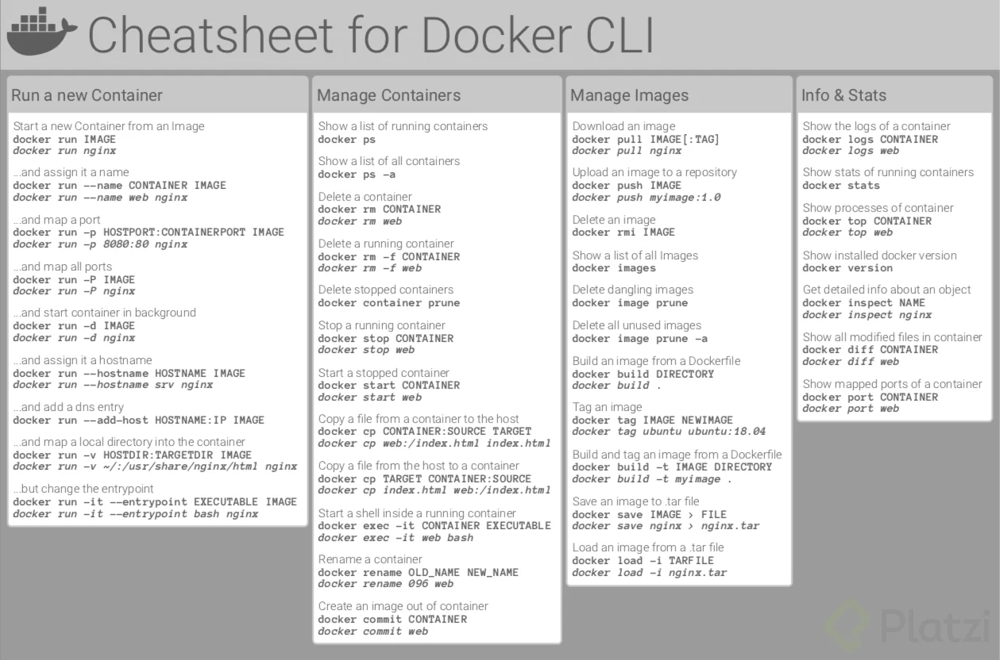


## 1.2 Las treas áreas en el desarrollo de software profesional

> Docker te permite construir, distribuir y ejecutar cualquier aplicación en cualquier lado.

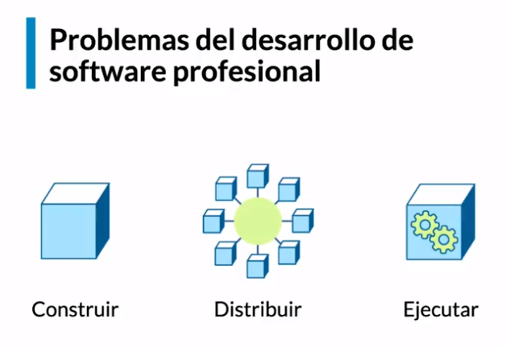

**Problemáticas del desarrollo de software**

1. `Construir` - Escribir código en la máquina del desarrollador. (Compile, que no compile, arreglar el bug, compartir código, etc. )

    - **Problemática:**

      - Entorno de desarrollo (paquetes)
      - Dependencias (Frameworks, bibliotecas)
      - Versiones de entornos de ejecución (runtime, versión Node)
      - Equivalencia de entornos de desarrollo (compartir el código)
      - Equivalencia con entornos productivos (pasar a producción)
      - Servicios externos (integración con otros servicios ejem: base de datos)
2. `Distribuir` - Llevar la aplicación donde se va a desplegar (Transformarse en un artefacto)

   - **Problemática:**

     - Output de build heterogeneous (múltiples compilaciones)
     - Acceso a servidores productivos (No tenemos acceso al servidor)
     - Ejecución nativa vs virtualizada
     - Entornos Serverless
3. `Ejecutar` - Implementar la solución en el ambiente de producción (Subir a producción)
El reto Hacer que funcione como debería funcionar (la máquina donde se ejecuta será diferente a la máquina dónde se diseñó)

   - **Problemática:**

     - Dependencia de aplicación (paquetes, runtime)
     - Compatibilidad con el entorno productivo (sistema operativo poco amigable con la solución)
     - Disponibilidad de servicios externos (Acceso a los servicios externos)
     - Recursos de hardware (Capacidad de ejecución - Menos memoria, procesador más débil)

**¡La respuesta a todos estos problemas es docker!**

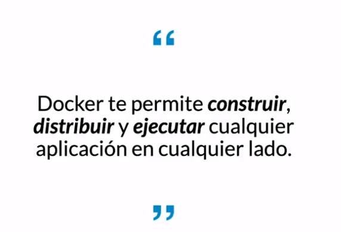

## 1.3 Virtualización

Es la versión virtual de algún recurso tecnológico ya sea hardware, software, el concepto de una máquina ETC.
Permite atacar en simultáneo los tres problemas del desarrollo de software profesional.

**Problemas de las máquinas virtuales:**

- `PESO:` En el orden de los GBs. Repiten archivos en común. Inicio lento.
- `COSTO DE ADMINISTRACION:` Necesita mantenimiento igual que cualquier otra computadora.
- `MULTIPLES DE FORMATO:` VDI, VMDK, VHD, raw, etc (como se empaquetan los vms)
 
Docker ofrece una alternativa de solución a las VMs que evita los problemas anteriormente mencionados, haciendo uso de
`contenedores`.

**Containerization**

A diferencia de la virtualización de una VM las cual es la versión virtual de una máquina, computador o servidor. 
Un contenedor solamente virtualiza lo estrictamente necesario para que el código sea ejecutado.

El concepto de contenedores nace de un problema de la industria del transporte de mercancía marítima, en el cual anteriormente 
era muy difícil transportar mercancía por lo cual se crearon containers los cuales facilitaron el transporte de los 
artículos de una manera más segura que los métodos empleados en esa época. Al usar containers su principal uso es la construcción y despliegue del software.

> La containerization es el empleo de contenedores para construir y desplegar software.

**Ventajas de los contenedores:**
- `flexibles:` cualquier aplicación que quieras meter en un contenedor se puede meter en un contenedor.
- `livianos:` reutilizar kernel para ejecutar el código sin necesidad de tener un sistema operativo completo.
- `portables:` se pueden ejecutar en cualquier máquina, tranquilo están diseñados para eso.
- `bajo acoplamiento:` tiene todo lo necesario para correr el código que está dentro de sí mismo sin necesidad de afectar a otros contenedores.
- `escalables:` se pueden crear varios contenedores sin el temor de que esto afecte el rendimiento o funcionamiento de los mismos.
- `seguros:` solo puede acceder a lo necesario para ejecutar el código. Un contenedor no puede acceder a otro contenedor, ni al sistema operativo que lo ejecuta.


**Virtualization vs Containerization**

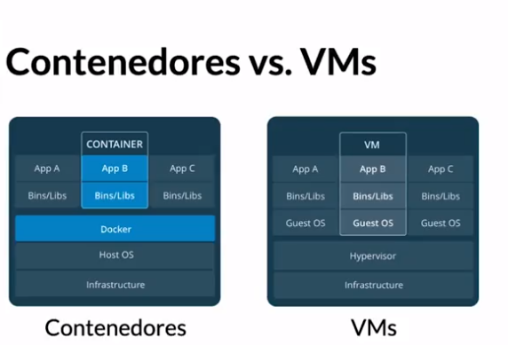

`Virtualization:` A diferencia de un contenedor, las máquinas virtuales ejecutan un sistema operativo completo, incluido su propio kernel.
`Containerization:` Un contenedor es un silo aislado y ligero para ejecutar una aplicación en el sistema operativo host. 

Los contenedores se basan en el kernel del sistema operativo host (que puede considerarse la fontanería del sistema operativo), 
y solo puede contener aplicaciones y algunas API ligeras del sistema operativo y servicios que se ejecutan en modo de usuario.


## 1.4 Preparando tu entorno de trabajo

[Instalación paso a paso](https://docs.docker.com/engine/install/ubuntu/#install-using-the-repository)

### Set up the repository

Update the apt package index and install packages to allow apt to use a repository over HTTPS:

```
sudo apt-get update
sudo apt-get install \
    ca-certificates \
    curl \
    gnupg \
    lsb-release
```
Add Docker’s official GPG key:
```
sudo mkdir -p /etc/apt/keyrings
curl -fsSL https://download.docker.com/linux/ubuntu/gpg | sudo gpg --dearmor -o /etc/apt/keyrings/docker.gpg
```
Use the following command to set up the repository:
```
echo \
  "deb [arch=$(dpkg --print-architecture) signed-by=/etc/apt/keyrings/docker.gpg] https://download.docker.com/linux/ubuntu \
  $(lsb_release -cs) stable" | sudo tee /etc/apt/sources.list.d/docker.list > /dev/null
```
### Install Docker Engine
```
sudo apt-get update
```
Receiving a GPG error when running apt-get update?
```
sudo chmod a+r /etc/apt/keyrings/docker.gpg
sudo apt-get update
```
Install Docker Engine, containerd, and Docker Compose.
```
sudo apt-get install docker-ce docker-ce-cli containerd.io docker-compose-plugin
```
Verify that the Docker Engine installation is successful by running the hello-world image:
```
sudo docker run hello-world
```
Expected Answer:

```
Unable to find image 'hello-world:latest' locally
latest: Pulling from library/hello-world
2db29710123e: Pull complete 
Digest: sha256:94ebc7edf3401f299cd3376a1669bc0a49aef92d6d2669005f9bc5ef028dc333
Status: Downloaded newer image for hello-world:latest

Hello from Docker!
This message shows that your installation appears to be working correctly.

To generate this message, Docker took the following steps:
 1. The Docker client contacted the Docker daemon.
 2. The Docker daemon pulled the "hello-world" image from the Docker Hub.
    (amd64)
 3. The Docker daemon created a new container from that image which runs the
    executable that produces the output you are currently reading.
 4. The Docker daemon streamed that output to the Docker client, which sent it
    to your terminal.

To try something more ambitious, you can run an Ubuntu container with:
 $ docker run -it ubuntu bash

Share images, automate workflows, and more with a free Docker ID:
 https://hub.docker.com/

For more examples and ideas, visit:
 https://docs.docker.com/get-started/

```

## 1.5 Play with Docker

[Play with docker](https://labs.play-with-docker.com/#)

Play with docker es una página web que te permite tener acceso a una máquina virtual que contiene docker instalado

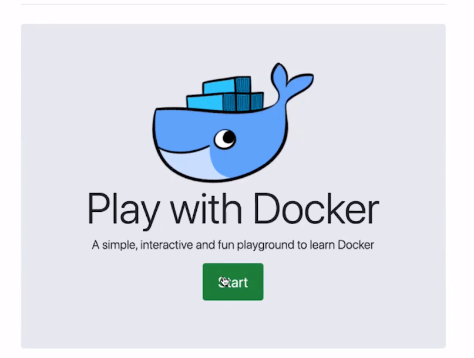

Para empezar a usar docker es tán simple como crear una nueva instancia de docker dentro de la máquina virtual.

Cabe resaltar que todo lo que hagamos en play with docker tiene un tiempo máximo de duración de 4 horas, después de ese tiempo
todas las sesiones e instancias de docker serán eliminadas.

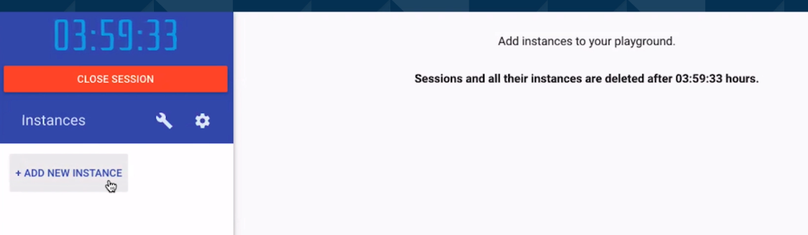

Una vez que creamos una nueva instancia, nos otorgan una máquina virtual con 4 GiB de memoria RAM y una terminal de linux con 
varios de los programas más útiles para desarrollar, como por ejemplo Git y obviamente una versión de Docker que podemos
comprobar con el comando 
> docker --version
> 

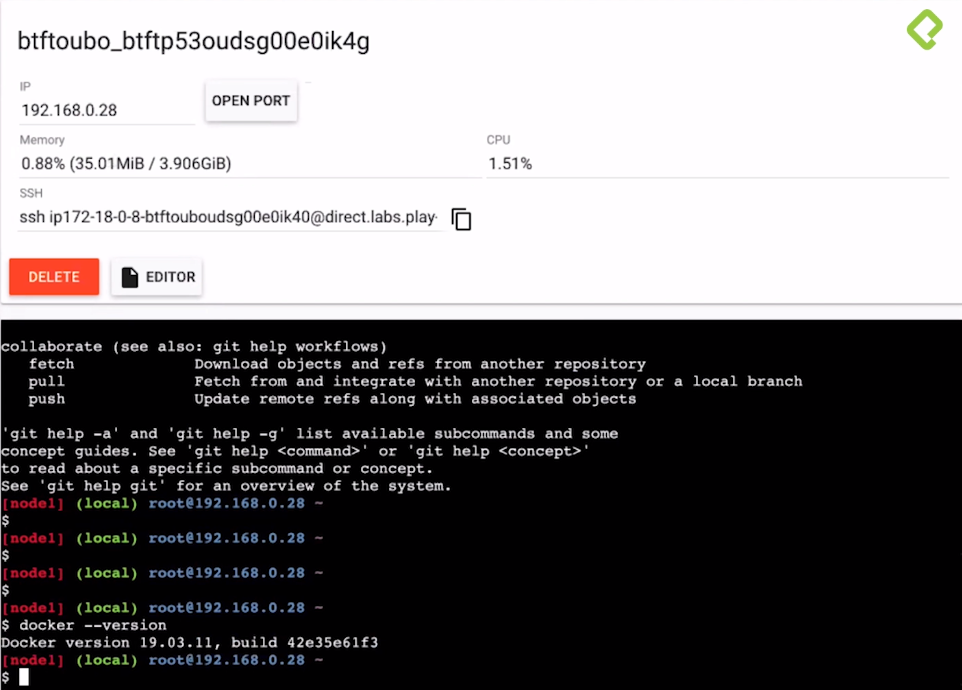

## 1.6 Qué es y cómo funciona Docker

Docker es una plataforma que permite construir, ejecutar y compartir aplicaciones mediante contenedores.


**Componentes DENTRO del círculo de Docker:**

- `Docker daemon:` Es el centro de docker, el corazón que gracias a él, podemos comunicarnos con los servicios de docker.
- `REST API:` Como cualquier otra API, es la que nos permite visualizar docker de forma “gráfica”.
- `Cliente de docker:` Gracias a este componente, podemos comunicarnos con el corazón de docker (Docker Daemon) que por defecto es la línea de comandos.

**Dentro de la arquitectura de Docker encontramos:**

- `Contenedores:` Es la razón de ser de Docker, es donde podemos encapsular nuestras imágenes para llevarlas a otra computadora, o servidor, etc.
- `Imágenes:` Son las encapsulaciones de x contenedor. Podemos correr nuestra aplicación en Java por medio de una imagen, podemos utilizar Ubuntu para correr nuestro proyecto, etc.
- `Volúmenes de datos:` Podemos acceder con seguridad al sistema de archivos de nuestra máquina.
- `Redes:` Son las que permiten la comunicación entre contenedores.

La arquitectura Docker es una arquitectura cliente-servidor, dónde el cliente habla con el servidor (que es un proceso daemon)
mediante un API para poder gestionar el ciclo de vida de los contenedores y así poder construir, ejecutar y distribuir los contenedores.

El hecho de que el cliente se comunique con el servidor mediante el API hace que el cliente y servidor puedan estar en 
la misma máquina comunicándose mediante sockets de UNIX o bien en máquinas diferentes comunicándose mediante un end-point en la red.

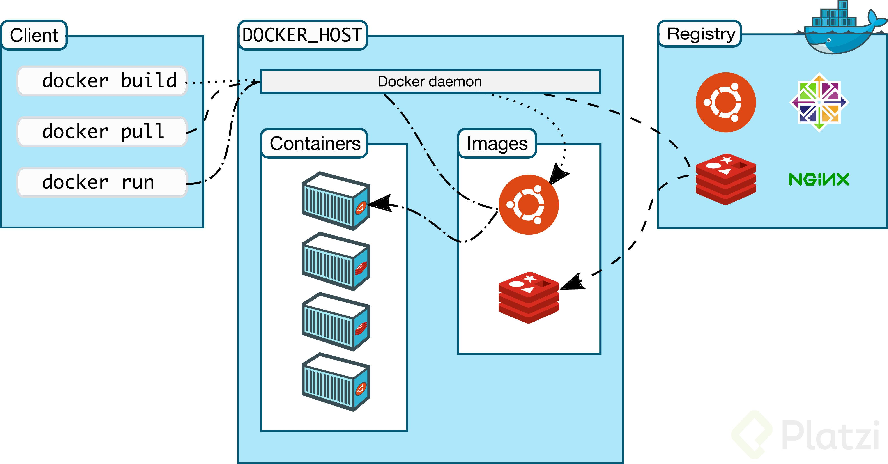

Docker está escrito en GO, aunque también se aprovecha de muchas de las capacidades del kernel Linux, como namespaces, cgroups, y el sistema de ficheros UnionFS.

Dentro de los elementos de la Arquitectura Docker encontramos dos, por un lado, el elemento principal de la arquitectura Docker que es el Docker Engine y por otro el Registro Docker.

**Docker Engine**

El Docker Engine es la aplicación cliente-servidor que implementa Docker. Esta aplicación tiene tres componentes:

1. `Servidor:` es el proceso principal de Docker y que funciona como proceso demonio del sistema. Es el encargado de gestionar los objetos que hay en Docker como imágenes, contenedores, redes y volúmenes. Se representa mediante el comando dockerd.
2. `API Rest:` es un API Rest que nos permite acceder a las capacidades del servidor y ejecutar comandos sobre él. Podemos utilizar un simple curl para acceder a las capacidades del API de Docker
3. `Cliente`: es la línea de comandos representada por el comando docker. El cliente habla vía el API Rest para poder ejecutar los comandos. Es lo que utilizaremos para poder ir gestionando el ciclo de vida de nuestras imágenes y contenedores.

**Registros Docker**

Los registros Docker (Docker Registry) son los que almacenan imágenes Docker. El Docker Hub es un registro público que almacena múltiples imágenes, algunas de ellas certificadas por Docker.

# 2. Contenedores

## 2.1 Primeros pasos: Hola mundo

Intentemos nuestro primer hola mundo utilizando docker

> docker run hello-world

Es probable que nos arroje el siguiente error:

```commandline
ocker: permission denied while trying to connect to the Docker daemon socket at unix. connect: permission denied.
See 'docker run --help'.
```
Para resolver el error debemos correr el comando con permisos de superusuario

> sudo docker run hello-world

La respuesta esperada es entonces:

```
Hello from Docker!
This message shows that your installation appears to be working correctly.

To generate this message, Docker took the following steps:
 1. The Docker client contacted the Docker daemon.
 2. The Docker daemon pulled the "hello-world" image from the Docker Hub.
    (amd64)
 3. The Docker daemon created a new container from that image which runs the
    executable that produces the output you are currently reading.
 4. The Docker daemon streamed that output to the Docker client, which sent it
    to your terminal.

To try something more ambitious, you can run an Ubuntu container with:
 $ docker run -it ubuntu bash

Share images, automate workflows, and more with a free Docker ID:
 https://hub.docker.com/

For more examples and ideas, visit:
 https://docs.docker.com/get-started/

```

## 2.2 Conceptos fundamentales de Docker: contenedores

Docker es un software que nos ayuda en el proceso del desarrollo de software, solucionando problemas en diferentes 
aspectos como lo son la construcción, distribución y ejecución mediante el concepto de contenedores

Un contenedor la unidad logica más importante de docker que permite encapsular las dependencias de un proyecto en un 
entorno aislado, con esto puedes conseguir resolver el problema de “But it works in my machine”, ya que te permite 
crear una especie de máquina virtual y pasársela a tus compañeros o colocarlo en un servidor para el despliegue de 
manera fácil.

`¡Alerta!` Puedes ver a un contendor como una máquina virtual, pero eso no significa que lo sea, una máquina virtual 
puede llegar a ser muy similar debido a sus funcionalidades como el aislamiento de procesos.

Entonces… **¿Cuál es el beneficio de usar contenedores en lugar de máquinas virtuales?**

El mayor beneficio es que los contenedores de Docker están en el nivel de los MB eso nos da ventajas en el consumo de 
recursos, ya que estos corren compartiendo el host del kernel de Linux, por otro lado, las máquinas virtuales son un 
sistema operativo(O.S) con sus propias apps que corre sobre el tuyo usando virtualización y que consume muchos recursos 
en el nivel de los GB. Una mejor forma de ver esto es observando la arquitectura de los contendores y de las máquinas virtuales

> ## Resumen en bullets

- El concepto de contenedor es uno de los más importantes en el mundo de Docker
- El contenedor será el lugar donde se correrán nuestras aplicaciones
- Un contenedor se podría entender como una máquina virtual liviana
  - Una máquina virtual es un programa que corre en una máquina, pero tiene un sistema operativo, propia memoria, interfaces de red, etc. Es decir, que todo lo que tiene una computadora es virtualizado.
- Un contenedor es una agrupación de procesos que corren nativamente en la máquina, pero están aislados del resto del sistema
- Un contenedor es una unidad lógica, no como una máquina virtual, que es una agrupación física aunque virtualizada que tiene abstracciones de memoria, CPU, etc.
- Al ser una agrupación lógica puede correr de manera nativa en la máquina anfitriona
  - Dicha agrupación está limitada a que cosas acceder y ver de la máquina anfitriona
- Lo que corre adentro de un contenedor, realmente cree que está en la máquina virtual, representada por el contenedor.
  - Es decir que no puede ver más allá de lo que permitamos

> **RESUMEN:** A fines prácticos, un contenedor es como una máquina virtual, para el software que deseemos correr. 
> Lo que caracteriza a un contenedor es que se hace sencillo definir los alcances que tendrá cada contenedor, es liviano y corre de manera nativa.

Un contenedor es una instancia ejecutable de una imagen. Puede crear, iniciar, detener, mover o eliminar un contenedor 
mediante la API o la CLI de Docker. Puede conectar un contenedor a una o más redes, adjuntarle almacenamiento o incluso 
generar una nueva imagen basada en su estado actual.

De forma predeterminada, un contenedor está relativamente bien aislado de otros contenedores y de su máquina host. 
Puede controlar qué tan aislados están la red, el almacenamiento u otros subsistemas subyacentes de un contenedor de 
otros contenedores o de la máquina host.

Un contenedor se define por su imagen, así como por las opciones de configuración que le proporcione al crearlo o 
iniciarlo. Cuando se quita un contenedor, cualquier cambio en su estado que no esté almacenado en el almacenamiento 
persistente desaparece.
[Referencia.](https://docs.docker.com/get-started/overview/)

**Características de unos contendores:**

- Los contenedores: son una agrupación de procesos que se encuentran dentro de una entidad lógica.
- Los contenedores están aislados, y tienen recursos limitados.
- Los contenedores ejecutan procesos de forma nativa en linux.
- Los contenedores se pueden ver como máquinas virtuales livianas y aisladas.
- Cada contenedor tiene un ID único, también tiene un nombre


Para limitar los recursos que un contenedor usa, lo podemos hacer desde su creación (cuando corremos el comando docker run) usando flags de:
Runtime constraints on resources

```
docker run --memory="100m" --cpus=0.5 <image>
```

## 2.3 Comprendiendo el estado de Docker

``` bash
# Hola mundo con docker
$ docker run hello-world
# Ver contenedores corriendo
$ docker ps
# Ver todos los contenedores
$ docker ps -a
# Inspecionar la config un contenedor
$ docker inspect <container_id or container_name>
# Crear un contenedor con un nombre personalizado
$ docker run --name <custom_name> <image_name>
# Renombrar un contenedor
$ docker rename --name <old_name> <new_name>
# Eliminar un contenedor
$ docker rm <container_id or container_name>
# Eliminar todos los contenedores apagados
$ docker container prune
# Eliminar TODOS los contenedores
$ docker rm -f $(docker ps -aq)
```

> Solucionando: permission denied while trying to connect to the Docker daemon socket at unix

1. Enter the command below to create the docker group on the system.
    ```bash
    sudo groupadd -f docker
    ```
2. Type the following usermod command to add the active user to the docker group.
    ```bash
    sudo usermod -aG docker $USER
    ```
3. Apply the group changes to the current terminal session by typing:
    ```bash
    newgrp docker
    ```
4. Check if the docker group is in the list of user groups.
    ```bash
    groups
    ```

The group appears in the command output.

```commandline
docker adm cdrom sudo dip plugdev lpadmin lxd sambashare ichcanziho
```

1. Para observar la lista de contenedores que hemos creado:

    ```bash
    docker ps -a
    ```
    Valor esperado:
    ```commandline
    CONTAINER ID   IMAGE         COMMAND    CREATED        STATUS                    PORTS     NAMES
    60fe77cefcf9   hello-world   "/hello"   26 hours ago   Exited (0) 26 hours ago             distracted_thompson
    fb6bd4692734   hello-world   "/hello"   27 hours ago   Exited (0) 27 hours ago             musing_knuth
    ```
    Los contenedores pueden ser identificados por su `CONTAINER ID` El cual es un número de identificación generado
    automáticamente por docker, o por `NAMES` el cual es un alias que se genera automáticamente o puede ser seleccionado por el usuario.

2. Creando un contenedor con un nombre personalizado:

    ```bash
    docker run --name ejemplito hello-world
    docker pes -a
    ```

    Respuesta esperada:
    
    ```bash
    CONTAINER ID   IMAGE         COMMAND    CREATED         STATUS                     PORTS     NAMES
    1e29458b4fa2   hello-world   "/hello"   6 seconds ago   Exited (0) 6 seconds ago             ejemplito
    60fe77cefcf9   hello-world   "/hello"   26 hours ago    Exited (0) 26 hours ago              distracted_thompson
    fb6bd4692734   hello-world   "/hello"   28 hours ago    Exited (0) 28 hours ago              musing_knuth
   ```
   
3. Eliminando un contenedor por su nombre:
    ```bash
    docker run rm ejemplito
    docker pes -a
    ```

    Respuesta esperada:
    
    ```bash
    CONTAINER ID   IMAGE         COMMAND    CREATED         STATUS                     PORTS     NAMES
    60fe77cefcf9   hello-world   "/hello"   26 hours ago    Exited (0) 26 hours ago              distracted_thompson
    fb6bd4692734   hello-world   "/hello"   28 hours ago    Exited (0) 28 hours ago              musing_knuth
   ```

4. Eliminando todos los contenedores inactivos:

    ```bash
    docker container prune
    docker pes -a
    ```

    Respuesta esperada:
    
    ```bash
    CONTAINER ID   IMAGE         COMMAND    CREATED         STATUS                     PORTS     NAMES
   ```

## 2.4 El modo interactivo

En esta clase vamos a ver como utilizar un contenedor que tenga una función en específico, para ello primero vamos a descargar
un contenedor de linux `ubuntu`

```bash
docker run ubuntu
```

Respuesta esperada:

```bash
Unable to find image 'ubuntu:latest' locally
latest: Pulling from library/ubuntu
677076032cca: Pull complete 
Digest: sha256:9a0bdde4188b896a372804be2384015e90e3f84906b750c1a53539b585fbbe7f
Status: Downloaded newer image for ubuntu:latest
```

Como no encontró una descarga del contenedor de ubuntu, lo primero que hizo fue buscar un contenedor de ubuntu y descargarlo.
Sin embargo, más allá de eso no parece haber hecho nada el comando, veamos su estado con un `ps -a`

```bash
docker ps -a
```

Respuesta esperada:

```bash
CONTAINER ID   IMAGE     COMMAND       CREATED         STATUS                     PORTS     NAMES
d48c3671d68d   ubuntu    "/bin/bash"   2 minutes ago   Exited (0) 2 minutes ago             thirsty_merkle
```

Vemos que efectivamente se creó un contenedor llamado `thirsty_merkle` sin embargo su estado es `Exited (0)`, esto se debe a que
una vez que se creó el contenedor de ubuntu, el último comando de su creación fue un `/bin/bash` que refiere al comando de salir de
ubuntu. Pero esto no parece muy práctico, para poder entrar a ubuntu y utilizarlo desde dentro debemos entrar al modo interactivo.

Podemos acceder al modo interactivo desde que creamos el contenedor de la siguiente manera:

```bash
docker run -it --name ubuntito ubuntu
```

Respuesta esperada:

```bash
root@3d75f60733ce:/# 
```

Eureka, estamos dentro de linux ubuntu, así que vamos a comprobarlo de la siguiente manera, comprobando la versión de ubuntu
instalada con docker. Para ello corramos el siguiente comando:

```bash
cat /etc/lsb-release
```

Respuesta esperada:

```commandline
DISTRIB_ID=Ubuntu
DISTRIB_RELEASE=22.04
DISTRIB_CODENAME=jammy
DISTRIB_DESCRIPTION="Ubuntu 22.04.1 LTS"
```


Si abrimos otra terminal, podemos ver el estado actual de nuestros contenedores con nuestro comando de siempre:

```bash
docker ps -a
```

Respuesta esperada:

```commandline
CONTAINER ID   IMAGE     COMMAND       CREATED          STATUS                      PORTS     NAMES
3d75f60733ce   ubuntu    "/bin/bash"   4 minutes ago    Up 4 minutes                          ubuntito
d48c3671d68d   ubuntu    "/bin/bash"   10 minutes ago   Exited (0) 10 minutes ago             thirsty_merkle
```

Vemos como nuestro docker `ubuntito`se encuentra activo y corriendo. 

Para salir de esta versión de ubuntu es tan simple como ejecutar: `exit`

```commandline
root@3d75f60733ce:/# exit
```
Y esto me regresa a mi terminal normal.

## 2.5 Ciclo de vida de un contenedor

Cuando un contenedor se ejecuta lo que en realidad ejecuta es un proceso del sistema operativo. Este proceso determina si 
el contenedor sigue vivo o no en función de si está funcionando o no. Sin embargo, en nuestro último contendor `ubuntito`
su última acción fue `exit` entonces su main process término y por ende el proceso del contenedor termina y sale de la 
ejecución del contenedor. 

Vamos a crear un nuevo contenedor de ubuntu cuyo proceso principal NO SEA `/bin/bash` esto nos va a permitir tener un contenedor
que siempre esté activo mientras su proceso principal se esté ejecutando.

```bash
docker run --name alwaysup -d ubuntu tail -f /dev/null 
docker ps -a
```

Respuesta esperada:

```commandline
CONTAINER ID   IMAGE     COMMAND               CREATED          STATUS                      PORTS     NAMES
f53ace3b3544   ubuntu    "tail -f /dev/null"   5 seconds ago    Up 5 seconds                          alwaysup
3d75f60733ce   ubuntu    "/bin/bash"           28 minutes ago   Exited (0) 10 minutes ago             ubuntito
```
Lo más importante es resaltar que ahora está corriendo `tail -f /dev/null`

Y entonces, ahora que está corriendo un proceso diferente, entonces cómo entro a este contenedor de ubuntu para hacer algo con él?
Vamos a utilizar la función `exec`

```commandline
docker exec -it <container_id> <action_to_exec>
```
En este específico caso queremos entrar a alwaysup a su terminal bash, entonces ejecutamos el siguiente comando:
```bash
docker exec -it alwaysup bash
```
Perfecto ya estamos dónde antes, dentro de bash de ubuntu
```commandline
root@f53ace3b3544:/# 
```

Y si ahora salimos de ubuntu con `exit` y después vemos los procesos podemos observar lo siguiente:

```bash
exit
docker ps -a
```

Respuesta esperada:

```commandline
CONTAINER ID   IMAGE     COMMAND               CREATED          STATUS                      PORTS     NAMES
f53ace3b3544   ubuntu    "tail -f /dev/null"   3 minutes ago    Up 3 minutes                          alwaysup
3d75f60733ce   ubuntu    "/bin/bash"           32 minutes ago   Exited (0) 14 minutes ago             ubuntito
```

Always up sigue corriendo como si nada. Para detener el contenedor, tenemos más de una forma, una de ellas, es detener 
el main process que está ejecutando el contenedor alwaysup, porque nosotros ya sabemos que si se detiene este proceso entonces
el contenedor también se detendrá, para ello encontremos el id del main process de alwaysup:

```bash
docker inspect --format '{{.State.Pid}}' alwaysup
```
En mi caso su id es el siguiente `17948`

Desde `linux` el comando para detener el proceso sería:

```bash
kill 17948
```

Otra forma más genérica de detener el contenedor, sin pensar en el main process es:

```commandline
docker stop <container_id or container_name>
```

```bash
docker stop alwaysup
```

Respuesta esperada:

```commandline
CONTAINER ID   IMAGE     COMMAND               CREATED          STATUS                        PORTS     NAMES
f53ace3b3544   ubuntu    "tail -f /dev/null"   9 minutes ago    Exited (137) 41 seconds ago             alwaysup
3d75f60733ce   ubuntu    "/bin/bash"           38 minutes ago   Exited (0) 19 minutes ago               ubuntito
```

Y a pesar de que always up actualmente se encuentra detenido, como su proceso principal es `tail -f /dev/null`

Puedo volver a utilizarlo, simplemente encendiendo el contenedor con `docker start` y volviendo a ejecutar en modo interactivo

```bash
docker start alwaysup
docker exect -it alwaysup bash
```

## 2.6 Exponiendo contenedores


1. Para exponer un contenedor se debe habilitar un puerto para que escuche las solicitudes que se le hacen al contenedor, nginx para este caso práctico trae un puerto habilitado que es el 80 y tiene un proceso encendido por defecto

2. Luego a ese puerto del contenedor se le debe asociar a un puerto de la máquina hosts

3. Adicionalmente, visualizar los logs de peticiones

Crear un contenedor partiendo de una imagen de nginx Asociar un puerto de un contenedor a una máquina hosts
Ejecución del paso 1 y 2

```commandline
$ sudo docker run -d --name <nombre contenedor> -p <puerto hosts>:<puerto contenedor>    <imagen> 

	-d or --detach : 
		Inicia un contenedor sin asociar el input/output del contenedor al terminal.
	-name: 
		asigna un nombre a nuestra contenedor, localmente

	-p: 
		publish,  asocia el puerto hosts con el puerto del contenedo
```

Ejemplo:

```bash
sudo docker run -d --name proxy -p 8080:80 nginx 
```

Respuesta esperada:

```commandline
Unable to find image 'nginx:latest' locally
latest: Pulling from library/nginx
bb263680fed1: Pull complete 
258f176fd226: Pull complete 
a0bc35e70773: Pull complete 
077b9569ff86: Pull complete 
3082a16f3b61: Pull complete 
7e9b29976cce: Pull complete 
Digest: sha256:6650513efd1d27c1f8a5351cbd33edf85cc7e0d9d0fcb4ffb23d8fa89b601ba8
Status: Downloaded newer image for nginx:latest
e4064d4de0b9f063094e6f6d764549a05e0e0911ea4cc6ad1dcb354913f09122
```

Veamos nuestros contenedores:

```bash
docker ps -a
```

Respuesta esperada:

```commandline
CONTAINER ID   IMAGE     COMMAND                  CREATED          STATUS                        PORTS                                   NAMES
e4064d4de0b9   nginx     "/docker-entrypoint.…"   36 seconds ago   Up 35 seconds                 0.0.0.0:8080->80/tcp, :::8080->80/tcp   proxy
f53ace3b3544   ubuntu    "tail -f /dev/null"      25 minutes ago   Exited (137) 14 minutes ago                                           alwaysup
3d75f60733ce   ubuntu    "/bin/bash"              54 minutes ago   Exited (0) 35 minutes ago                                             ubuntito
```

Lo importante a resaltar es que ahora tenemos un contenedor llamado proxy con un puente de puertos, que usa el puerto de mi
computadora 8080 con el puerto 80 del contenedor.

y si en mi navegador voy a [localhost:8080](localhost:8080)

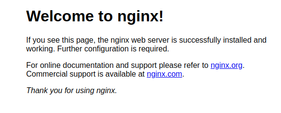

**Visualizar los logs**

Ejecución del paso 3

```commandline
$ sudo  docker logs <nombre contenedor>
$ sudo  docker logs -f  <nombre contenedor>
$ sudo  docker logs --tail 10 -f <nombre contenedor

	-f:
		Follow, conecta input/output de nuestra termianl
	--tail n:
		Muestra las n lineas en la terminal
```

Ejemplo:

```bash
$ sudo docker logs proxy
$ sudo docker logs -f proxy
$ sudo docker logs --tail 10 -f proxy
```

Respuesta esperada:

```commandline
172.17.0.1 - - [19/Feb/2023:04:29:18 +0000] "GET / HTTP/1.1" 200 615 "-" "Mozilla/5.0 (X11; Linux x86_64) 
AppleWebKit/537.36 (KHTML, like Gecko) Chrome/110.0.0.0 Safari/537.36" "-"
2023/02/19 04:29:18 [error] 30#30: *2 open() "/usr/share/nginx/html/favicon.ico" failed (2: No such file or directory), 
client: 172.17.0.1, server: localhost, request: "GET /favicon.ico HTTP/1.1", host: "localhost:8080", referrer: 
"http://localhost:8080/"
172.17.0.1 - - [19/Feb/2023:04:29:18 +0000] "GET /favicon.ico HTTP/1.1" 404 555 "http://localhost:8080/" "Mozilla/5.0 
(X11; Linux x86_64) AppleWebKit/537.36 (KHTML, like Gecko) Chrome/110.0.0.0 Safari/537.36" "-"
```

Si detengo el contenedor proxy

```bash
docker stop proxy
docker ps -a
```

Respuesta esperada:

```commandline
CONTAINER ID   IMAGE     COMMAND                  CREATED             STATUS                        PORTS     NAMES
e4064d4de0b9   nginx     "/docker-entrypoint.…"   6 minutes ago       Exited (0) 37 seconds ago               proxy
f53ace3b3544   ubuntu    "tail -f /dev/null"      31 minutes ago      Exited (137) 20 minutes ago             alwaysup
3d75f60733ce   ubuntu    "/bin/bash"              About an hour ago   Exited (0) 41 minutes ago               ubuntito
```
Puedo observar que Ya no tengo puertos disponibles y si intento ir a [localhost:8080](localhost:8080)
ahora me da un error de que no se puede acceder a este sitio.

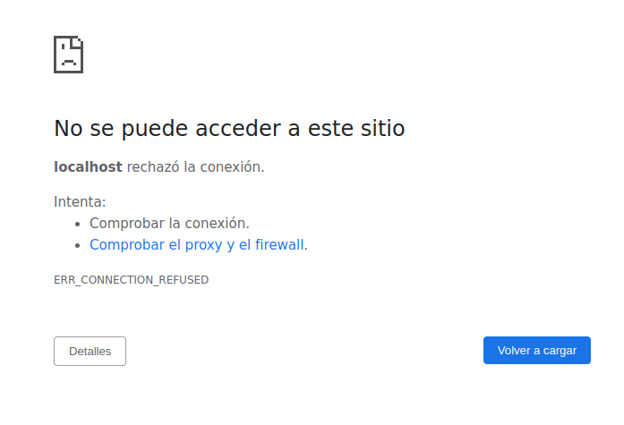

Bastaría con volver a iniciar el contenedor con `docker start proxy` para volver a utilizar nginx.

# 3. Datos en Docker

## 3.1 Bind mounts

Muchas veces necesitamos acceder a datos en nuestros contenedores que se encuentran por fuera de ellos mismos. Sin embargo, 
directamente los contenedores de docker no saben que se encuentran contenidos, y para ellos todo el universo que existe
solo se encuentra dentro de lo que alcanzan a ver (el propio contenedor). En esta clase veremos una forma en la cual podemos
compartir información y datos que existen fuera del contenedor al contenedor. 

Para empezar con el ejemplo creemos un contenedor que contenga una base de datos de Mongo:

```bash
docker run -d --name mongo_db mongo
```

Respuesta esperada:

```commandline
Unable to find image 'mongo:latest' locally
latest: Pulling from library/mongo
10ac4908093d: Pull complete 
685504455d09: Pull complete 
ebd36404f329: Pull complete 
3abd9b25affb: Pull complete 
2d7fde532eae: Pull complete 
24fc70e4c7d7: Pull complete 
ffc2353072f7: Pull complete 
560de8e3a6c7: Pull complete 
0748cd1d792c: Pull complete 
Digest: sha256:2374c2525c598566cc4e62145ba65aecfe1bd3bf090cccce1ca44f3e2b60f861
Status: Downloaded newer image for mongo:latest
798c3fe2cb6f6578ffcb0626984a6eeb8325952ee91e8e21c220a2a026dbd798
```

Obsevemos el estado de nuestros contenedores:

```bash
docker ps -a
```

Respuesta esperada:

```commandline
CONTAINER ID   IMAGE     COMMAND                  CREATED          STATUS                      PORTS       NAMES
798c3fe2cb6f   mongo     "docker-entrypoint.s…"   36 seconds ago   Up 35 seconds               27017/tcp   mongo_db
e4064d4de0b9   nginx     "/docker-entrypoint.…"   18 hours ago     Exited (0) 18 hours ago                 proxy
f53ace3b3544   ubuntu    "tail -f /dev/null"      18 hours ago     Exited (137) 18 hours ago               alwaysup
3d75f60733ce   ubuntu    "/bin/bash"              19 hours ago     Exited (0) 19 hours ago                 ubuntito
```

Excelente ya tenemos un contenedor de mongo llamado `mongo_db`

Entremos al contenedor con el comando `exec` de forma iterativa

```bash
docker exec -it mongo_db bash
```

Ahora supongamos que queremos crear una base de datos llamada `platzi` y crear  un schema llamado `users` donde almacenemos 
el nombre de los usuarios.

Para ello estando dentro del contenedor de `mongo_db`

Ejecutamos el siguiente comando: `mongosh`

```bash
root@798c3fe2cb6f:/# mongosh
```

Respuesta esperada:

```commandline
Current Mongosh Log ID:	63f2a2e7630523f5d94c34be
Connecting to:		mongodb://127.0.0.1:27017/?directConnection=true&serverSelectionTimeoutMS=2000&appName=mongosh+1.6.2
Using MongoDB:		6.0.4
Using Mongosh:		1.6.2

For mongosh info see: https://docs.mongodb.com/mongodb-shell/


To help improve our products, anonymous usage data is collected and sent to MongoDB periodically (https://www.mongodb.com/legal/privacy-policy).
You can opt-out by running the disableTelemetry() command.

------
   The server generated these startup warnings when booting
   2023-02-19T22:24:27.100+00:00: Using the XFS filesystem is strongly recommended with the WiredTiger storage engine. See http://dochub.mongodb.org/core/prodnotes-filesystem
   2023-02-19T22:24:27.303+00:00: Access control is not enabled for the database. Read and write access to data and configuration is unrestricted
   2023-02-19T22:24:27.303+00:00: vm.max_map_count is too low
------

------
   Enable MongoDB's free cloud-based monitoring service, which will then receive and display
   metrics about your deployment (disk utilization, CPU, operation statistics, etc).
   
   The monitoring data will be available on a MongoDB website with a unique URL accessible to you
   and anyone you share the URL with. MongoDB may use this information to make product
   improvements and to suggest MongoDB products and deployment options to you.
   
   To enable free monitoring, run the following command: db.enableFreeMonitoring()
   To permanently disable this reminder, run the following command: db.disableFreeMonitoring()
```

Podemos listar a nuestras bases de datos actuales:

```bash
test> show dbs
```

Respuesta esperada:

```commandline
admin   40.00 KiB
config  12.00 KiB
local   40.00 KiB
```

Y ahora creamos una nueva llamada `platzi`

```bash
test> use platzi
```

Respuesta esperada:

```commandline
switched to db platzi
```

Y ahora en el schema `users`agreguemos el nombre de Gabriel a la columna `nombre`:

```bash
platzi> db.users.insert({"nombre": "Gabriel"}
```

Respuesta esperada:

```commandline
DeprecationWarning: Collection.insert() is deprecated. Use insertOne, insertMany, or bulkWrite.
{
  acknowledged: true,
  insertedIds: { '0': ObjectId("63f2a331babefe10bec0f55c") }
}
```

Y para observar que el dato se encuentra correctamente grabado:

```bash
platzi> db.users.find()
```

Respuesta esperada:

```commandline
[ { _id: ObjectId("63f2a331babefe10bec0f55c"), nombre: 'Gabriel' } ]
```

Sin embargo, si nosotros ahora detuviéramos el contenedor y lo borraremos, si volviéramos a crear un nuevo contenedor mongodb
y quisiéramos crear la dbs `platzi` está sería completamente nueva y nuestros datos de la base anterior no existirían, puesto
que esta es una nueva instancia de mongo db es un contenedor completamente aislado del anterior.

Eliminemos la base `mongo_db`

```bash
docker rm -f mongo_db
```
Ahora lo que vamos a hacer es una carpeta especial que esté espejada y que lo qué existe en esta carpeta también se vea de 
la misma manera dentro de un contenedor.

Primero vamos a crear una carpeta llamada `mongo_db` que usaremos para hacerla espejo más adelante.

```bash
mkdir mongo_db
```

Lo primero que necesito es la ruta completa de dónde se encuentra mi carpeta `mongodata`:

```bash
pwd
```

Respuesta esperada:

```commandline
/home/ichcanziho/Documentos/programacion/cursos_platzi/docker/dockerdata
```

Entonces ahora vamos a crear de nuevo el contenedor de mongo pero con un data bind de la carpeta dockerdata:

```bash
docker run -d --name mongo_db -v /home/ichcanziho/Documentos/programacion/cursos_platzi/docker/dockerdata/mongo_db:/data/db mongo
```

Después del parámetro -v debe ir la ruta completa de la carpeta local : ruta de la carpeta dentro del contenedor.

Entramos al contenedor:

```bash
docker exec -it mongo_db bash
mongosh
use platzi
db.users.insert({"nombre": "Gabriel"})
db.users.find()
exit 
exit
```
Y puedo volver a eliminar el contenedor:
```bash
docker rm -f mongo_db
```

Ahora dentro de dockerdata tengo una carpeta llamada `mongo_db` que tiene toda la información que genero el contenedor anterior.

Si ahora vuelvo a crear el contenedor:

```bash
docker run -d --name mongo_db -v /home/ichcanziho/Documentos/programacion/cursos_platzi/docker/dockerdata/mongo_db:/data/db mongo
docker exec -it mongo_db bash
mongosh
use cursos_platzi
db.users.find()
```

Ahora sí se encontraran mis datos disponibles:

```commandline
[ { _id: ObjectId("63f2a9d2850faa3a35505028"), nombre: 'Gabriel' } ]
```

## 3.2 Volúmenes

Una alternativa bastante eficiente y más segura es usar volúmenes, pues estos los gestiona directamente Docker y solo son visibles
por el administrador y no tienes necesidad de estar enlazando carpetas entre la máquina local y el contenedor docker.

> Nota de seguirada: Ojo que el contenido de los volúmenes “aministrados por Docker” sí se puede acceder desde fuera… Simplemente hay que hacer docker volume inspect VOLUME_NAME, ahí aparecerá el “Mountpoint” del volumen (path en el disco local), y si nos dirigimos allí (con usuario administrador o sudo en sistemas UNIX) podremos ver todo el contenido y gestionarlo.

Los volúmenes son el mecanismo preferido para conservar los datos generados y utilizados por los contenedores de Docker. 
Si bien los montajes de enlace dependen de la estructura del directorio y el sistema operativo de la máquina host, 
Docker administra completamente los volúmenes. Los volúmenes tienen varias ventajas sobre los montajes vinculantes:

**Ventajas**

- Mayor seguridad al compartir archivos entre contenedores, los archivos los maneja directamente docker esto implica que, cualquier persona no puedes acceder a estos archivos.
- Los volúmenes son más fáciles de respaldar o migrar que enlazar montajes.
- Puede administrar volúmenes mediante los comandos de la CLI de Docker o la API de Docker.
- Los volúmenes funcionan tanto en contenedores de Linux como de Windows.
- Los volúmenes se pueden compartir de forma más segura entre varios contenedores.
- Los controladores de volumen le permiten almacenar volúmenes en hosts remotos o proveedores en la nube, para cifrar el contenido de los volúmenes o para agregar otras funciones.
- Los nuevos volúmenes pueden tener su contenido pre cargado por un contenedor.
- Los volúmenes en Docker Desktop tienen un rendimiento mucho mayor que los montajes de enlace de hosts de Mac y Windows.
- Además, los volúmenes suelen ser una mejor opción que los datos persistentes en la capa de escritura de un contenedor, porque un volumen no aumenta el tamaño de los contenedores que lo usan y el contenido del volumen existe fuera del ciclo de vida de un contenedor determinado.

**Desventajas**
- Una de las desventajas es que si se desea visualizar los archivos desde la máquina hosts es mucho más complicado.


### Pasos para conservar datos fuera de los contenedores con volúmenes.

1. Crear el volumen
2. verificar que el volumen fue creado
3. crear un nuevo contenedor basado en una imagen de mongo e indicarle que guardará o usará los datos de un volumen
4. Es opcional, pero se puede inspeccionar el contenedor para visualizar si el volumen quedo configurado.
5. Acceder al bash de nuestro contenedor,
6. Acceder a mongo
7. Crear un base de datos y usarla
8. Realizar una inserción de datos en la base de datos
9. Confirmar la inserción en la base de datos
10. Salir del contenedor
11. borrar contenedor.

### Pasos para crear un nuevo contenedor y usar un volumen anteriormente creado.

1. Crear un nuevo contenedor basado en una imagen de mongo e indicarle que guardará o usará los datos de un volumen anteriormente creado
2. Acceder al bash de nuestro contenedor,
3. Acceder a mongo
4. Usar la bases de datos creadas
5. Confirmar la inserción en la base de datos, que fue realizada anteriormente

### Ejecución de los pasos para conservar datos fuera de los contenedores con usando volúmenes

```bash
$ sudo docker volume create dbdata
$ sudo docker volume ls
$ sudo docker run -d --name db --mount src=dbdata,dst=/data/db mongo
$ sudo docker inspect db
$ sudo docker exec -it db bash
$ mongosh
use platzi

db.users.insert({“nombre”:“guido”})

db.users.find()

$ exit
sudo docker rm -f
```

### Ejecución de los pasos para crear un nuevo contenedor y usar un volumen anteriormente creado.

```bash
$ sudo docker run -d --name db --mount src=dbdata,dst=/data/db mongo
$ sudo docker exec -it db bash
$ mongosh
show dbs
use platzi

db.users.find()
```

### Explicación de los comandos de volumen

```commandline
parámetros

	<nombre c>: 
		nombre del contenedor, así se llamará localmente
<path L>: 
	directorio local
<path C>: 
	directorio del contenedor
< nombre i>:
	nombre de la imagen

flag
--name: 
	asigna un nombre de forma local a nuestro contenedor
-d or --detach: 
	Inicia un contenedor sin asociar el input/output del contenedor al terminal.
    --mount  src =<volume F>,dst=<Carpeta d>:
	Se indica  el  src es igual al volumen fuente, dst es igual a la carpeta destino, es decir a la carpeta del contenedor donde se genera los datos 
```

Ejemplo:

```commandline
$ sudo docker run -d --name db --mount  src =dbdata,dst=/data/db mongo
```

Crear un volumen

```commandline
$ sudo docker volume create <nombre de volumen>
```

```commandline
volume create:
	Crear volumen 
<nombre de volumen>:
	Nombre Volumen
```

Ejemplo:

```commandline
$ sudo docker volume create dbdata
```

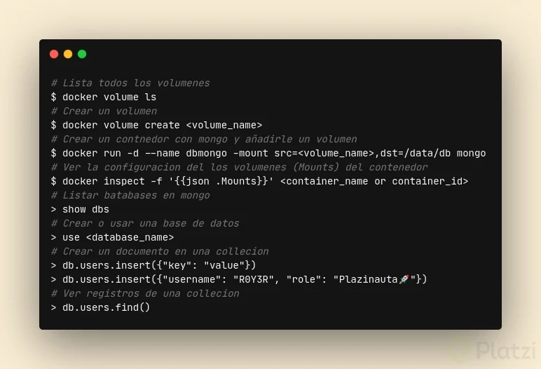


## 3.3 Insertar y extraer archivos de un contenedor

Independientemente de si usamos bind mounts, o volúmenes, muchas veces queremos poder compartir archivos desde nuestra máquina 
anfitriona a nuestro contenedor, esto es lo que veremos en esta clase.

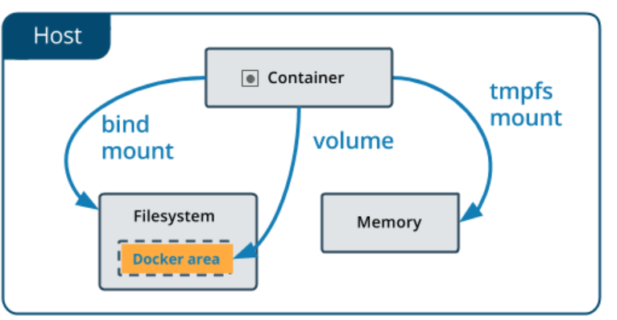

- `Host:` Donde Docker esta instalado.
- `Bind Mount:` Guarda los archivos en la máquina local persistiendo y visualizando estos datos (No seguro).
- `Volume:` Guarda los archivos en el área de Docker donde Docker los administra (Seguro).
- `TMPFS Mount:` Guarda los archivos temporalmente y persiste los datos en la memoria del contenedor, cuando muera sus datos mueren con el contenedor.

Ahora hagamos un ejercicio rápido de transferencia de archivos entre máquina local y contenedor.

1. Creamos un archivo de texto vació:
   ```bash
   touch prueba.txt
   ```
2. Creamos un contenedor de ubuntu que se mantenga corriendo:
    ```bash
   docker run -d --name copytest ubuntu tail -f /dev/null
   docker ps -a
   ```
   Respuesta esperada:
   ```commandline
    CONTAINER ID   IMAGE     COMMAND                  CREATED          STATUS          PORTS       NAMES
    b87515bed57b   ubuntu    "tail -f /dev/null"      13 seconds ago   Up 12 seconds               copytest
    9a21d22678d1   mongo     "docker-entrypoint.s…"   24 minutes ago   Up 24 minutes   27017/tcp   mongodb
    ```
3. Entramos dentro del contenedor de ubuntu:
    ```bash
   docker exec -it copytest bash
   ```
4. Creo una carpeta dentro del directorio principal de ubuntu:
    ```bash
    mkdir testing 
   ll
    ```
   Respuesta esperada:
    ```commandline
    total 60
    drwxr-xr-x   1 root root 4096 Feb 20 17:00 ./
    drwxr-xr-x   1 root root 4096 Feb 20 17:00 ../
    -rwxr-xr-x   1 root root    0 Feb 20 16:57 .dockerenv*
    lrwxrwxrwx   1 root root    7 Jan 26 02:03 bin -> usr/bin/
    drwxr-xr-x   2 root root 4096 Apr 18  2022 boot/
    drwxr-xr-x   5 root root  340 Feb 20 16:57 dev/
    drwxr-xr-x   1 root root 4096 Feb 20 16:57 etc/
    drwxr-xr-x   2 root root 4096 Apr 18  2022 home/
    lrwxrwxrwx   1 root root    7 Jan 26 02:03 lib -> usr/lib/
    lrwxrwxrwx   1 root root    9 Jan 26 02:03 lib32 -> usr/lib32/
    lrwxrwxrwx   1 root root    9 Jan 26 02:03 lib64 -> usr/lib64/
    lrwxrwxrwx   1 root root   10 Jan 26 02:03 libx32 -> usr/libx32/
    drwxr-xr-x   2 root root 4096 Jan 26 02:03 media/
    drwxr-xr-x   2 root root 4096 Jan 26 02:03 mnt/
    drwxr-xr-x   2 root root 4096 Jan 26 02:03 opt/
    dr-xr-xr-x 500 root root    0 Feb 20 16:57 proc/
    drwx------   2 root root 4096 Jan 26 02:06 root/
    drwxr-xr-x   5 root root 4096 Jan 26 02:06 run/
    lrwxrwxrwx   1 root root    8 Jan 26 02:03 sbin -> usr/sbin/
    drwxr-xr-x   2 root root 4096 Jan 26 02:03 srv/
    dr-xr-xr-x  13 root root    0 Feb 20 16:57 sys/
    drwxr-xr-x   2 root root 4096 Feb 20 17:00 testing/
    drwxrwxrwt   2 root root 4096 Jan 26 02:06 tmp/
    drwxr-xr-x  14 root root 4096 Jan 26 02:03 usr/
    drwxr-xr-x  11 root root 4096 Jan 26 02:06 var/
    ```
5. Ahora puedo salir de la máquina de ubuntu para estar en la terminal principal
    ```bash
   exit
    ```

6. Vamos a copiar nuestro archivo `prueba.txt` a la carpeta `testing` del contenedor `copytest`:
    ```commandline
    docker cp <archivo a copiar> <nombre o id del contenedor>:<ruta a donde copiar>/<nuevo nombre del archivo>
    ```
    ```bash
   docker cp prueba.txt copytest:/testing/test.txt 
   ```

7. Verificamos que la copia del archivo fue exitosa:
    ```bash
    docker exec -it copytest bash
   cd testing
   ll
   ```
   Respuesta esperada:
    ```commandline
    total 8
    drwxr-xr-x 2 root root 4096 Feb 20 17:02 ./
    drwxr-xr-x 1 root root 4096 Feb 20 17:02 ../
    -rw-rw-r-- 1 1000 1000    0 Feb 20 16:55 test.txt
    ```
   Salimos del contenedor
    ```bash
   exit
    ```
8. Finalmente, veremos como pasar datos de dentro del contenedor a nuestra máquina local:
    ```commandline
    docker cp <nombre o id del contenedor>:<ruta a carpeta o archivo a copiar> <ruta de destino>
    ```
   Ejemplo:
    ```bash
   docker cp copytest:/testing localtesting
    ```   

9. Verificando que los datos se hayan copiado correctamente a nuestra máquina local:
   ```bash
   ll 
   ```
   Respuesta esperada:
    ```commandline
    drwxrwxr-x  5 ichcanziho ichcanziho  4096 feb 20 11:09 ./
    drwxrwxr-x 10 ichcanziho ichcanziho  4096 feb 16 11:35 ../
    drwxrwxr-x  3 ichcanziho ichcanziho  4096 feb 19 17:05 dockerdata/
    drwxrwxr-x  2 ichcanziho ichcanziho  4096 feb 20 10:51 imgs/
    drwxr-xr-x  2 ichcanziho ichcanziho  4096 feb 20 11:02 localtesting/
    -rw-rw-r--  1 ichcanziho ichcanziho     0 feb 20 10:55 prueba.txt
    -rw-rw-r--  1 ichcanziho ichcanziho 48633 feb 20 11:08 README.MD
    ```
   Verificando archivos copiados:
   ```bash
   cd localtesting
   ll 
   ```
   Respuesta esperada:
    ```commandline
    drwxr-xr-x 2 ichcanziho ichcanziho 4096 feb 20 11:02 ./
    drwxrwxr-x 5 ichcanziho ichcanziho 4096 feb 20 11:09 ../
    -rw-rw-r-- 1 ichcanziho ichcanziho    0 feb 20 10:55 test.txt
    ```

# 4. Imágenes

## 4.1 Conceptos fundamentales de Docker: Imágenes

**¿Qué son las imágenes?**

Son moldes o plantillas que tienen empaquetado todo lo necesario para funcionar. Docker usa estás misma para construir contenedores.

**¿Para qué sirven las imágenes en la construcción de software?**

Las imágenes sirven para crear contenedores y también es como docker intenta solucionar el problema de construcción de y distribución de software.

```bash
docker image ls
```

Listar imágenes locales de docker. Esta instrucción de terminal mostrará las siguientes columnas

- `TAG:` Es la version de la imagen, cuando no especificamos que versión de descargar docker asume que es la última
- `CREATE AT:` tiempo de creación
- `SIZE:` Tamaño de la imagen
- `IMAGE ID:` Este es el identificador de la imagen. Si descargamos dos imágenes que son iguales al realizar un pull, docker lo que hará es tener un puntero lógico a la misma imagen ya descargada y no descargará la otra imagen. Existe la posibilidad que tenga TAG diferentes, pero serán la misma imagen. Esto último se puede comprobar viendo el IMAGE ID, debería ser los mismos.

Respuesta esperada:

```commandline
REPOSITORY    TAG       IMAGE ID       CREATED         SIZE
nginx         latest    3f8a00f137a0   11 days ago     142MB
mongo         latest    a440572ac3c1   2 weeks ago     639MB
ubuntu        latest    58db3edaf2be   3 weeks ago     77.8MB
hello-world   latest    feb5d9fea6a5   17 months ago   13.3kB
```

Para descargar una imagen de docker podemos ir a [docker hub](https://hub.docker.com/) a revisar que imágenes están disponibles.
Vayamos a la imagen de [ubuntu](https://hub.docker.com/_/ubuntu) a la fecha 20 de febrero de 2023, luce de la siguiente manera:

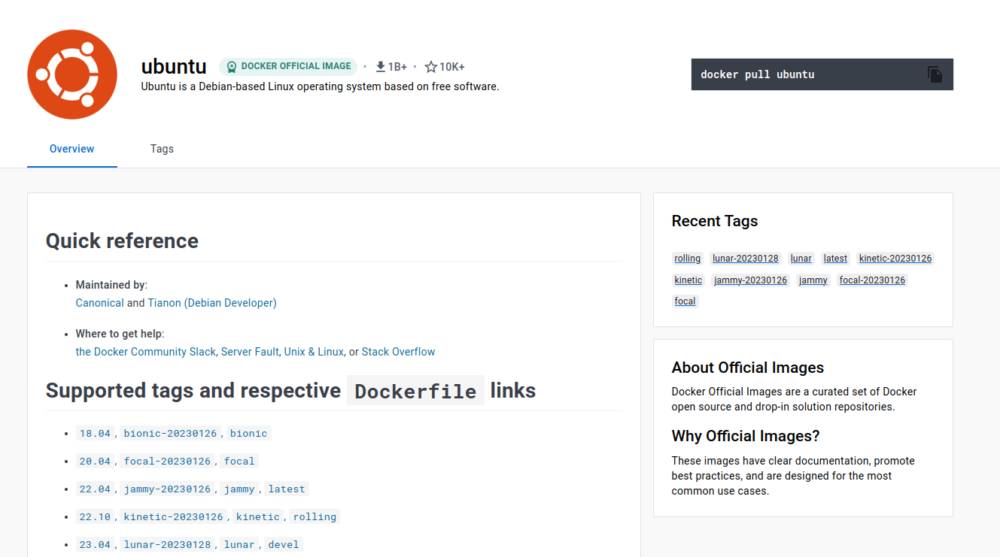

Podemos observar en la parte superior derecha como el comando para descargar la imagen docker de ubuntu es: `docker pull ubuntu`

Por defecto docker asume que quieres descargar la versión más reciente de una imagen, pero si quisieras descargar una versión diferente
tendrías que especificarlo de la siguiente manera: `docker pull <imageName>:<versionImage>`.

```bash
docker pull ubuntu:20.04
```

Si no colocamos un parámetro después de pull entenderá que deberá realizar la descarga de docker hub. EL parámetro extra después de pull es para indicarle el repositorio

> ## Extra:
> Como analogía a la programación orientada a objetos. Una imagen de docker es una plantilla con la que podemos instanciar varios contenedores.
> Esto es muy similar a la forma lógica en la cual nosotros en programación orientada a objetos creamos una clase, para posteriormente
> crear objetos a partir de la misma. De esta manera tendríamos el siguiente simil lógico
>
>   > Imagen - Clase
>   >
>   > Contenedor - Objeto
>


## 4.2 Construyendo una imagen propia

Todas las imágenes son un conjunto de capas o layers. 

Docker es sumamente eficiente con la administración de recursos de memoria tanto de forma local como de forma remota al compartir nuestras imágenes en docker hub.
Su sistema basado en capas recuerda mucho a la manera en la que git administra los cambios entre versiones. De modo que cuando nosotros creamos o compartimos
una nueva imagen de docker basada en otra imagen, docker NO genera una copia con todos los archivos de la imagen original más los nuevos archivos
que tu nueva imagen haya generado. 

Para hacer más eficiente el uso de memoria, docker solamente publicará los archivos que difieren de la versión base de nuestra nueva imagen, 
esto le permite reutilizar las capas que ya existían en otro repositorio y simplemente añadir las nuevas capas que nosotros hemos montado.

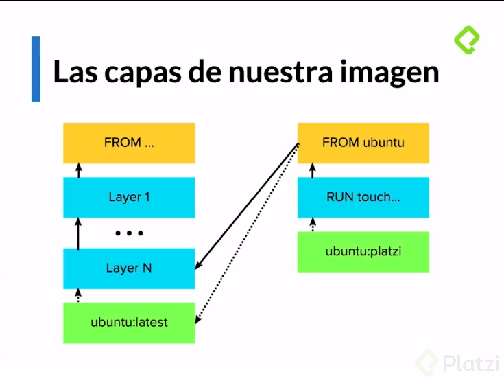

Cuando nosotros creamos una versión ligeramente diferente de la imagen de ubuntu con por ejemplo un archivo de texto extra que la
versión original de ubuntu no tenía, realmente lo único que estamos haciendo es añadiendo un par de capas extras a la pre-configuración
de la imagen original de ubuntu.

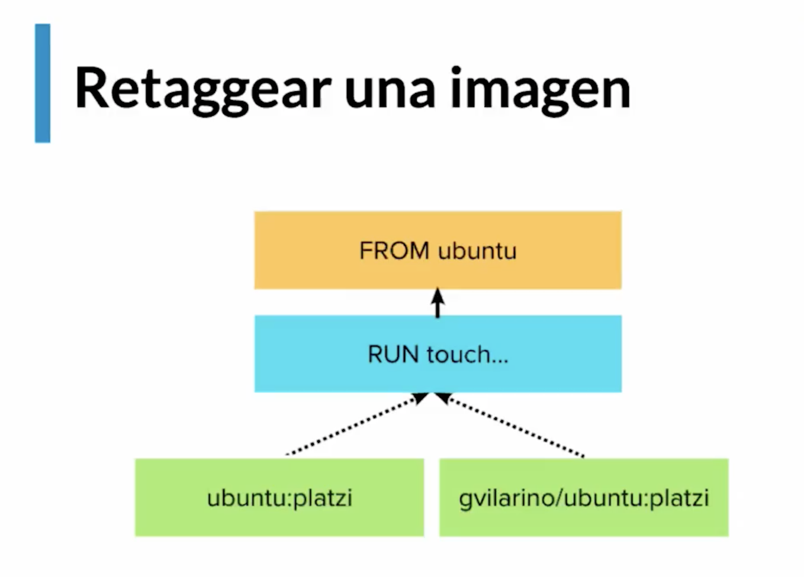

Adicionalmente, cuando creamos una nueva imagen que queremos compartir con la comunidad a través de docker hub necesitamos crear un
nuevo tag a dicha imagen para decir que el repositorio de esta nueva imagen estará alojado por mi usuario y no por el usuario base de la 
imagen. Imagina el problema que sería que cualquier usuario pudiera estar alterando las imágenes oficiales de ubuntu por cualquier mínimo cambio.

> ## Advertencia: 
> Por defecto los repositorios en Docker Hub son públicos, esto significa que cualquier usuario puede disponer
> de las imágenes que compartamos, esto es algo que queremos evitar cuando trabajamos con proyectos privados como código 
> realizado en un trabajo. Para ello Docker ofrece alternativas de pago que permiten a los repositorios ser privados y accesibles
> solo por una determinada cantidad de usuarios.

### Ejemplo práctico:

Construyamos nuestra primer imagen Docker a partir de la imagen base de [ubuntu](https://hub.docker.com/_/ubuntu).

1. Creamos una nueva carpeta que contendrá el código que instanciará a una nueva versión de ubuntu.
   ```bash
   mkdir new_ubuntu_img
   cd new_ubuntu_img/
   ```
2. Creamos el archivo `Dockerfile`:
   ```bash
   touch Dockerfile
   ```
3. Aquí empieza la magia, con nuestro edito de texto/código favorito accedemos al archivo `Dockerfile` y escribimos lo siguiente:
   ```doctest
   # Como base de la creación de mi nueva imagen tomo la versión más reciente de ubuntu
   FROM ubuntu:latest
   # En mi versión modificada de ubuntu habrá un archivo llamado `hola-mundo.txt` vacío
   RUN touch /usr/src/hola-mundo.txt
   # Aquí terminan las capas de modificación de la imagen original de ubuntu
   ```
4. Crearemos una imagen a partir de este Dockerfile, para ello es importante en este instante estar en la misma carpeta que el archivo dockerfile.
   ```bash
   docker build -t ubuntu:gabriel .
   # en este momento estoy versionando la imagen ubuntu con la etiqueta `gabriel`
   # el `.`final indica que se estará tomando como contexto de la imagen la ruta actual
   ```
   Respuesta esperada:
   ```commandline
   => [internal] load .dockerignore                                                                                                      0.1s
    => => transferring context: 2B                                                                                                        0.0s
    => [internal] load build definition from Dockerfile                                                                                   0.1s
    => => transferring dockerfile: 343B                                                                                                   0.0s
    => [internal] load metadata for docker.io/library/ubuntu:latest                                                                       0.0s
    => [1/2] FROM docker.io/library/ubuntu:latest                                                                                         0.0s
    => [2/2] RUN touch /usr/src/hola-mundo.txt                                                                                            0.3s
    => exporting to image                                                                                                                 0.1s
    => => exporting layers                                                                                                                0.0s
    => => writing image sha256:07b38109d489de9dbcf04e5ebb87f939a7d8770ec3fca2dc8cc75a69631c8df3                                           0.0s
    => => naming to docker.io/library/ubuntu:gabriel 
   ```
5. Poniendo a prueba nuestra nueva imagen, ejecutándola.
   ```bash
   docker run -it ubuntu:gabriel
   ll usr/src/
   ```
   Respuesta esperada:
   ```commandline
   total 12
   drwxr-xr-x 1 root root 4096 Feb 20 18:42 ./
   drwxr-xr-x 1 root root 4096 Jan 26 02:03 ../
   -rw-r--r-- 1 root root    0 Feb 20 18:42 hola-mundo.txt
   ```
6. Compartiendo la imagen en [DockerHub](https://hub.docker.com/)
   ```bash
   docker login
   ```
   Nos pedirá nuestro nombre de usuario y contraseña. Ahora debemos cambiar el tag de nuestra imagen, puesto que no podemos usar
   el de `ubuntu` directamente
   
   ```bash
   docker tag ubuntu:gabriel ichcanziho/ubuntu:gabriel
   # dónde ichcanziho debe ser remplazado por tu nombre de usuario
   ```
   
   Observemos nuestros cambios:
   ```bash
   docker image ls
   ```
   Respuesta esperada:
   
   ```commandline
   REPOSITORY          TAG       IMAGE ID       CREATED          SIZE
   ichcanziho/ubuntu   gabriel   07b38109d489   11 minutes ago   77.8MB
   ubuntu              gabriel   07b38109d489   11 minutes ago   77.8MB
   nginx               latest    3f8a00f137a0   11 days ago      142MB
   mongo               latest    a440572ac3c1   2 weeks ago      639MB
   ubuntu              latest    58db3edaf2be   3 weeks ago      77.8MB
   hello-world         latest    feb5d9fea6a5   17 months ago    13.3kB
   ```
   
   Nota: Obsevamos que los repositorios `ichanziho/ubuntu` y `ubuntu`cuyo tag es `gabriel` tienen el mismo `IMAGE ID` esto hace 
   referencia a que en realidad son la misma imagen, simplemente tienen un nombre de repositorio diferente, esto significa que el
   `SIZE` de `77.8MB`es compartido, es exactamente el mismo.
   
   Finalmente, vamos a hacer push de nuestra imagen a nuestro repositorio en DockerHub:
   
   ```bash
   docker push ichcanziho/ubuntu:gabriel
   ```
   
   Respuesta esperada:
   ```commandline
   The push refers to repository [docker.io/ichcanziho/ubuntu]
   8106596fe5dc: Pushed 
   c5ff2d88f679: Mounted from library/mongo 
   gabriel: digest: sha256:a8262a1265e5749bb74689e332a0781ae532995f57d5fd9b68058df5fbc7612f size: 736
   ```
   
   Para concluir, podemos ir a nuestro DockerHub y observar nuestro nuevo repositorio:
   
   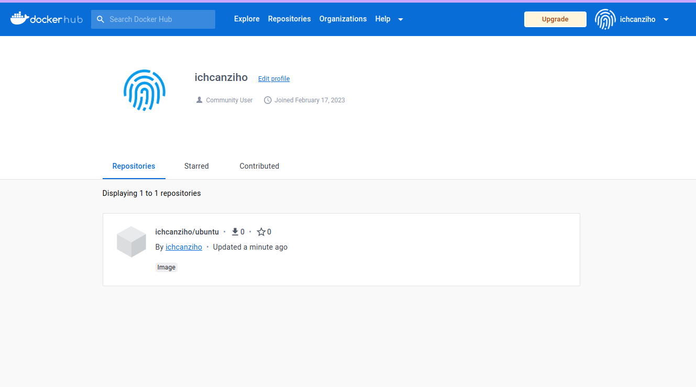

   Ahora cualquier persona puede hacer pull de mi imagen y usarla libremente:

   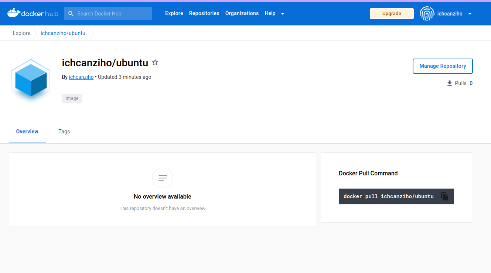

   ```bash
   docker pull ichcanziho:ubuntu
   ```

## 4.3 El sistema de capas

Las imágenes son un conjunto de capas, y a partir del Dockerfile se puede saber como está construido una imagen. Existen distintas maneras de ver las capas que conforman una imagen:

1. Si la imagen es pública se puede visitar Dockerhub y buscar una imagen para ver su Dockerfile. Una vez encontrar la imagen buscamos en los tag y haciendo clic en los tag se mostrará el docker file para construir dicha imagen.

2. Se puede hacer a través de la línea, esta opción no es muy cómoda. Es importante destaca que los cambios se presenta por filas y las filas más inferiores son los cambios más viejos y las que están más arriba son los cambios más recientes. el comando es:

   $ sudo docker history <nombre imagen: nombre tag>

   **Ejemplo:**

   ```
   sudo docker history ubuntu:gabriel
   ```
   Respuesta esperada:
   ```commandline
   IMAGE          CREATED          CREATED BY                                      SIZE      COMMENT
   07b38109d489   51 minutes ago   RUN /bin/sh -c touch /usr/src/hola-mundo.txt…   0B        buildkit.dockerfile.v0
   <missing>      3 weeks ago      /bin/sh -c #(nop)  CMD ["/bin/bash"]            0B        
   <missing>      3 weeks ago      /bin/sh -c #(nop) ADD file:18e71f049606f6339…   77.8MB    
   <missing>      3 weeks ago      /bin/sh -c #(nop)  LABEL org.opencontainers.…   0B        
   <missing>      3 weeks ago      /bin/sh -c #(nop)  LABEL org.opencontainers.…   0B        
   <missing>      3 weeks ago      /bin/sh -c #(nop)  ARG LAUNCHPAD_BUILD_ARCH     0B        
   <missing>      3 weeks ago      /bin/sh -c #(nop)  ARG RELEASE                  0B 
   ```

3. Otra opción es una herramienta de terminal creada por un usuario llamada dive https://github.com/wagoodman/dive, al ejecutar esta herramienta se puede visualizar que del lado izquierdo las capas que tiene la imagen y del lado derecho se visualiza el detalle de cambios que genera cada capa. el comando es el siguiente:

   Instalación en linux:
   ```bash
   wget https://github.com/wagoodman/dive/releases/download/v0.9.2/dive_0.9.2_linux_amd64.deb
   sudo apt install ./dive_0.9.2_linux_amd64.deb
   ```

   $ sudo dive < nombre de imagen:nombre tag >

   **Ejemplo:**
   ```
   sudo dive ubuntu:gabriel
   ```
   
   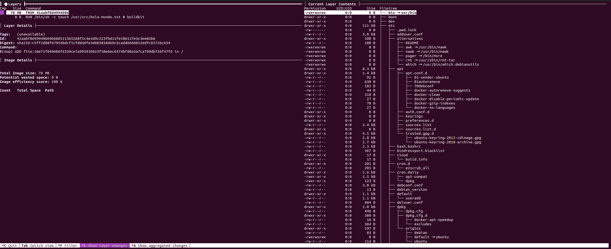   

4. Los cambios que se muestran en la terminal son de la siguiente forma, los más antiguos abajo y los más recientes arriba


**En la construcción de una imagen Es importante tomar en cuenta lo siguiente:**

Se puede optar por instalar paquetes o crear archivos en una capa y luego desinstalar los paquetes o eliminar los archivos en otra capa. Esto es poco óptimo porque las capas son inmutables y en este caso estaríamos desperdiciando espacios. El motivo de que las capas son inmutables es para que al momento de crear una imagen docker no agrega capas ya creadas.

Una estrategia para evitar desperdiciar espacio es que en la misma capa se cree o instalen los paquetes y luego de terminar 
la operación que esto realizan se desinstale o eliminen. Otra estrategia de optimizar es que una vez generada la imagen 
todas las operaciones se hagan desde un contenedor.

# 5. Docker como herramienta de desarrollo

Esta sección cuenta con las siguientes clases:

- [5.1 Usando Docker para desarrollar aplicaciones](#51-usando-docker-para-desarrollar-aplicaciones)

- [5.2 Aprovechando el caché de capas para estructurar correctamente tus imágenes](#52-aprovechando-el-caché-de-capas-para-estructurar-correctamente-tus-imágenes)

- [5.25 EXTRA: Creando un contenedor FLASK-PYTHON](#525-extra--creando-un-contenedor-flask-python)

- [5.3 Docker networking: Colaboración entre contenedores](#53-docker-networking--colaboración-entre-contenedores)

## 5.1 Usando Docker para desarrollar aplicaciones

En esta clase veremos como Docker nos puede ayudar en nuestro trabajo diario para construir aplicaciones.

Para esta clase vamos a utilizar un contenedor de Docker de un repositorio de github de [Platzi](https://github.com/platzi/docker)

1. Creamos una nueva carpeta para el proyecto
   ```bash
   mkdir docker_platzi
   cd docker_platzi
   ```
2. Clonamos el repositorio de github:
   ```bash
   git clone https://github.com/platzi/docker
   cd docker
   ```
   Podemos utilizar nuestro editor de texto favorito para observar los documentos del repositorio:
   
   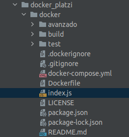
   
   Centrémonos en [index.js](docker_platzi/docker/index.js) Que es una API que se conecta a una base de MongoDB
   ```commandline
   const express = require('express')
   const app = express()
   const port = 3000
   
   const MongoClient = require('mongodb').MongoClient
   
   // Connection URL
   const mongoUrl = process.env.MONGO_URL || 'mongodb://localhost:27017/test';
   
   app.get('/', (req, res) => {
     MongoClient.connect(mongoUrl, { useNewUrlParser: true }, (err, db) => {
       if (err) {
         res.status(500).send('💥 BOOM 💥: ' + err);
       } else {
         res.send('Me conecté a la DB! 😎');
         db.close();
       }
     });
   });
   
   app.listen(port, () => console.log(`Server listening on port ${port}!`))
   ```
   
   Ese es el proyecto del repositorio, pero ahora veamos por dentro como luce el [Dockerfile](docker_platzi/docker/Dockerfile)
   del proyecto:
   
   ```doctest
   # Imagen base (node en la version 12)
   FROM node:12
   
   # Copiar todo lo que hay en la carpeta actual, a la carpeta /usr/src en el contenedor
   
   COPY [".", "/usr/src/"]
   
   # Establecer el directorio de trabajo (cd /usr/src)
   WORKDIR /usr/src
   
   # Descargar las dependencias del proyecto (en jerga de node, va a instalar lo que se 
   # encuentre dentro del archivo `package.json` bastante similar al `requirements.txt`  
   # de pip para python
   RUN npm install
   
   # Le dice al contenedor que esté escuchando en el puerto 3000
   EXPOSE 3000
   
   # Ejecutar el comando de node `index.js`
   CMD ["node", "index.js"]
   ```
3. Ahora que entendimos la plantilla del `Dockerfile` vamos a proceder a crear la imagen con un `Docker build`:
   ```bash
   docker build -t platziapp .
   ```
   Recordemos que en este ejemplo `platziapp` es por decirlo, el `nombre del repositorio` que como solo vamos a usar de forma
   `local` no hace falta poner el nombre de usuario antes.
   
   Respuesta esperada:
   
   ```commandline
   [+] Building 104.3s (10/10) FINISHED                                                                 
    => [internal] load .dockerignore                                                               0.1s
    => => transferring context: 133B                                                               0.0s
    => [internal] load build definition from Dockerfile                                            0.1s
    => => transferring dockerfile: 149B                                                            0.0s
    => [internal] load metadata for docker.io/library/node:12                                      1.7s
    => [auth] library/node:pull token for registry-1.docker.io                                     0.0s
    => [1/4] FROM docker.io/library/node:12@sha256:01627afeb110b3054ba4a1405541ca095c8bfca1cb6f2  93.1s
    => => resolve docker.io/library/node:12@sha256:01627afeb110b3054ba4a1405541ca095c8bfca1cb6f2b  0.0s
    => => sha256:3a69ea1270dbf4ef20477361be4b7a43400e559c6abdfaf69d73f7c755f434f5 2.21kB / 2.21kB  0.0s
    => => sha256:9bed1e86f01ee95c76d2c8b4385a47ae336e6d293afade9368469d99daa93 11.30MB / 11.30MB  18.5s
    => => sha256:f44e4bdb3a6c1325cc4d40e585ed7a759127c0c87b0388ec0236b1698827d70 4.34MB / 4.34MB  15.4s
    => => sha256:01627afeb110b3054ba4a1405541ca095c8bfca1cb6f2be9479c767a2711879e 776B / 776B      0.0s
    => => sha256:6c8de432fc7f7d8c58899f61982d1662ec6b73fb3ef92f862ba170dcc5b64fa9 7.68kB / 7.68kB  0.0s
    => => sha256:f5196cdf25181bc7e4411865a2e002932b7b6b0ffce787c04c1bdeaf1f204f 45.43MB / 45.43MB  8.5s
    => => extracting sha256:f5196cdf25181bc7e4411865a2e002932b7b6b0ffce787c04c1bdeaf1f204f20       0.5s
    => => sha256:2f75d131f4060950dd6cc1f580e2fa5504ece8d692113a9cdb0a866637b39 49.77MB / 49.77MB  22.0s
    => => sha256:07dff4ad21ebdb3ce3e329699663b2f81af70152453025f6624584a39a8 214.48MB / 214.48MB  89.4s
    => => extracting sha256:9bed1e86f01ee95c76d2c8b4385a47ae336e6d293afade9368469d99daa9369f       0.1s
    => => sha256:e0ac4f13b766d321acc3b650d3d23b82828995711f6f247ff591722c00d04ce 4.19kB / 4.19kB  19.2s
    => => extracting sha256:f44e4bdb3a6c1325cc4d40e585ed7a759127c0c87b0388ec0236b1698827d70d       0.1s
    => => sha256:df2c3b2eb7cc63351bb32f26457bbe0402af8082548f26975f0c329bc7841 23.70MB / 23.70MB  34.9s
    => => extracting sha256:2f75d131f4060950dd6cc1f580e2fa5504ece8d692113a9cdb0a866637b397d7       0.7s
    => => sha256:efe636eac583776a8a114d50fef15bc65b648f3d2bb53326cf1f21cc5ef2b3a 2.34MB / 2.34MB  23.1s
    => => sha256:fe17849545bb51455d3f7c8773ded2dbb1d6668a85bd00564573a4b88afd36f6 464B / 464B     23.5s
    => => extracting sha256:07dff4ad21ebdb3ce3e329699663b2f81af70152453025f6624584a39a8e22b6       2.4s
    => => extracting sha256:e0ac4f13b766d321acc3b650d3d23b82828995711f6f247ff591722c00d04cec       0.0s
    => => extracting sha256:df2c3b2eb7cc63351bb32f26457bbe0402af8082548f26975f0c329bc7841881       0.4s
    => => extracting sha256:efe636eac583776a8a114d50fef15bc65b648f3d2bb53326cf1f21cc5ef2b3ae       0.1s
    => => extracting sha256:fe17849545bb51455d3f7c8773ded2dbb1d6668a85bd00564573a4b88afd36f6       0.0s
    => [internal] load build context                                                               0.1s
    => => transferring context: 105.14kB                                                           0.0s
    => [2/4] COPY [., /usr/src/]                                                                   0.2s
    => [3/4] WORKDIR /usr/src                                                                      0.1s
    => [4/4] RUN npm install                                                                       8.9s
    => exporting to image                                                                          0.2s
    => => exporting layers                                                                         0.2s
    => => writing image sha256:a01a9b0323668309fe1286c86560c03b62da570bc95292483c818706c3a5d996    0.0s 
    => => naming to docker.io/library/platziapp                                                    0.0s
   ```
4. Corroboramos que `platziapp` ya sea una imagen disponible:

   ```commandline
   docker image ls
   ```
   
   Respuesta esperada:
   
   ```commandline
   REPOSITORY          TAG       IMAGE ID       CREATED         SIZE
   platziapp           latest    a01a9b032366   2 minutes ago   931MB
   ichcanziho/ubuntu   gabriel   07b38109d489   30 hours ago    77.8MB
   ubuntu              gabriel   07b38109d489   30 hours ago    77.8MB
   nginx               latest    3f8a00f137a0   12 days ago     142MB
   mongo               latest    a440572ac3c1   2 weeks ago     639MB
   ubuntu              latest    58db3edaf2be   3 weeks ago     77.8MB
   hello-world         latest    feb5d9fea6a5   17 months ago   13.3kB
   ```
5. Como ya tengo una imagen construida entonces ahora puedo crear un contenedor a partir de él:

   ```bash
   docker run --rm -p 3000:3000 platziapp
   ```
   
   > Nota: el parámetro `--rm` 
   > 
   > Parámetro -p indicar que el puerto del host:contenedor están asociados.
   
   Respuesta esperada:
   
   ```commandline
   Server listening on port 3000!
   ```
   
   Si me dirijo a [localhost:3000](localhost:3000)
   
   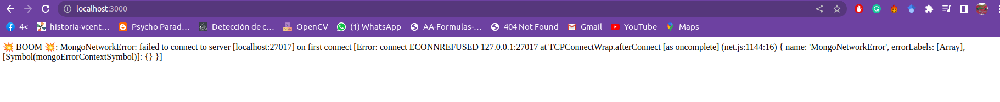
   
   Podemos observar que hemos ejecutado exitosamente el contenedor. Claro hay un error porque no tenemos las credenciales
   para acceder a la base de datos, pero este error válida que nuestro proceso de ejecutar el contenedor ha sido exitoso.


## 5.2 Aprovechando el caché de capas para estructurar correctamente tus imágenes

Problema: Imaginemos que en nuestro archivo del ejemplo pasado [index.js](docker_platzi/docker/index.js) quisiera cambiar
una línea de código, digamos cambiar una palabra mal escrita, tendría que volver a construir la imagen con, `Docker build`
pero este proceso de nuevo sería lento porque tendría que volver a descargar, instalar y ejecutar todo. Sin embargo, podemos
hacer un pequeño truco de optimización en el propio [Dockerfile](docker_platzi/docker/Dockerfile) que nos permita ahorrar mucho tiempo.

La primera versión del dockerfile es la siguiente:

```doctest
FROM node:12

COPY [".", "/usr/src/"]

WORKDIR /usr/src

RUN npm install

EXPOSE 3000

CMD ["node", "index.js"]
```

Vemos que la primera área que podemos optimizar es que NO necesitamos copiar TODO lo que hay en la carpeta del proyecto `.` a
`/usr/src` para después instalar las dependencias de npm.

¿Qué pasaría si primero, únicamente copio los archivos que necesito para instalar las dependencias de npm, después ejecuto 
`RUN npm install` y hasta después de la instalación de las dependencias entonces termino de copiar los demás archivos?

```doctest
FROM node:12

COPY ["package.json", "package-lock.json", "/usr/src/"]

WORKDIR /usr/src

RUN npm install

COPY [".", "/usr/src/"]

EXPOSE 3000

CMD ["node", "index.js"]
```

Primero estaría instalando todas las dependencias de node y ya después copiaría el código, esto significa que si yo modifico
una línea del código de `index.js` y volviera a hacer `docker build` NO tendría que rehacer todo desde 0, puesto que las primeras capas
de la instalación de `npm` no se modificaron, entonces realmente solo tendría que correr las últimas capas que van desde la copia
de los archivos modificados, lo cual es mucho más ventajoso al momento de desarrollar proyectos.

Sin embargo, podemos optimizar aún más está lógica con las herramientas que ya hemos visto en clase. El objetivo es que el 
`contenedor se este actualizando automáticamente cada que cambiamos manualmente el código`
Vamos a cambiar ligeramente nuestro Dockerfile para que el último comando sea más inteligente.

```doctest
FROM node:12

COPY ["package.json", "package-lock.json", "/usr/src/"]

WORKDIR /usr/src

RUN npm install

COPY [".", "/usr/src/"]

EXPOSE 3000

CMD ["npx", "nodemon", "index.js"]
```

Lo que hace está versión es que en lugar de ejecutar directamente node sobre index.js lo que hace es un servicio que le
permite reiniciar a node si encuentra cambios en el código. Pero lo que nos hace falta es poder comunicarnos desde fuera
nuestra máquina local a nuestro contenedor. Pero nosotros ya sabemos hacer eso con [Bind Mounts](#31-bind-mounts).

Asi que vamos entonces a construir nuestra imagen actualizada de platziapp y después vamos a crear un nuevo contenedor que tenga
un enlace directo entre el archivo `index.js` de mi máquina local con el `index.js` del contenedor.

> Nota para borrar la imagen anterior de platziapp utiliza `docker rmi <IMAGE ID>`

```bash
docker build -t platziapp .
```

Una vez construida nuestra nueva imagen de `platziapp`

Vamos a crear nuestro nuevo contenedor pero con un poco más de información que la vez pasada:

  ```bash
   docker run --rm --init -p 3000:3000 --name nodetest -v $(pwd)/index.js:/usr/src/index.js platziapp
   ```
   > ## Notas:
   >
> El comando --init es para decirle al contenedor que con ctrl+c se detenga
> 
> con el atajo $(pwd) puedo escribir toda la ruta absoluta hasta donde me encuentro
> 
> el comando -v como recordatorio es para crear el bind mounts entre el archivo index.js de mi máquina local y
> el que se encontrará dentro del contenedor en /usr/src/index.js
   
Respuesta esperada:

```commandline
[nodemon] 1.18.6
[nodemon] to restart at any time, enter `rs`
[nodemon] watching: *.*
[nodemon] starting `node index.js`
Server listening on port 3000!
```

Ahora si yo modifico un poco el código de index.js de forma automática me reinicia el servidor:

```commandline
[nodemon] restarting due to changes...
[nodemon] starting `node index.js`
Server listening on port 3000!
```

## 5.25 EXTRA: Creando un contenedor FLASK-PYTHON

El objetivo de esta clase extra será crear una API con [FLASK](https://flask.palletsprojects.com/en/2.2.x/) en Python que
mediante el método POST de un request reciba como parámetro de entrada un nombre y devuelva `hola nombre`.

```python
query = {"nombre": "Gabriel"}
x = requests.post("http://127.0.0.1:8181/api_saludar", json=query)
print(x.text)
```
Respuesta esperada:
```commandline
Hola Gabriel!
```

1. **Primer paso:** Construyendo la API de forma local.

   Creamos la carpeta del proyecto
   ```bash
   mkdir flaskapi
   cd flaskapi
   ```
   
   Creamos un entorno virtual de python:
   ```bash
   python3 -m venv .flaskvenv
   ```
   
   Activamos el entorno virtual:
   ```bash
   source .flaskvenv/bin/activate
   ```
   
   Instalamos las librerias necesarias:
   
   ```bash
   pip install Flask
   pip install requests
   pip freeze
   ```
   
   Respuesta esperada:
   
   ```commandline
   certifi==2022.12.7
   charset-normalizer==3.0.1
   click==8.1.3
   Flask==2.2.3
   idna==3.4
   itsdangerous==2.1.2
   Jinja2==3.1.2
   MarkupSafe==2.1.2
   requests==2.28.2
   urllib3==1.26.14
   Werkzeug==2.2.3
   ```
   
   Creamos nuestro archivo de `requirements.txt`
   ```bash
   pip freeze > requirements.txt
   ```
   
   Creamos nuestra aplicación FLASK-PYTHON `app.py`
   ```bash
   touch app.py
   ```
   
   Código de [app.py](flaskapi/app.py)
   
   ```python
   from flask import Flask, request
   from json import loads as decode_json
   
   app = Flask(__name__)
   
   
   @app.route('/')
   def hello_world():
       return 'Hello, Docker!'
   
   
   @app.route("/api_saludar", methods=["POST"])
   def saludar():
       args = decode_json(request.data)
       nombre = args["nombre"]
       return f"Hola {nombre}!"
   
   
   # flask --app app run -p 8181
   ```
   
   Ejecutando nuestra API en local:
   
   ```bash
   flask --app app run -p 8181
   ```
   
   Respuesta esperada:
   
   ```pycon
    * Serving Flask app 'app'
    * Debug mode: off
   WARNING: This is a development server. Do not use it in a production deployment. Use a production WSGI server instead.
    * Running on http://127.0.0.1:8181
   Press CTRL+C to quit
   ```
   
   Creemos nuestro archivo POST de prueba:
   
   ```bash
   touch send.py
   ```
   
   Código de prueba [send.py](flaskapi/send.py)
   
   ```python
   import requests
   from time import time
   
   port = 8181
   endpoint = "api_saludar"
   url = "http://127.0.0.1:{:d}/{:s}".format(port, endpoint)
   headers = {'Content-Type': 'application/json', 'Accept': 'application/json'}
   query = {"nombre": "Gabriel"}
   if __name__ == '__main__':
       a = time()
       x = requests.post(url, json=query, headers=headers)
       print(x.text)
       print(f"Request's time: {time() - a} seconds")
   ```
   
   Corramos nuestro código de prueba:
   
   ```bash
   python send.py 
   ```
   
   Respuesta esperada:
   
   ```commandline
   Hola Gabriel!
   Request's time: 0.002546548843383789 seconds
   ```
   
   Hasta este momento tenemos nuestra API funcionando perfectamente de forma Local.
2.  **Segundo paso:** Creemos nuestro `Dockerfile`:

   ```doctest
   # Empezamos de una imagen de python ligero
   FROM python:3.8-slim-buster
   # Nuestro contenedor tendrá una carpeta llamada app, dentro de esta carpeta estará disponible todo el código
   # y servirá como raiz del proyecto, el comando WORKDIR crear la carpeta y automáticamente hace CD a la carpeta
   WORKDIR /app
   # de mi máquina local copia el archivo requirements.txt al contenedor con el nombre requirements.txt
   COPY requirements.txt requirements.txt
   # En el contenedor instala los requisitos de python
   RUN pip3 install -r requirements.txt
   # Termina de copiar todo lo que había en la carpeta raíz del proyecto local al contenedor 
   COPY . .
   # Ejecuta el servidor flask en el host 0.0.0.0 y puerto 8181
   CMD [ "python3", "-m" , "flask", "run", "--host=0.0.0.0", "--port=8181"]
   ```
   
   Antes de continuar repasemos la estructura del directorio de nuestro proyecto:
   
   ```commandline
   python-docker
   |____ app.py
   |____ requirements.txt
   |____ Dockerfile
   |____ send.py
   ```
3. **Tercer paso:** Construyamos la imagen de nuestro proyecto:

   ```bash
   docker build -t api_saludar .
   docker images
   ```
   
   Respuesta esperada:
   ```commandline
   REPOSITORY          TAG       IMAGE ID       CREATED             SIZE
   api_saludar         latest    d43f7f6a7f08   28 seconds ago      153MB
   ```
4. **Cuarto paso:** Creemos un contenedor con la imagen anterior:
   ```bash
   docker run --rm --init -p 8181:8181 --name saludar_contenedor api_saludar
   ```
   Probando que el servidor responda un get:
   ```bash
   curl localhost:8181
   ```
   Respuesta esperada:
   ```commandline
   Hello, Docker!
   ```
   Probando la API:
   ```bash
   python send.py 
   ```
   
   Respuesta esperada en terminal:
   
   ```commandline
   Hola Gabriel!
   Request's time: 0.002546548843383789 seconds
   ```
   Respuesta esperada en el contenedor:
   ```commandline
   172.17.0.1 - - [22/Feb/2023 03:06:46] "POST /api_saludar HTTP/1.1" 200 -
   ```
   terminamos la ejecución con `ctrl + c`
   
   Vemos nuestra lista de contenedores:
   
   ```bash
   docker ps -a
   ```
   Respuesta esperada:
   ```commandline
   CONTAINER ID   IMAGE            COMMAND                  CREATED        STATUS                      PORTS     NAMES
   ```
   Felicidades, hemos limpiado correctamente el contenedor al terminar de usarlo, sin embargo, la imágen aún está disponible para nosotros
   
   ```bash
   docker images
   ```
   
   Respuesta esperada:
   
   ```commandline
   REPOSITORY          TAG       IMAGE ID       CREATED          SIZE
   api_saludar         latest    d43f7f6a7f08   21 minutes ago   153MB
   ```


## 5.3 Docker networking: Colaboración entre contenedores

Nuestra aplicación `platziapp` tiene una función para conectarse a una bade de datos de Mongo, sin embargo, el contenedor
que construimos NO posee una instancia de Mongo, entonces para el contenedor dicho programa NO existe y no puede proceder.

Una forma de lidiar con esta situación es crear otro contenedor que contenga una instalación de Mongo y después enlazar ambos
contenedores a través de una red. Esta red le permitirá a ambos contenedores intercambiar información entre ellos y ambos
pensarán que se encuentran juntos, es casi como tener un contenedor que contenga a ambos contenedores. 
 
Primero cambiemos nuestro dockerfile a la versión anterior que era más simple, unicamente para efectos de volver más sencillo el código:

```doctest
FROM node:12

COPY ["package.json", "package-lock.json", "/usr/src/"]

WORKDIR /usr/src

RUN npm install

COPY [".", "/usr/src/"]

EXPOSE 3000

CMD ["node", "index.js"]
```

El objetivo de esta clase será crear una red, tener dos contenedores uno de la imagen de `platziapp`y otro de la imagen de 
`mongo` después conectar a ambos a través de la red que creemos.

1. **Primer paso:** Veamos nuestras redes disponibles:
   ```bash
   docker network ls
   ```
   Respuesta esperada:
   ```commandline
   NETWORK ID     NAME      DRIVER    SCOPE
   2bcf07cca2ed   bridge    bridge    local
   74a4aacedd1f   host      host      local
   51bd06b10ae5   none      null      local
   ```
   - La red `bridge` es la red por defecto de docker que está presente por retrocompatibilidad con versiones anteriores.
   - `host` es una representación en docker de nuestra red real de la máquina
   - `none` es una red especial de docker que se utiliza para que un contenedor no tenga ningún tipo de acceso a red.

2. **Segundo paso:** Creando nuestra propia red:
   ```bash
   docker network create --attachable platzinet
   docker network ls
   ```
   > El parámetro --attachable: permite que otros contenedores se conecten a esta red
   
   Respuesta esperada:
   ```commandline
   NETWORK ID     NAME        DRIVER    SCOPE
   2bcf07cca2ed   bridge      bridge    local
   74a4aacedd1f   host        host      local
   51bd06b10ae5   none        null      local
   035f6a90d019   platzinet   bridge    local
   ```
   Adicionalmente podemos inspeccionar a nuestra red para conocer más información de la misma:
   ```commandline
   docker network inspect platzinet
   ```
   Respuesta esperada:
   ```commandline
   [
       {
           "Name": "platzinet",
           "Id": "035f6a90d0197aa61f6199b231cf48ae980862693f6c67e76b13465bbd458208",
           "Created": "2023-02-22T17:01:03.37312466-06:00",
           "Scope": "local",
           "Driver": "bridge",
           "EnableIPv6": false,
           "IPAM": {
               "Driver": "default",
               "Options": {},
               "Config": [
                   {
                       "Subnet": "172.18.0.0/16",
                       "Gateway": "172.18.0.1"
                   }
               ]
           },
           "Internal": false,
           "Attachable": true,
           "Ingress": false,
           "ConfigFrom": {
               "Network": ""
           },
           "ConfigOnly": false,
           "Containers": {},
           "Options": {},
           "Labels": {}
       }
   ]
   ```
   Creamos rápidamente un contenedor llamado `mongodb` de nuestra imagen `mongo`:
   ```bash
   docker run -d --name mongodb mongo
   ```
   Y también debemos crear un contenedor llamado `app` de nuestra imagen `platziapp`:
   ```bash
   docker run -d --name app -p 3000:3000 --env MONGO_URL=mongodb://mongodb:27017/test platziapp
   ```
   > Nota: el parámetro --env permite setear variables de entorno para nuestros contenedores
   >
   > En nuestro archivo [index.js](docker_platzi/docker/index.js) tenemos el siguiente comando:
   >
   > // Connection URL
   >
   > const mongoUrl = process.env.MONGO_URL || 'mongodb://localhost:27017/test';
   >
   > el mismo ocupa una variable de entorno llamada `MONGO_URL` pero no nos preocupemos que justamente en el comando de creación de nuestro contenedor de platziapp ya pusimos esa variable con el parámetro --env.
   >
   
   > Nota: después del mongodb://<nombre_del_contenedor> a la izquierda ya estaba `mongodb` pero ese viene del index.js a la derecha va el nombre del contenedor en este caso se llama igual.
   
   Veamos nuestros contenedores activos:
   ```commandline
   docker ps
   ```
   Respuesta esperada:
   ```commandline
   CONTAINER ID   IMAGE       COMMAND                  CREATED          STATUS          PORTS                                       NAMES
   666371aad458   platziapp   "docker-entrypoint.s…"   32 seconds ago   Up 31 seconds   0.0.0.0:3000->3000/tcp, :::3000->3000/tcp   app
   7936407ea0b8   mongo       "docker-entrypoint.s…"   11 minutes ago   Up 11 minutes   27017/tcp                                   mongodb
   ```
3. **Tercer paso:** Conectando nuestros contenedores a nuestra red `platzinet`:
   ```bash
   docker network connect platzinet mongodb
   docker network connect platzinet app
   docker network inspect platzinet
   ```
   Respuesta esperada:
   ```commandline
   [
       {
           "Name": "platzinet",
           "Id": "035f6a90d0197aa61f6199b231cf48ae980862693f6c67e76b13465bbd458208",
           "Created": "2023-02-22T17:01:03.37312466-06:00",
           "Scope": "local",
           "Driver": "bridge",
           "EnableIPv6": false,
           "IPAM": {
               "Driver": "default",
               "Options": {},
               "Config": [
                   {
                       "Subnet": "172.18.0.0/16",
                       "Gateway": "172.18.0.1"
                   }
               ]
           },
           "Internal": false,
           "Attachable": true,
           "Ingress": false,
           "ConfigFrom": {
               "Network": ""
           },
           "ConfigOnly": false,
           "Containers": {
               "666371aad45889dc8ab1a6da1bd99a7f30cc6cd23699a79922ed35ba76412864": {
                   "Name": "app",
                   "EndpointID": "29730c041b6188e3aa31f4d71875e3a0938a7d7437b5fa620607430ee26484c9",
                   "MacAddress": "02:42:ac:12:00:03",
                   "IPv4Address": "172.18.0.3/16",
                   "IPv6Address": ""
               },
               "7936407ea0b83b6a0d449c00e0c5160c21aa0fd521a4e5ad9ec1527ef6bf422c": {
                   "Name": "mongodb",
                   "EndpointID": "59575c816cf2d693e11f97479279db69e2abf493b3a04f33841410efc649a9da",
                   "MacAddress": "02:42:ac:12:00:02",
                   "IPv4Address": "172.18.0.2/16",
                   "IPv6Address": ""
               }
           },
           "Options": {},
           "Labels": {}
       }
   ]
   ```

Si nos dirigimos a: 
[localhost:3000](localhost:3000)

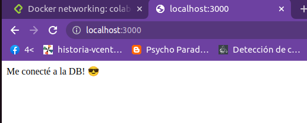

[Éxito total, Éxito Rotundo](https://platzi.com/clases/2066-docker/32861-docker-networking-colaboracion-entre-contenedores/?time=540)


# 6. Docker compose

## 6.1 Docker Compose: La herramienta todo en uno

## 6.2 Subcomandos de Docker Compose

## 6.3 Docker Compose como herramienta de desarrollo

## 6.4 Compose en equipo: override

# 7. Docker Avanzado

## 7.1 Administrando tu ambiente de Docker

## 7.2 Deteniendo contenedores correctamente: SHELL vs EXEC

## 7.3 Contenedores ejecutables: ENTRYPOINT vs CMD

## 7.4 El contexto de build

## 7.5 Multi-stage build

## 7.6 Docker-in-Docker