# Curso Profesional de Machine Learning con Scikit-Learn


Scikit-Learn es una biblioteca de Python que ofrece un conjunto de algoritmos eficientes que pueden ser utilizados para realizar Machine Learning en un ambiente productivo. Con el Curso Profesional de Machine Learning con SciKit-Learn de Platzi aprenderemos a implementar los principales algoritmos disponibles en esta biblioteca.

## Objetivos del curso

- Iniciar un proyecto con Scikit-Learn
- Aplicar técnicas de regularización a regresiones
- Manejar datos atípicos
- Reducir la dimensionalidad

---------------

## Tabla de contenidos:

- [1. Aprender los conceptos clave](#1-aprender-los-conceptos-clave)
- [2. Iniciar un proyecto con sklearn](#2-iniciar-un-proyecto-con-sklearn)
- [3. Optimización de features](#3-optimización-de-features)
- [4. Regresiones robustas](#4-regresiones-robustas)
- [5. Métodos de ensamble aplicados a clasificación](#5-métodos-de-ensamble-aplicados-a-clasificación)
- [6. Clustering](#6-clustering)
- [7. Optimización paramétrica](#7-optimización-paramétrica)
- [8. Salida a producción](#8-salida-a-producción)
- [Conclusiones](#conclusiones)

# 1. Aprender los conceptos clave

## 1.1 Introducción:

Scikit-learn es una herramienta desarrollada en 2007 por David Cournapeau como un proyecto del Google Summer of Code
nace en un entorno academico universitario, pero crece a convertirse en proyectos profesionales utilizados en la industria.

### ¿Por qué usar Scikit-learn?

- Curva de aprendizaje suave.
- Es una biblioteca muy versátil.
- Comunidad de soporte.
- Uso en producción.
- Integración con librerías externas.

### Conociendo Scikit Learn

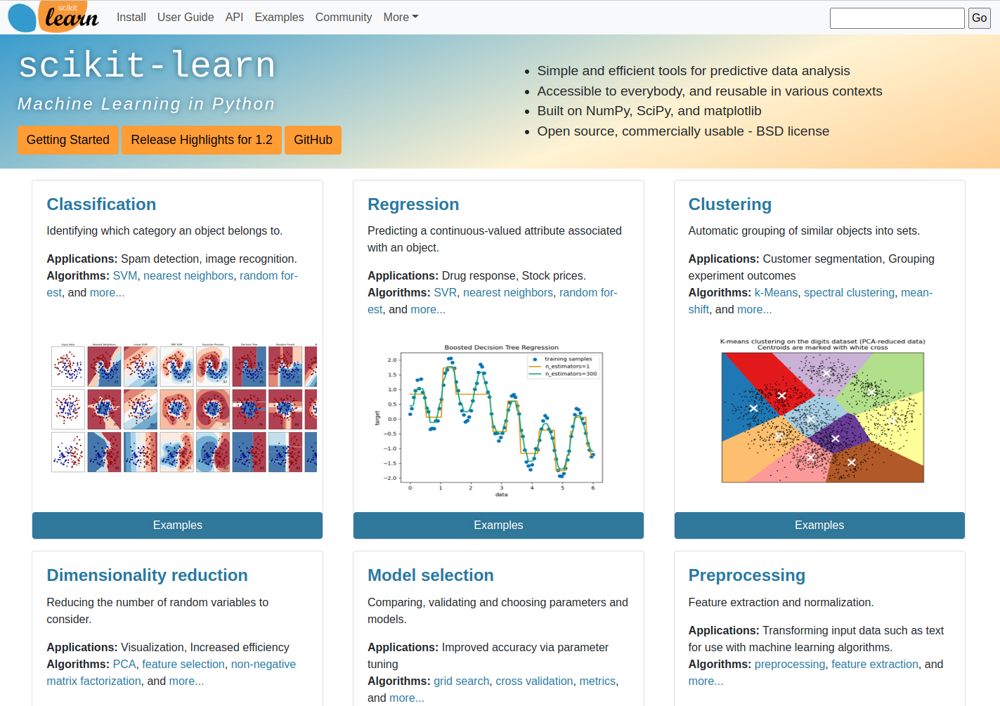

- [Clasificación.](https://scikit-learn.org/stable/supervised_learning.html#supervised-learning)
    - Identificar a cuál categoría pertenece un objeto.
- [Regresión.](https://scikit-learn.org/stable/supervised_learning.html#supervised-learning)
  - Predecir el valor continuo asociado a un objeto. 
- [Clustering.](https://scikit-learn.org/stable/modules/clustering.html#clustering)
  - Agrupación automática de objetos con características similares dentro de conjuntos.
- [Preprocesamiento.](https://scikit-learn.org/stable/modules/preprocessing.html#preprocessing)
  - Extracción de características y normalizado de variables. 
- [Reducción de dimensionalidad.](https://scikit-learn.org/stable/modules/decomposition.html#decompositions)
  - Reducción del número de variables aleatorias a ser considerado. 
- [Selección del modelo.](https://scikit-learn.org/stable/model_selection.html#model-selection)
  - Comparación, validación y elección de parámetros y modelos.

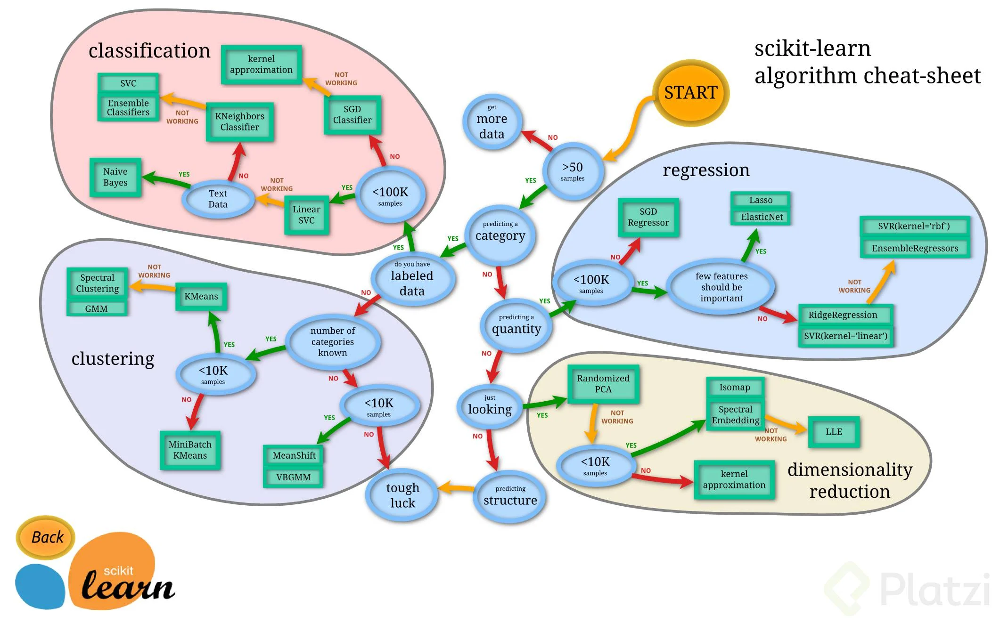

### Preguntas que nos haremos y resolveremos en el curso:

- ¿Cómo nos ayuda Scikit Learn en el preprocesamiento de datos?
- ¿Qué modelos podemos utilizar para resolver problemas específicos?
- ¿Cuál es el procedimiento a seguir para poder optmizar los modelos?

## 1.2 ¿Cómo aprenden las máquinas?

Los datos lo son todo, entré mejor conocidos y analizados los tengamos será más fácil llegar a tener modelos más robustos.

Dependiendo de la naturaleza y estructura que tengas los datos será necesaria utilizar un enfoque diferente de machine learning. 
Los principales enfoques de machine learning que existen son: 

- Aprendizaje supervisado (Algoritmos **por observación**):
    - Si de los datos se puede extraer con anticipación información precisa del resultado que esperamos.
- Aprendizaje por refuerzo (Algoritmos **por prueba y error**):
  - Si de los datos no se puede sacar exactamente la información que queremos predecir, pero si podemos dejar que el modelo tome decisiones y evalue si estas decisiones son buenas o malas.
- Aprendizaje no supervisado (Algoritmos **por descubrimiento**):
  - Cuando no se tiene ninguna información adicional sobre lo que esperamos, sino que los datos por sí solos nos van a revelar información relevante sobre su propia naturaleza y estructura.

### Alternativas al Machine Learning dentro de la Inteligencia Artificial
**Algoritmos evolutivos**

Son una serie de algoritmos heuristicos, en donde, en tu espacio de soluciones se explora las mejores candidatos, según se optimice cierta función de costo. Por ejemplo, se usa en la industría automotriz o de diseño aeroespacial para encontrar el mejor diseño que minimice, por ejemplo, la resistencia al aire.

**Lógica Difusa**

Es una generalización de la lógica clásica, pero en lugar de tener solo dos condiciones (verdadero, falso) [principio de tercero excluido], se tienen condiciones de verdad continuas. Por ejemplo, si 1 representa verdadero, y 0 representa falso, en la lógica difusa, el grado de verdad ahora puede tomar valores en el intervalo continuo de [0, 1]. Este enfoque tenía mucho auge en sistemas de control y robotica, antes del auge de las redes neuronales.

**Agentes y Sistemas expertos**

Para sistemas cuyas propiedades se puede describir por la interacción de agentes, se utiliza este enfoque para encontrar o describir comportamientos en el colectivo. (Por ejemplo, los mercados financieros compuestos por agentes economicos, vendedores y compradores, etc). La física estadística y los sistemas complejos también se ayudan de este enfoque.

## 1.3 Problemas que podemos resolver con Scikit-learn

Algunas limitaciones de Scikit-learn

1. No es una herramienta de Computer Vision.
   - Se necesita complementar con una herramienta adicional tales como [OpenCV](https://opencv.org/) o [TorchVision](https://pytorch.org/docs/stable/torchvision/index.html) que forma parte del proyecto de Pytorch.
2. No se puede correr en GPUs.
3. No es una herramienta de estadística avanzada.
4. No es muy flexible en temas de Deep Learning.

### Qué problemas podemos abordar con Scikit-learn?

- **Clasificaciones**: Necesitamos etiquetar nuestros datos para que encajen en alguna de ciertas categorías previamente definidas.
  - Ejemplos:
    - ¿Es cáncer o no es cáncer?
    - ¿La imagen pertenece a un Ave, Perro o Gato?
    - ¿A qué segmento de clientes pertenece determinado usuario?

- **Regresión**: Cuando necesitamos modelar el comportamiento de una variable continua, dadas otras variables correlaciones
  - Ejemplos:
    - Predecir el precio del dólar para el mes siguiente.
    - El total de calorías de una comida dados sus ingredientes.
    - La ubicación más probable de determinado objeto dentro de una imagen.

- **Clustering**: Queremos descubrir subconjuntos de datos similares dentro del dataset. Queremos encontrar valores que se salen del comportamiento global.
  - Ejemplo:
    - Identificar productos similares para un sistema de recomendación.
    - Descubrir el sitio ideal para ubicar paradas de buses según la densidad poblacional.
    - Segmentar imágenes según patrones de colores y geometrías.

## 1.4 Las matemáticas que vamos a necesitar

La cortina de fondo: Varias técnicas que usamos para que los computadores aprendan están inspiradas en el mundo natural.

- Redes neuronales artificiales: Están inspiradas en el cerebro humano.
- Aprendizaje por refuerzo: Está inspirado en las teorías de la psicología conductual.
- Algoritmos evolutivos: Los teorías de Charles Darwin.

Temas matemáticos generales a repasar:

- Funciones y trigonométrica.
- Algebra lineal.
- Optimización de funciones.
- Calculo diferencial.

Temas de probabilidad y estadistica a repasar:

- Probabilidad básica.
- Combinaciones y permutaciones.
- Variables aleatorias y distribuciones.
- Teorema de Bayes.
- Pruebas estadísticas.

> - La conclusión es que si no tienes buenas bases de matemáticas, es muy difícil tener un “entendimiento real” de machine learning e inteligencia artificial. Serán como “cajas negras”.
>
> - La estrategia del curso será de desarrollo de software y ciencia de la computación.
> - Scikit Learn nos ayudará a cubrir algunos vacios conceptuales de una manera que beneficie a nuestro modelo.

# 2. Iniciar un proyecto con sklearn

## 2.1 Configuración de nuestro entorno Python

En este curso estaremos haciendo uso de varias librerías complementarías de python. 
Es por eso que es buena idea no tener necesariamente la versión más actualizada de python desde la página oficial.
Esto se debe a que existe una versión por ejemplo Python 3.12 actualmente, las librerias que usaremos toman un tiempo
en adaptar su código a la verisón más reciente de python, y por temas de compatilibdad sería una mejor idea tener una
versión instalada menos reciente que ya haya sido completamente probada por nuestras otras dependencias, en este caso por
ejemplo python 3.10.

Para verificar la versión de python que tenemos instalada:

```bash
python --version
```

Primero actualicemos nuestra gestor de instalador de paquetes de python:

```bash
python3 -m pip install --upgrade pip
```

Para este proyecto estaremos utilizando entornos virtuales de python, para encapsular nuestros paquetes.
Para más información sobre entornos virtuales, consulta el siguiente repositorio de ayuda:

[Entornos virutales en python](https://github.com/ichcanziho/cursos_platzi/tree/master/pip_entornos_curso)

Primer paso: Instalación de virtualenv en python:

```bash
python3 -m pip install virtualenv
```

Creando el entorno virtual:

```bash
python3 -m virtualenv skl_env
```

Activando el entorno virtual:

```bash
source skl_env/bin/activate
```

Comprobando que es un entorno virgen:

```bash
pip freeze
```

Como no hemos instalado ninguna dependencia externa entonces el comando anterior
no debería haber regresado nada. 

## 2.1 Instalación de librerías en python:

Instalación de librerías:
```bash
pip install numpy
pip install scipy
pip install joblib
pip install pandas
pip install matplotlib
pip install seaborn
pip install scikit-learn
```

Creación del archivo de requirements.txt

```bash
pip freeze > requirements.txt
```

Verificando que sklearn está activo sin problemas.

```python
import sklearn
print(sklearn.__version__)
```

## 2.3 Datasets que usaremos en el curso

> [Datasets e informacion sobre ellos en el repo](datasets)

- [World Happiness Report](https://www.kaggle.com/unsdsn/world-happiness): Es un dataset que desde el 2012 recolecta variables sobre diferentes países y las relaciona con el nivel de felicidad de sus habitantes.

> **Nota: Este data set lo vamos a utilizar para temas de regresiones**

- [The Ultimate Halloween Candy Power Ranking](https://www.kaggle.com/fivethirtyeight/the-ultimate-halloween-candy-power-ranking): Es un estudio online de 269 mil votos de más de 8371 IPs deferentes. Para 85 tipos de dulces diferentes se evaluaron tanto características del dulce como la opinión y satisfacción para generar comparaciones. 

> **Nota: Este dataset lo vamos a utilizar para temas de clustering**

- [Heart disease prediction](https://www.kaggle.com/c/SAheart): Es un subconjunto de variables de un estudio que realizado en 1988 en diferentes regiones del planeta para predecir el riesgo a sufrir una enfermedad relacionada con el corazón. 

> **Nota: Este data set lo vamos a utilizar para temas de clasificación.**


# 3. Optimización de features

## 3.1 ¿Cómo afectan nuestros features a los modelos de Machine Learning?

El éxito o fracaso de nuestros proyectos de machine learning, dependerá en gran medida de la calidad de los datos de entrada
con los que serán entrenados los mismos.

**¿Qué son los features?** Son los atributos de nuestro modelo que usamos para realizar una interferencia o predicción. Son las variables de entrada.

Más features simpre es mejor, ¿verdad?
**La respuesta corta es: NO**

En realidad si tenemos variables que son irrelevantes pasarán estas cosas:

- Se le abrirá el paso al ruido.
- Aumentará el costo computacional.
- Si introducimos demasiados features y estos tienen valores faltantes, se harán sesgos muy significativos y vamos a perder esa capacidad de predicción.

> Nota: Hacer una buena selección de nuestro features, hará que nuestros algoritmos corran de una manera mas eficiente.

Una de las formas de saber que nuestros features han sido bien seleccionados es con el **sesgo (bias)** y la **varianza**.

- Una mala selección de nuestro features nos puede llevar a alguno de esos dos escenarios indeseados.


> Nota: El sesgo (bias) es la diferencia que hay entre nuestras predicciones y los valores reales.
> Por otro lado, la varianza es la distancia entre diferentes predicciones que pertenecen a la misma clase.

Algo que debemos que recordar es que nuestro modelo de ML puede caer en uno de 2 escenarios que debemos evitar:


- **Underfitting**: Significa que nuestro modelo es demasiado simple, en donde nuestro modelo no está captando los features y nuestra variable de salida, por lo cual debemos de investigar variables con mas significado o combinaciones o transformaciones para poder llegar a nuestra variable de salida.

- **Overfitting**: Significa que nuestro modelo es demasiado complejo y nuestro algoritmo va a intentar ajustarse a los datos que tenemos, pero no se va a comportar bien con los datos del mundo real. Si tenemos overfiting lo mejor es intentar seleccionar los features de una manera mas critica descartando aquellos que no aporten información o combinando algunos quedándonos con la información que verdaderamente importa.

> - Cuando tenemos un sesgo (bias) alto lo que se hace es añadir mas features, aumentar el numero de datos no ayudara mucho.
> - Cuando tenemos un varianza (variance) alto lo que se hace es aumentar el numero de datos para que nuestro modelo generalice mejor.

**¿Qué podemos hacer para solucionar estos problemas?**

- Aplicar técnicas reducción de la dimensionalidad. Utilizaremos el algoritmo de PCA.
- Aplicar la técnica de la regulación, que consiste en penalizar aquellos features que no le estén aportando o que le estén restando información a nuestro modelo.
- Balanceo: Se utilizará Oversampling y Undersampling en problemas de rendimiento donde tengamos un conjunto de datos que está desbalanceado, por ejemplo en un problema de clasificación donde tenemos muchos ejemplos de una categoría y muy pocos de otra.

## 3.2 Introducción al Algoritmo PCA (Principal Component Analysis)

**¿Por qué usaríamos este algoritmo?**

- Porque en machine learning es normal encontrarnos con problemas donde tengamos una enorme cantidad de features en donde hay relaciones complejas entre ellos y con la variable que queremos predecir.

**¿Cuando utilizar un algoritmo PCA?**
- Nuestro dataset tiene un número alto de features y no todos sean significativos.
- Hay una alta correlación entre los features.
- Cuando hay overfiting.
- Cuando implica un alto coste computacional.

**¿En quŕ consiste el algoritmo PCA?**

Básicamente en reducir la complejidad del problema:

1. Seleccionando solamente las variables relevantes.
2. Combinándolas en nuevas variables que mantengan la información más importante (varianza de los features).


**¿Cuáles son pasos para llevar a cabo el algoritmo PCA?**

1. Calculamos la matriz de covarianza para expresar las relaciones entre nuestro features.
2. Hallamos los vectores propios y valores propios de esta matriz, para medir la fuerza y variabilidad de estas relaciones.
3. Ordenamos y escogemos los vectores propios con mayor variabilidad, esto es, aportan más información.

**¿Qué hacer si tenemos una PC de bajos recursos?**

- Si tenemos un dataset demasiado exigente, podemos usar una variación como IPCA.
- Si nuestros datos no tienen una estructura separable linealmente, y encontramos un KERNEL que pueda mapearlos podemos usar KPCA.

### Conceptos a tener en cuenta:

**varianza:** Es el promedio de la suma de los cuadrados de la distancia entre un elemento y su promedio.

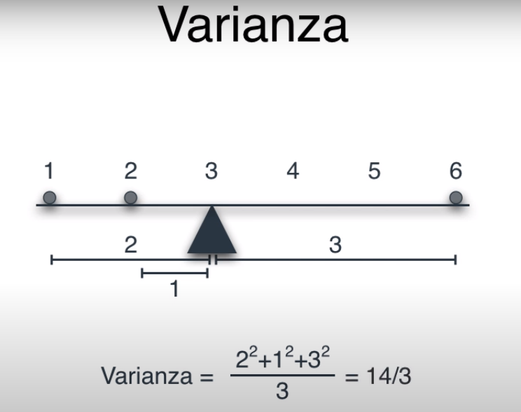

¿Qué pasa cuando los puntos se encuentran en un plano bidimensional?

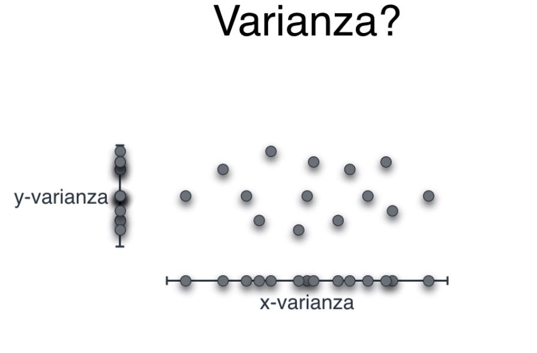

Para ello puedo obtener la varianza en cada uno de los ejes, y-varianza y la x-varianza.

Sin embargo, la varianza por sí mismo no es completamente determinante, pues puede haber conjuntos diferentes que tengan la misma varianza, 
veamos el siguiente ejemplo: 

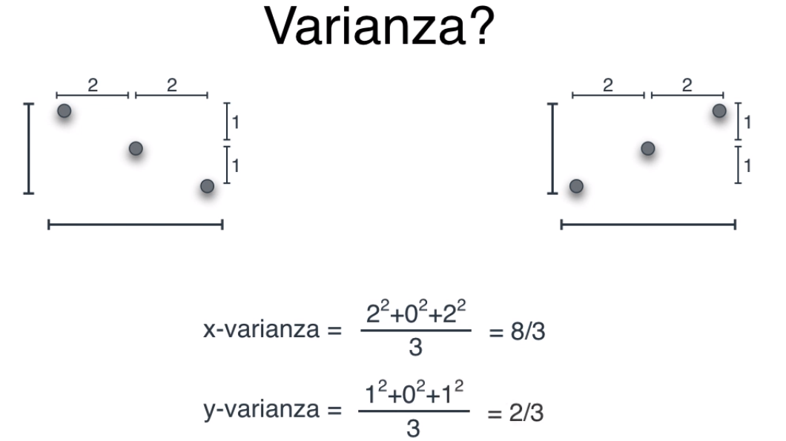

Tanto el conjunto de la izquierda como el de la derecha tienen inclinaciones diferentes, pero en terminos de x-varianza y y-varianza son lo
mismo. Para lidiar con esta situación usaremos la covarianza.

La covarianza es el promedio del producto de las coordenadas:

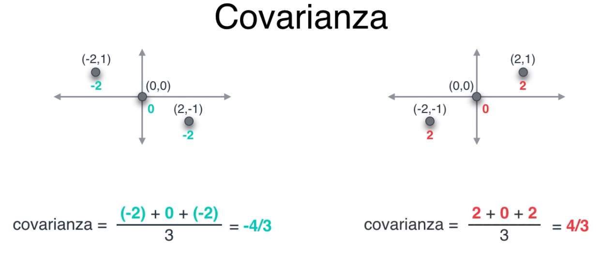

De esta forma podemos distinguir que la distribución de puntos del lado izquierdo tiene una covarianza negativa y del lado derecho es positiva.

Otros terminos que debo investigar:
- Eigenvectors
- Eigenvalues

Para más información y recordar PCA [Explicación PCA](https://www.youtube.com/watch?v=7My_PBhxeP4&t=0s)


## 3.3 Preparación de datos para PCA e IPCA

Empezamos importando los librerias que vamos a utilizar:

```python
import pandas as pd
from scipy.sparse.construct import random
import sklearn
import matplotlib.pyplot as plt

from sklearn.decomposition import PCA
from sklearn.decomposition import IncrementalPCA

from sklearn.linear_model import LogisticRegression

from sklearn.preprocessing import StandardScaler
from sklearn.model_selection import train_test_split
```

Lectura del dataset y separación entre los datos independientes (predictores) y dependientes (target)

```python
df_heart = pd.read_csv('./datasets/heart.csv')
print(df_heart.head(5))
# Guardamos nuestro dataset sin la columna de target
df_features = df_heart.drop(['target'], axis=1)
# Este será nuestro dataset, pero sin la columna
df_target = df_heart['target']
```
Valor esperado:

```
   age  sex  cp  trestbps  chol  fbs  ...  exang  oldpeak  slope  ca  thal  target
0   52    1   0       125   212    0  ...      0      1.0      2   2     3       0
1   53    1   0       140   203    1  ...      1      3.1      0   0     3       0
2   70    1   0       145   174    0  ...      1      2.6      0   0     3       0
3   61    1   0       148   203    0  ...      0      0.0      2   1     3       0
4   62    0   0       138   294    1  ...      0      1.9      1   3     2       0

```

Normalización de datos (paso indispensable para utilizar de forma correcta PCA) y creación de datos particiones
de entrenamiento y testing.

```python
# Normalizamos los datos
df_features = StandardScaler().fit_transform(df_features)

# Partimos el conjunto de entrenamiento.
# Para añadir replicabilidad usamos el random state
X_train, X_test, y_train, y_test = train_test_split(df_features,
                                                    df_target,
                                                    test_size=0.3,
                                                    random_state=42)

print(X_train.shape)
print(y_train.shape)
```
Valor esperado
```
[5 rows x 14 columns]
(717, 13)
(717,)
```

Nota sobre el funcionamiento de StandardScaler de Sklearn
```
# La estandarizacion que hace sklearn con StandardScaler es: 
z = (x - u) / s
x = valor
u = media
s = desviacion estandar
```
**Partimos el conjunto de entrenamiento.**

- `X` representa los features. Normalmente, es una matriz, por eso la mayúscula.
- `y` representa el target. Siempre es un vector, nunca una matriz, por eso la minúscula.

**Para añadir replicabilidad usamos el random state**

- `random_state` es para dejar estáticos los valores aleatorios que te genera, de forma que al volverlo a correr siga trabajando con esos valores aleatorios y no te genere nuevos valores aleatorios.

## 3.4 Implementación del Algoritmo PCA e IPCA

Empecemos por instanziar un modelo de clasificación que nos sirva para comparar el rendimiento de nuestros nuevos features utilizando PCA

```python
# Configuración de la regresión logística
logistic = LogisticRegression(solver='lbfgs')
```

Ahora entrenemos a nuestro algoritmo PCA con nuestros datos de entrada, algo importante a mencionar es que por defecto el número de componentes que utiliza
PCA es el mínimo entre la cantidad de muestras y la cantidad de features, pero en general nosotros buscamos tener un valor más pequeño que el número de features
de tener el mismo entonces no tendría mucho sentido usar PCA.

```python
# PCA
# Llamamos y configuramos nuestro algoritmo PCA
# El número de componentes es opcional
# Si no le pasamos el número de componentes lo asignará de esta forma:
# a: n_components = min(n_muestras, n_features)
pca = PCA(n_components=3)
# Entrenando algoritmo de PCA
pca.fit(X_train)
```

Ahora que nuestro algoritmo de PCA ha sido entrenado, debemos transformar nuestros datos de dependientes (X) de entrenamiento y validación utilizando PCA esto
para que el modelo de regresión logística NO utilice las 13 features originales, sino en este caso solamente 3. 

```python
# Configuramos los datos de entrenamiento con PCA
df_train = pca.transform(X_train)
df_test = pca.transform(X_test)
# Entrenamos la regresion logistica con datos del PCA
logistic.fit(df_train, y_train)
```

Finalmente, podemos observar cuál es el Accuracy de nuestro modelo.

```python
# Calculamos nuestra exactitud de nuestra predicción
print('Score/Accuracy PCA: ', logistic.score(df_test, y_test))
```

Valor esperado:
```
Score/Accuracy PCA:  0.7857142857142857
```

Ahora podemos repetir la metodología pero para IPCA y comparar los resultados:

```python
# IPCA
# Haremos una comparación con incremental PCA, haremos lo mismo para el IPCA.
# El parámetro batch se usa para crear pequeños bloques,
# de esta forma podemos ir entrenandolos poco a poco y combinarlos en el resultado final
ipca = IncrementalPCA(n_components=3, batch_size=10)
# Entrenando algoritmo de IPCA
ipca.fit(X_train)

# Configuramos los datos de entrenamiento con IPCA
df_train = ipca.transform(X_train)
df_test = ipca.transform(X_test)
# Entrenamos la regresion logistica con datos del IPCA
logistic.fit(df_train, y_train)
print('Score/Accuracy IPCA: ', logistic.score(df_test, y_test))
```
Valor esperado:
```
Score/Accuracy IPCA:  0.8051948051948052
```

### Bonus: Comparar el accuracy de PCA e IPCA utilizando diferentes valores en `n_components`

```python
# Bonus
max_features = X_train.shape[1]  # El máximo número de features en este caso sería de 13
pca_data = {'accuracy': [],
            'n_components': []}
ipca_data = {'accuracy': [],
             'n_components': []}
# PCA
print("I'm running PCA")
for n in range(1, max_features+1):
    pca = PCA(n_components=n)
    pca.fit(X_train)
    df_train = pca.transform(X_train)
    df_test = pca.transform(X_test)
    logistic.fit(df_train, y_train)
    acccuracy = logistic.score(df_test, y_test)
    print(f"PCA with n_componentes = {n} give us {acccuracy} Accuracy")
    pca_data['accuracy'].append(acccuracy)
    pca_data['n_components'].append(n)

# IPC
print("I'm running IPCA")
for n in range(1, max_features+1):
    ipca = IncrementalPCA(n_components=n, batch_size=max_features+1)
    ipca.fit(X_train)
    df_train = ipca.transform(X_train)
    df_test = ipca.transform(X_test)
    logistic.fit(df_train, y_train)
    acccuracy = logistic.score(df_test, y_test)
    print(f"IPCA with n_componentes = {n} give us {acccuracy} Accuracy")
    ipca_data['accuracy'].append(acccuracy)
    ipca_data['n_components'].append(n)

plt.plot(pca_data['n_components'], pca_data['accuracy'], label='PCA')
plt.plot(ipca_data['n_components'], ipca_data['accuracy'], label='IPCA')
plt.title('N Components vs Accuracy - PCA vs IPCA')
plt.xlabel('Number of Components')
plt.ylabel('Accuracy of Logistic-Regression')
plt.legend()

plt.savefig("resultados.png")
plt.show()
plt.close()
```

Respuesta esperada:

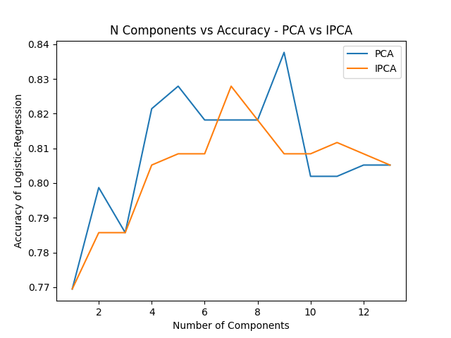

> ## Resumen

**En esta sección lo que hicimos fue:**

1. Configuración de la regresión logística
2. PCA
- Llamamos y configuramos nuestro algoritmo PCA. El número de componentes es opcional. Si no le pasamos el número de componentes lo asignará de esta forma: n_components = min(n_muestras, n_features)
- Entrenando algoritmo de PCA
- Configuramos los datos de entrenamiento con PCA
- Entrenamos la regresión logística con datos del PCA
- Calculamos nuestra exactitud de nuestra predicción
3. IPCA
- Haremos una comparación con incremental PCA, haremos lo mismo para el IPCA. El parámetro batch se usa para crear pequeños bloques, de esta forma podemos ir entrenandolos poco a poco y combinarlos en el resultado final
- Mismos pasos a partir del 2 que para PCA.

> ## Conclusión
>
> El rendimiento de los dos algoritmos es casi exactamente el mismo, pero hay que considerar que nuestro dataset tenia 13 fetures originalmente para intentar predecir una clasificación binaria y utilizando PCA, solo tuvimos que utilizar 3 features artificiales que fueron los que nos   devolvió PCA para llegar a un resultado coste computacional y estamos utilizando información que es realmente relevante para nuestro modelo. Finalmente, la gráfica revela que el mejor resultado de 
> clasificación se obtiene con PCA utilizando únicamente 7 componentes, demostrando que es completamente posible que un modelo con menos features pueda obtener resultados iguales o incluso mejores que un modelo con mayor cantidad de features.

[Código completo de está sección](1_optimización_de_features/pca.py)

> HOW TO RUN

Recordemos que debemos tener un entorno virtual creado y activado, para más información ir a:
[Iniciar un proyecto con sklearn](#2-iniciar-un-proyecto-con-sklearn)

```bash
source skl_env/bin/activate
cd 1_optmización_de_features
python pca.py
```

## 3.5 Kernels y KPCA

Un **Kernel** es una función matemática que toma mediciones que se comportan de manera no lineal y las proyecta en un espacio dimensional más grande en donde sen linealmente separables.

Pongamos de ejemplo el siguiente escenario hipotético:

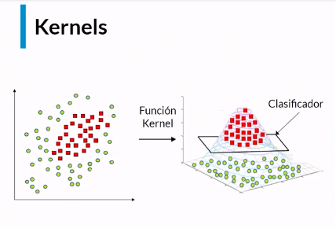

Si nuestro objetivo fuera clasificar los puntos verdes de los rojos, esto genera que está mezcla no pueda ser separada de forma lineal.
A través de una única línea, no existe manera de clasificarlos correcta y balanceadamente, pero utilizando una función de Kernel podemos
agregar una nueva dimensión, en este caso proyectar hacia arriba lo cual nos permite tener más opciones al momento de buscar formas lineales de
separarlos. 

Entre las funciones de Kernels más comunes podemos mencionar a los siguientes:

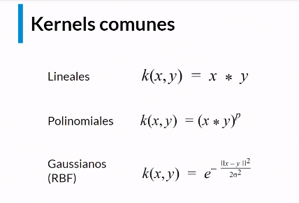

Ejemplo de la forma en que diferentes Kernels interactúan con la forma de clasificar de un mismo clasificador.

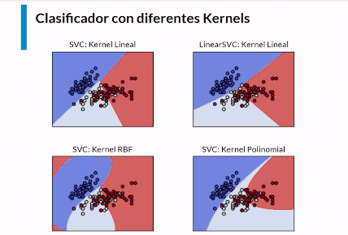


> ### Conclusión
> 
> Si tenemos datos bastante complejos que no pueden ser "segmentados" con líneas o combinaciones de líneas podemos utilizar la
> estrategia de kernel con el fin de aumentar el número de dimenciones y con ello mejorar a nuestro clasificador.

> ## Implementación en código

Empezamos a importar las librerías que vamos a usar (muy similares al módulo anterior)

```python
import pandas as pd
from sklearn.decomposition import KernelPCA
from sklearn.linear_model import LogisticRegression
from sklearn.preprocessing import StandardScaler
from sklearn.model_selection import train_test_split
```

Lectura del dataset y separación entre los datos independientes (predictores) y dependientes (target). Normalizado de datos y separación en training y testing:

```python
df_heart = pd.read_csv('../datasets/heart.csv')
    
    # Guardamos nuestro dataset sin la columna de target
    df_features = df_heart.drop(['target'], axis=1)
    # Este será nuestro dataset, pero sin la columna
    df_target = df_heart['target']
    
    # Normalizamos los datos
    df_features = StandardScaler().fit_transform(df_features)
    
    # Partimos el conjunto de entrenamiento.
    # Para añadir replicabilidad usamos el random state
    X_train, X_test, y_train, y_test = train_test_split(df_features,
                                                        df_target,
                                                        test_size=0.3,
                                                        random_state=42)
```

Instanciamos a nuestro clasificador:

```python
# Configuracion de la regresión logística
logistic = LogisticRegression(solver='lbfgs')
```

Y aquí viene la única y principal diferencia respecto al código anterior, la instancia a PCA aplicado con Kernel.

```python
# KPCA
# Alternativas a kernel, "linear, poly, rbf"
kpca = KernelPCA(n_components=4, kernel='poly')
kpca.fit(X_train)
```

Recordemos que PCA NO es un clasificador, únicamente es una forma de reducir la dimensionalidad de nuestros datasets, sin embargo pese a no
clasificar los datos, es necesario entrenarlo sobre nuestro conjunto de datos de entrenamiento. Una vez el modelo haya sido entrenado entonces
puede ser utilizado para transformar a los datos de entrada de entrenamiento y validación y estos modelos ya transformados son los que usaremos
en nuestro clasificador de cabecera. 

```python
# Configuramos los datos de entrenamiento con PCA
df_train = kpca.transform(X_train)
df_test = kpca.transform(X_test)
```
Ya con los datos transformados por KPCA entonces podemos proceder a entrenar y evaluar a nuestro modelo:

```python
# Entrenando algoritmo de KPCA
# Entrenamos la regresion logistica con datos del PCA
logistic.fit(df_train, y_train)
# Calculamos nuestra exactitud de nuestra predicción
print('Score/Accuracy KPCA: ', logistic.score(df_test, y_test))
```

Valor esperado:

```
Score/Accuracy KPCA:  0.7987012987012987
```

[Código Completo](1_optimización_de_features/kpca.py)

## 3.6 ¿Qué es la regularización y cómo aplicarla?
La regularización es una técnica que consiste en disminuir la complejidad de nuestro modelo a través de una penalización aplicada a sus variables más irrelevantes.

**¿Que busca la regularización?**

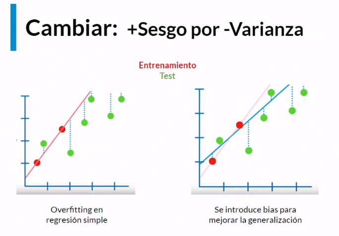

En términos generales la regularización busca reducir la varianza incrementando el sesgo de modelo. Pero, ¿por qué esto tiene sentido?

Supongamos que nuestros datos de entrenamiento son los puntos rojos y los datos de validación o prueba son los verdes. En general nuestros
datos de entrenamiento siempre serán menos cantidad y diversidad que los que tengamos en un ambiente de producción en escenarios reales. 
Es normal que tengamos un modelo que sea muy bueno prediciendo nuestros valores de entrenamiento "overfitting", pero al momento de predecir
los valores de prueba el rendimiento caiga. La distancia que hay entre nuestra predicción y el valor real es la varianza. Pero si nosotros
introducimos un poco de sesgo al modelo se reducirá el "overfitting" con ello la precisión en los datos de entrenamiento disminuirá, pero el modelo será
más versátil para lidiar con datos no vistos y será en términos generales un mejor modelo de clasificación para los datos de prueba.
De esta manera, aumentando el sesgo en el modelo pudimos reducir la varianza del mismo. 

Definamos el concepto de `perdida`. La perdida es una métrica que nos dice que tan lejos están nuestras predicciones del valor real que queremos predecir.
A menor sea la perdida mejor será nuestro modelo. 

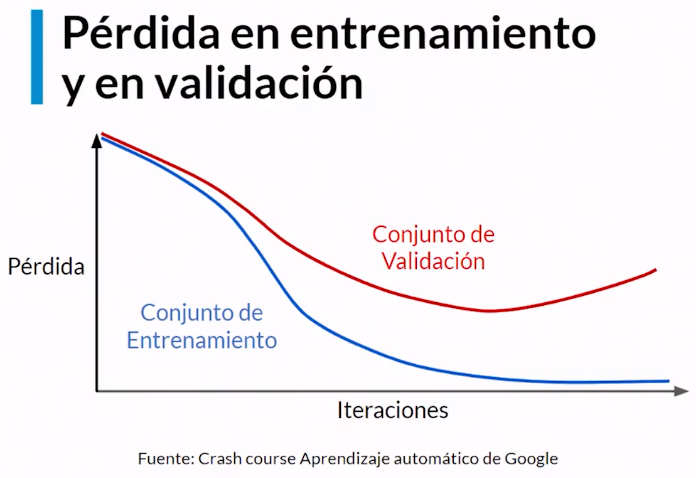

Naturalmente, conforme entrenamos a nuestro modelo sobre los datos ya conocidos "conjunto de entrenamiento" este se irá puliendo y de esta forma disminuyendo 
la perdida, esto se debe a que cada vez se está ajustando más a los valores del conjunto de entrenamiento. Sin embargo, en la vida real, lo que nos
interesa optimizar más que nada es disminuir la perdida en el conjunto de validación. 

Suele ocurrir que conforme un modelo optimiza mucho su perdida en el conjunto de validación tiende a empeorar su rendimiento en el conjunto de validación, a este
fenómeno se le conoce como overfitting, y en la gráfica se ve representado como el punto de inflección de la línea roja, en dónde en lugar de seguir disminuyendo
la perdida en el conjunto de validación esta empieza a aumentar, esto se debe a que el modelo está dejando de generalizar para empezar a memorizar.

> Conclusiones:
>
> - La regularización aumenta el sesgo y disminuye la varianza con el objetivo de mejorar la generalización del modelo.
> .
> - PCA: Combinábamos variables creando así variables artificiales.
> - Regularización: Se penaliza a las variables que aportan menos información.
> - Ambas buscan disminuir la complejidad del modelo.


### Tipos de regularización

[Ridge vs Lasso Regression | StatQuest with Josh Starmer | Youtube](https://www.youtube.com/watch?v=Xm2C_gTAl8c)

- **L1 Lasso**: Para reducir la complejidad a través de eliminación de features que no aportan demasiado al modelo.
  - Penaliza a los features que aporta poca información volviéndolos cero, eliminado el ruido que producen en el modelo.

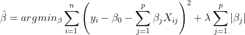


- **L2 Ridge**: Reducir la complejidad disminuyendo el impacto de ciertos features a nuestro modelo.
  - Penaliza los features poco relevantes, pero no los vuelve cero. Solamente limita la información que aportan a nuestro modelo.

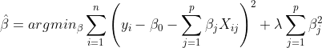


- **ElasticNet**: Es una combinación de las dos anteriores.

> Conclusión
> Lasso vs Ridge.
>
> 1. No hay un campeón definitivo para todos los problemas.
> 2. Si hay pocos features que se relacionen directamente con la variable a predecir: **Probar Lasso**.
> 3. Si hay varios features relacionados con la variable a predecir: **Probar Ridge**.

## 3.7 Implementacion de Lasso y Ridge

Cargamos nuestras librerías:

```python
import pandas as pd
from sklearn.linear_model import LinearRegression
from sklearn.linear_model import Lasso
from sklearn.linear_model import Ridge
from sklearn.model_selection import train_test_split
from sklearn.metrics import mean_squared_error as mse
```

Creamos una función que nos permita entrenar al modelo, y evaluar su rendimiento con una métrica parametrizada.

```python
def fit_predict_score(model, x_train, y_train, x_test, y_test, metric) -> float:
    model.fit(x_train, y_train)
    y_predict = model.predict(x_test)
    score = metric(y_test, y_predict)
    return score
```

Cargamos nuestro dataset:

```python
dataset = pd.read_csv("../datasets/happines.csv")
print(dataset.describe())
```
Valor esperado:

```
             rank       score        high  ...  generosity  corruption    dystopia
count  155.000000  155.000000  155.000000  ...  155.000000  155.000000  155.000000
mean    78.000000    5.354019    5.452326  ...    0.246883    0.123120    1.850238
std     44.888751    1.131230    1.118542  ...    0.134780    0.101661    0.500028
min      1.000000    2.693000    2.864884  ...    0.000000    0.000000    0.377914
25%     39.500000    4.505500    4.608172  ...    0.154106    0.057271    1.591291
50%     78.000000    5.279000    5.370032  ...    0.231538    0.089848    1.832910
75%    116.500000    6.101500    6.194600  ...    0.323762    0.153296    2.144654
max    155.000000    7.537000    7.622030  ...    0.838075    0.464308    3.117485

[8 rows x 11 columns]
```

Optamos por conservar únicamente un par de features y creamos nuestros conjuntos de entrenamiento y testing:

```python
# Vamos a elegir los features que vamos a usar
X = dataset[['gdp', 'family', 'lifexp', 'freedom',
             'corruption', 'generosity', 'dystopia']]
# Definimos nuestro objetivo, que sera nuestro data set, pero solo en la columna score
y = dataset[['score']]
print(X.shape)
print(y.shape)
X_train, X_test, y_train, y_test = train_test_split(X, y, test_size=0.25)
```
Valor esperado:
```
(155, 7)
(155, 1)
```

Creamos los modelos que vamos a comparar y los asociamos a un diccionario cuya llave es el nombre del modelo y valor es la instancia del modelo.

```python
models = {"Linear Regression": LinearRegression(),
              "Lasso": Lasso(alpha=0.2),
              "Ridge": Ridge(alpha=1)}
```

Finalmente, para cada modelo, llamamos a nuestra función `fir_predict_score`

```python
for name, model in models.items():
    score = fit_predict_score(model, X_train, y_train, X_test, y_test, mse)
    print(f"{name} loss: {score}")
```

Valor esperado:
```
Linear Regression loss: 8.192650789890735e-08
Lasso loss: 0.46042180411993383
Ridge loss: 0.004280210462122615
```

Como todos nuestros modelos son regresiones lineales, podemos observar los coeficientes que utilizaron en sus regresiones lineales.

```python
for name, model in models.items():
    print(f"Coef {name}: {model.coef_}")
```

Valor esperado:

```
Coef Linear: [[1.00013152 0.99985162 1.00000144 0.99997064 0.99967745 1.00026482 0.99997207]]
Coef Lasso:  [1.05022766  0.         0.         0.         0.         0.         0.21717833]
Coef Ridge:  [[1.06913383 0.96173165 0.88570284 0.89053239 0.64055658 0.766641   0.96879649]]
```
## 3.8 Explicación de resultados


Los coeficientes obtenidos en las regresiones lineales son un arreglo que tiene el mismo tamaño que las columnas que utilizamos, nuestros features.

```python
X = dataset[['gdp', 'family', 'lifexp', 'freedom', 'corruption', 'generosity', 'dystopia']]
```

Los numeros mas grandes dentro del arreglo, significa que la columna en si esta teniendo mas peso en el modelo que estamos entrenando.

**Lasso**
- Los valores que Lasso haya hecho 0, nos indica que el algoritmo no te dio la atencion necesaria o no los considero importante. Analizar porque hizo eso nuestro algoritmo Lasso ya esta tarea nuestra como Data Scientist.

**Ridge**
- En Ridge ninguno de los coeficientes han sido 0, sino que fueron disminuidos, esto se hace precisamente la regresión Ridge

Menor perdida es mejor, esto quiere decir que hubo menos equivocacion entre los valores esperados y los valores predichos.

Esto quiere decir que en este preciso ejemplo quien obtuvo mejores resultados fue `Linear Regression Loss`

[Código completo](1_optimización_de_features/regularization.py)

## 3.9 ElasticNet: Una técnica Intermedia

Hasta el momento hemos podido ver dos técnicas de regularización en las cuales añadimos un componente de penalización en el proceso donde encontramos los valores de los parámetros 𝛽 minimizando la función de error.

Por ejemplo, si usamos el método de Mínimos Cuadrados Ordinarios, tenemos por definición nuestra función definida como:

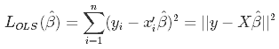

Ahora bien. Si aplicamos la regularización L1 también conocida como Lasso (Least Absolute Shrinkage and Selection Operator), tenemos una ecuación de la forma:

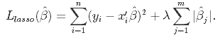

donde tenemos un parámetro de ajuste llamado ƛ que si tiene valores altos para el problema mandará el valor de 𝛽j a 0.

Por otro lado. Si aplicamos la regularización L2 también conocida como Ridge, tendremos la siguiente ecuación:

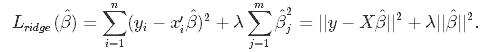

Tendremos una penalización también pero que no tiene la posibilidad de llevar los valores de los coeficientes a cero. Sin embargo esto nos permitirá realizar el intercambio de +sesgo por -varianza.

Recordando que :

1. Ninguna de las dos es mejor que la otra para todos los casos.

2. Lasso envía algunos coeficientes a cero permitiendo así seleccionar variables significativas para el modelo.

3. Lasso funciona mejor si tenemos pocos predictores que influyen sobre el modelo.

4. Ridge funciona mejor si es el caso contrario y tenemos una gran cantidad.

Para aplicarlos y decidir cuál es el mejor en la práctica, podemos probar usando alguna técnica como cross-validation iterativamente. o bien, podemos combinarlos…

**Regularización ElasticNet**

Es común encontrarnos en la literatura con un camino intermedio llamado ElasticNet. Esta técnica consiste en combinar las dos penalizaciones anteriores en una sola función. Así, nuestra ecuación de optimización quedará:

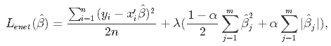

Donde tenemos ahora un parámetro adicional 𝛂 que tiene un rango de valores entre 0 y 1. Si 𝛂 = 0 , ElasticNet se comportará como Ridge, y si 𝛂 = 1 , se comportará como Lasso. Por lo tanto, nos brinda todo el espectro lineal de posibles combinaciones entre estos dos extremos.

1. Tenemos una forma de probar ambas L1 y L2 al tiempo sin perder información.

2. Supera las limitaciones individuales de ellas.

3. Si hace falta experiencia, o el conocimiento matemático de fondo, puede ser la opción preferente para probar la regularización.


**ElasticNet con Scikit-learn**


Para implementar esta técnica añadimos primero el algoritmo ubicado en el módulo linear_model.

```python
from sklearn.linear_model import ElasticNet
```

Y luego simplemente lo inicializamos con el constructor ElasticNet() y entrenamos con la función fit().

```python
regr = ElasticNet(random_state=0)

regr.fit(X, y)
```

# 4. Regresiones robustas

## 4.1 El problema de los valores atípicos.

- Un valor atípico es cualquier medición que se encuentre por fuera del comportamiento general de una muestra de datos.
- Pueden indicar variabilidad, errores de medición o novedades.

Es fundamental identificar los valores atípicos antes de iniciar con nuestro proceso de machine learning.


### ¿Por qué son problemáticos?

- Pueden generar sesgos importantes en los modelos de ML.
- A veces contienen información relevante sobre la naturaleza de los datos. (esto no es malo, solo indica que es posible
que no conozcamos del todo la naturaleza de nuestro problema)
- Detección temprana de fallos.

### ¿Cómo identificarlos?

#### Analíticamente, con métodos estadísticos

- **Z - Score**: Mide la distancia (en desviaciones estándar) de un punto dado a la media.
- Técnicas de clustering como **DBSCAN**. [Clusting with Scikit Learn - More Info](https://dashee87.github.io/data%20science/general/Clustering-with-Scikit-with-GIFs/)
  - Consiste en considerar a zonas muy densas como clusters, mientras que los puntos que carecen de **‘vecinos’** no pertenecen a ningún conjunto y por lo tanto se clasifican como ruido (o **outliers**).
  - Una ventaja de está técnica es que no se requiere que se especifique el número de clusters (como en K-means, por ejemplo), en cambio se debe especificar un número mínimo de datos que constituye un cluster y un parámetro epsilon que está relacionado con el espacio entre vecinos.

  

- Si `q< Q1-1.5IQR` ó `q > Q3+1.5IQR`. [Articulo en medium con explicación ampliada](https://towardsdatascience.com/why-1-5-in-iqr-method-of-outlier-detection-5d07fdc82097)

#### Graficamente

- Con Boxplot.
  - El grafico de caja de una buena forma para detectar los valores atípicos en un set de datos, a su vez también es aconsejable (dependiendo del caso) eliminarlos para que nuestro análisis sea lo más confiable posible.

    


## 4.2 Regresiones Robustas en Scikit-learn

¿Como podemos lidiar con valores atípicos?

- Se pueden tratar desde la etapa de pre procesamiento intentando eliminarlo y transformarlo de alguna manera.
- Hay veces que la unica menera de lidiar con ellos es cuando estamos aplicando nuestro modelo de Machine Learning.
  - Scikit Learn nos ofrece un meta estimador que nos permite configurar diferentes estimadores para lidiar con los valores atipicos, de una manera facil de implementar. A estas técnicas se las conoce como **Regresiones Robustas**

### Tipos | Más utilizadas

- **RANSAC**:
  - Selecciona una muestra aleatoria de los datos asumiendo que esa muestra se encuentra dentro de los valores inliners, con estos datos se entrena el modelo y se compara su comportamiento con respecto a los otros datos.
  - El procedimiento anterior se repite tantas veces como se indique y al finalizar el algoritmo escoge la combinación de datos que tenga la mejor cantidad de inliners, donde los valores atípicos puedan ser discriminados de forma efectiva.
  - [More info about RANSAC algorithm in Wikipedia](https://es.wikipedia.org/wiki/RANSAC)
  - [sklearn.linear_model.RANSACRegressor](https://scikit-learn.org/stable/modules/generated/sklearn.linear_model.RANSACRegressor.html?highlight=ransac#sklearn.linear_model.RANSACRegressor)
  - [Robust linear model estimation using RANSAC](https://scikit-learn.org/stable/auto_examples/linear_model/plot_ransac.html)


- **Huber Reggresor**:
  - No elimina los valores atípicos sino que los penaliza.
  - Realiza el entrenamiento y si el error absoluto de la perdida alcanza cierto umbral (epsilon) los datos son tratados como atípicos.
  - El valor por defecto de epsilon es 1.35 ya que se ha demostrado que logra un 95% de eficiencia estadística.
  - [Hube Regressor in Scikit Learn](https://scikit-learn.org/stable/modules/generated/sklearn.linear_model.HuberRegressor.html).
  - [HuberRegressor vs Ridge on dataset with strong outliers](https://scikit-learn.org/stable/auto_examples/linear_model/plot_huber_vs_ridge.html#sphx-glr-auto-examples-linear-model-plot-huber-vs-ridge-py)


## 4.3 Preparación de datos para la regresión robusta

Tomando como referencia nuestro dataset de felicidad:

```
country,  rank, score,  high, low,  gdp,  family, lifexp, freedom,  generosity, corruption, dystopia
Norway,      1,  7.53,  7.59,7.47, 1.61,    1.53,   0.79,    0.63,        0.36,       0.31,     2.27
```
Lo alteramos agregando información sucia como outliers artificiales:

```
country,  rank, score,  high, low,  gdp,  family, lifexp, freedom,  generosity, corruption, dystopia
Norway,      1,  7.53,  7.59,7.47, 1.61,    1.53,   0.79,    0.63,        0.36,       0.31,     2.27
A,         156,     0,     0,   0,    0,       0,      0,       0,           0,          0,        0
B,         156,     0,     0,   0,    0,       0,      0,       0,           0,          0,        0
```

## 4.4 Implementación regresión robusta

Lo que haremos es corromper los datos del dataset de felicidad agregando valores atipicos (outliers) y poder experimentar y aplicar nuestras regresiones robustas.

Primero, importamos nuestras librerias.

```python
import pandas as pd
from sklearn.linear_model import RANSACRegressor, HuberRegressor
from sklearn.svm import SVR
from sklearn.model_selection import train_test_split
from sklearn.metrics import mean_squared_error
import matplotlib.pyplot as plt
import warnings
warnings.simplefilter("ignore")
import seaborn as sns
sns.set()
```

Función de lectura y partición de datos:

```python
def read_split_data(data, x_columns, y_column, test_size, rs):
    dataset = pd.read_csv(data)
    X = dataset[x_columns]
    y = dataset[[y_column]]
    return train_test_split(X, y, test_size=test_size, random_state=rs)
```

Llamamos a nuestra función `read_split_data`

```python
input_cols = ["gdp", "family", "lifexp", "freedom", "generosity", "corruption", "dystopia"]
target = "score"
X_train, X_test, y_train, y_test = read_split_data(data="../datasets/happines_corrupt.csv",
                                                       x_columns=input_cols, y_column=target, test_size=0.3, rs=42)
```

Instancia de nuestros modelos:

```python
estimadores = {
        'SVR': SVR(gamma='auto', C=1.0, epsilon=0.1),
        'RANSAC': RANSACRegressor(),  # Meta estimador
        'HUBER': HuberRegressor(epsilon=1.35,)
    }
```

1. **SVM (Suppot Vector Machine):** Con el parámetro C podemos controlar la penalización por error en la clasificación. Si C tiene valores amplios entonces, se penaliza de forma más estricta los errores, mientras que si escogemos un C pequeño seremos menos estrictos con los errores. En otras palabras, si C es pequeño aumenta el sesgo y disminuye la varianza del modelo.
2. **RANSAC:** Al ser un meta estimador, podemos pasarle como parámetros diferentes estimadores, para nuestro caso vamos a trabajar de una forma genenérica.
3. **HUBER:** El valor de epsilon es 1.35. Utilizamos este valor ya que se ha demostrado que logra un 95% de eficiencia estadística.

Entrenamos cada modelo y predecimos resultados:

```python
for name, estimador in estimadores.items():
    # Entrenamos
    estimador.fit(X_train, y_train)
    # Predecimos
    predictions = estimador.predict(X_test)
    # Medimos
    mse = mean_squared_error(y_test, predictions)
    print(f'{name} MSE: ', round(mse, 10))
    print('=' * 64)
```
Valor esperado:

```
SVR MSE:  0.0067738484
================================================================
RANSAC MSE:  9.41e-08
================================================================
HUBER MSE:  1.036e-07
================================================================
```

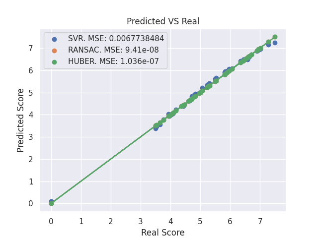


[código completo](2_regresiones_robustas/robust.py)

# 5. Métodos de ensamble aplicados a clasificación

# 6. Clustering

# 7. Optimización paramétrica

# 8. Salida a producción

# Conclusiones

https://github.com/francomanca93/machine-learning-profesional-con-scikit-learn/blob/main/proyecto.md

