# Curso Profesional de Machine Learning con Scikit-Learn


Scikit-Learn es una biblioteca de Python que ofrece un conjunto de algoritmos eficientes que pueden ser utilizados para realizar Machine Learning en un ambiente productivo. Con el Curso Profesional de Machine Learning con SciKit-Learn de Platzi aprenderemos a implementar los principales algoritmos disponibles en esta biblioteca.

## Objetivos del curso

- Iniciar un proyecto con Scikit-Learn
- Aplicar técnicas de regularización a regresiones
- Manejar datos atípicos
- Reducir la dimensionalidad

---------------

## Tabla de contenidos:

- [1. Aprender los conceptos clave](#1-aprender-los-conceptos-clave)
- [2. Iniciar un proyecto con sklearn](#2-iniciar-un-proyecto-con-sklearn)
- [3. Optimización de features](#3-optimización-de-features)
- [4. Regresiones robustas](#4-regresiones-robustas)
- [5. Métodos de ensamble aplicados a clasificación](#5-métodos-de-ensamble-aplicados-a-clasificación)
- [6. Clustering](#6-clustering)
- [7. Optimización paramétrica](#7-optimización-paramétrica)
- [8. Salida a producción](#8-salida-a-producción)
- [9. Cierre del curso](#9-cierre-del-curso)
- [10. Material Adicional](#10-material-adicional-para-consultar)

# 1. Aprender los conceptos clave

## 1.1 Introducción:

Scikit-learn es una herramienta desarrollada en 2007 por David Cournapeau como un proyecto del Google Summer of Code
nace en un entorno academico universitario, pero crece a convertirse en proyectos profesionales utilizados en la industria.

### ¿Por qué usar Scikit-learn?

- Curva de aprendizaje suave.
- Es una biblioteca muy versátil.
- Comunidad de soporte.
- Uso en producción.
- Integración con librerías externas.

### Conociendo Scikit Learn


- [Clasificación.](https://scikit-learn.org/stable/supervised_learning.html#supervised-learning)
    - Identificar a cuál categoría pertenece un objeto.
- [Regresión.](https://scikit-learn.org/stable/supervised_learning.html#supervised-learning)
  - Predecir el valor continuo asociado a un objeto. 
- [Clustering.](https://scikit-learn.org/stable/modules/clustering.html#clustering)
  - Agrupación automática de objetos con características similares dentro de conjuntos.
- [Preprocesamiento.](https://scikit-learn.org/stable/modules/preprocessing.html#preprocessing)
  - Extracción de características y normalizado de variables. 
- [Reducción de dimensionalidad.](https://scikit-learn.org/stable/modules/decomposition.html#decompositions)
  - Reducción del número de variables aleatorias a ser considerado. 
- [Selección del modelo.](https://scikit-learn.org/stable/model_selection.html#model-selection)
  - Comparación, validación y elección de parámetros y modelos.


### Preguntas que nos haremos y resolveremos en el curso:

- ¿Cómo nos ayuda Scikit Learn en el preprocesamiento de datos?
- ¿Qué modelos podemos utilizar para resolver problemas específicos?
- ¿Cuál es el procedimiento a seguir para poder optmizar los modelos?

## 1.2 ¿Cómo aprenden las máquinas?

Los datos lo son todo, entré mejor conocidos y analizados los tengamos será más fácil llegar a tener modelos más robustos.

Dependiendo de la naturaleza y estructura que tengas los datos será necesaria utilizar un enfoque diferente de machine learning. 
Los principales enfoques de machine learning que existen son: 

- Aprendizaje supervisado (Algoritmos **por observación**):
    - Si de los datos se puede extraer con anticipación información precisa del resultado que esperamos.
- Aprendizaje por refuerzo (Algoritmos **por prueba y error**):
  - Si de los datos no se puede sacar exactamente la información que queremos predecir, pero si podemos dejar que el modelo tome decisiones y evalue si estas decisiones son buenas o malas.
- Aprendizaje no supervisado (Algoritmos **por descubrimiento**):
  - Cuando no se tiene ninguna información adicional sobre lo que esperamos, sino que los datos por sí solos nos van a revelar información relevante sobre su propia naturaleza y estructura.

### Alternativas al Machine Learning dentro de la Inteligencia Artificial
**Algoritmos evolutivos**

Son una serie de algoritmos heuristicos, en donde, en tu espacio de soluciones se explora las mejores candidatos, según se optimice cierta función de costo. Por ejemplo, se usa en la industría automotriz o de diseño aeroespacial para encontrar el mejor diseño que minimice, por ejemplo, la resistencia al aire.

**Lógica Difusa**

Es una generalización de la lógica clásica, pero en lugar de tener solo dos condiciones (verdadero, falso) [principio de tercero excluido], se tienen condiciones de verdad continuas. Por ejemplo, si 1 representa verdadero, y 0 representa falso, en la lógica difusa, el grado de verdad ahora puede tomar valores en el intervalo continuo de [0, 1]. Este enfoque tenía mucho auge en sistemas de control y robotica, antes del auge de las redes neuronales.

**Agentes y Sistemas expertos**

Para sistemas cuyas propiedades se puede describir por la interacción de agentes, se utiliza este enfoque para encontrar o describir comportamientos en el colectivo. (Por ejemplo, los mercados financieros compuestos por agentes economicos, vendedores y compradores, etc). La física estadística y los sistemas complejos también se ayudan de este enfoque.

## 1.3 Problemas que podemos resolver con Scikit-learn

Algunas limitaciones de Scikit-learn

1. No es una herramienta de Computer Vision.
   - Se necesita complementar con una herramienta adicional tales como [OpenCV](https://opencv.org/) o [TorchVision](https://pytorch.org/docs/stable/torchvision/index.html) que forma parte del proyecto de Pytorch.
2. No se puede correr en GPUs.
3. No es una herramienta de estadística avanzada.
4. No es muy flexible en temas de Deep Learning.

### Qué problemas podemos abordar con Scikit-learn?

- **Clasificaciones**: Necesitamos etiquetar nuestros datos para que encajen en alguna de ciertas categorías previamente definidas.
  - Ejemplos:
    - ¿Es cáncer o no es cáncer?
    - ¿La imagen pertenece a un Ave, Perro o Gato?
    - ¿A qué segmento de clientes pertenece determinado usuario?

- **Regresión**: Cuando necesitamos modelar el comportamiento de una variable continua, dadas otras variables correlaciones
  - Ejemplos:
    - Predecir el precio del dólar para el mes siguiente.
    - El total de calorías de una comida dados sus ingredientes.
    - La ubicación más probable de determinado objeto dentro de una imagen.

- **Clustering**: Queremos descubrir subconjuntos de datos similares dentro del dataset. Queremos encontrar valores que se salen del comportamiento global.
  - Ejemplo:
    - Identificar productos similares para un sistema de recomendación.
    - Descubrir el sitio ideal para ubicar paradas de buses según la densidad poblacional.
    - Segmentar imágenes según patrones de colores y geometrías.

## 1.4 Las matemáticas que vamos a necesitar

La cortina de fondo: Varias técnicas que usamos para que los computadores aprendan están inspiradas en el mundo natural.

- Redes neuronales artificiales: Están inspiradas en el cerebro humano.
- Aprendizaje por refuerzo: Está inspirado en las teorías de la psicología conductual.
- Algoritmos evolutivos: Los teorías de Charles Darwin.

Temas matemáticos generales a repasar:

- Funciones y trigonométrica.
- Algebra lineal.
- Optimización de funciones.
- Calculo diferencial.

Temas de probabilidad y estadistica a repasar:

- Probabilidad básica.
- Combinaciones y permutaciones.
- Variables aleatorias y distribuciones.
- Teorema de Bayes.
- Pruebas estadísticas.

> - La conclusión es que si no tienes buenas bases de matemáticas, es muy difícil tener un “entendimiento real” de machine learning e inteligencia artificial. Serán como “cajas negras”.
>
> - La estrategia del curso será de desarrollo de software y ciencia de la computación.
> - Scikit Learn nos ayudará a cubrir algunos vacios conceptuales de una manera que beneficie a nuestro modelo.

# 2. Iniciar un proyecto con sklearn

## 2.1 Configuración de nuestro entorno Python

En este curso estaremos haciendo uso de varias librerías complementarías de python. 
Es por eso que es buena idea no tener necesariamente la versión más actualizada de python desde la página oficial.
Esto se debe a que existe una versión por ejemplo Python 3.12 actualmente, las librerias que usaremos toman un tiempo
en adaptar su código a la verisón más reciente de python, y por temas de compatilibdad sería una mejor idea tener una
versión instalada menos reciente que ya haya sido completamente probada por nuestras otras dependencias, en este caso por
ejemplo python 3.10.

Para verificar la versión de python que tenemos instalada:

```bash
python --version
```

Primero actualicemos nuestra gestor de instalador de paquetes de python:

```bash
python3 -m pip install --upgrade pip
```

Para este proyecto estaremos utilizando entornos virtuales de python, para encapsular nuestros paquetes.
Para más información sobre entornos virtuales, consulta el siguiente repositorio de ayuda:

[Entornos virutales en python](https://github.com/ichcanziho/cursos_platzi/tree/master/pip_entornos_curso)

Primer paso: Instalación de virtualenv en python:

```bash
python3 -m pip install virtualenv
```

Creando el entorno virtual:

```bash
python3 -m virtualenv skl_env
```

Activando el entorno virtual:

```bash
source skl_env/bin/activate
```

Comprobando que es un entorno virgen:

```bash
pip freeze
```

Como no hemos instalado ninguna dependencia externa entonces el comando anterior
no debería haber regresado nada. 

## 2.1 Instalación de librerías en python:

Instalación de librerías:
```bash
pip install numpy
pip install scipy
pip install joblib
pip install pandas
pip install matplotlib
pip install seaborn
pip install scikit-learn
```

Creación del archivo de requirements.txt

```bash
pip freeze > requirements.txt
```

Verificando que sklearn está activo sin problemas.

```python
import sklearn
print(sklearn.__version__)
```

## 2.3 Datasets que usaremos en el curso

> [Datasets e informacion sobre ellos en el repo](datasets)

- [World Happiness Report](https://www.kaggle.com/unsdsn/world-happiness): Es un dataset que desde el 2012 recolecta variables sobre diferentes países y las relaciona con el nivel de felicidad de sus habitantes.

> **Nota: Este data set lo vamos a utilizar para temas de regresiones**

- [The Ultimate Halloween Candy Power Ranking](https://www.kaggle.com/fivethirtyeight/the-ultimate-halloween-candy-power-ranking): Es un estudio online de 269 mil votos de más de 8371 IPs deferentes. Para 85 tipos de dulces diferentes se evaluaron tanto características del dulce como la opinión y satisfacción para generar comparaciones. 

> **Nota: Este dataset lo vamos a utilizar para temas de clustering**

- [Heart disease prediction](https://www.kaggle.com/c/SAheart): Es un subconjunto de variables de un estudio que realizado en 1988 en diferentes regiones del planeta para predecir el riesgo a sufrir una enfermedad relacionada con el corazón. 

> **Nota: Este data set lo vamos a utilizar para temas de clasificación.**


# 3. Optimización de features

## 3.1 ¿Cómo afectan nuestros features a los modelos de Machine Learning?

El éxito o fracaso de nuestros proyectos de machine learning, dependerá en gran medida de la calidad de los datos de entrada
con los que serán entrenados los mismos.

**¿Qué son los features?** Son los atributos de nuestro modelo que usamos para realizar una interferencia o predicción. Son las variables de entrada.

Más features simpre es mejor, ¿verdad?
**La respuesta corta es: NO**

En realidad si tenemos variables que son irrelevantes pasarán estas cosas:

- Se le abrirá el paso al ruido.
- Aumentará el costo computacional.
- Si introducimos demasiados features y estos tienen valores faltantes, se harán sesgos muy significativos y vamos a perder esa capacidad de predicción.

> Nota: Hacer una buena selección de nuestro features, hará que nuestros algoritmos corran de una manera mas eficiente.

Una de las formas de saber que nuestros features han sido bien seleccionados es con el **sesgo (bias)** y la **varianza**.

- Una mala selección de nuestro features nos puede llevar a alguno de esos dos escenarios indeseados.


> Nota: El sesgo (bias) es la diferencia que hay entre nuestras predicciones y los valores reales.
> Por otro lado, la varianza es la distancia entre diferentes predicciones que pertenecen a la misma clase.

Algo que debemos que recordar es que nuestro modelo de ML puede caer en uno de 2 escenarios que debemos evitar:


- **Underfitting**: Significa que nuestro modelo es demasiado simple, en donde nuestro modelo no está captando los features y nuestra variable de salida, por lo cual debemos de investigar variables con mas significado o combinaciones o transformaciones para poder llegar a nuestra variable de salida.

- **Overfitting**: Significa que nuestro modelo es demasiado complejo y nuestro algoritmo va a intentar ajustarse a los datos que tenemos, pero no se va a comportar bien con los datos del mundo real. Si tenemos overfiting lo mejor es intentar seleccionar los features de una manera mas critica descartando aquellos que no aporten información o combinando algunos quedándonos con la información que verdaderamente importa.

> - Cuando tenemos un sesgo (bias) alto lo que se hace es añadir mas features, aumentar el numero de datos no ayudara mucho.
> - Cuando tenemos un varianza (variance) alto lo que se hace es aumentar el numero de datos para que nuestro modelo generalice mejor.

**¿Qué podemos hacer para solucionar estos problemas?**

- Aplicar técnicas reducción de la dimensionalidad. Utilizaremos el algoritmo de PCA.
- Aplicar la técnica de la regulación, que consiste en penalizar aquellos features que no le estén aportando o que le estén restando información a nuestro modelo.
- Balanceo: Se utilizará Oversampling y Undersampling en problemas de rendimiento donde tengamos un conjunto de datos que está desbalanceado, por ejemplo en un problema de clasificación donde tenemos muchos ejemplos de una categoría y muy pocos de otra.

## 3.2 Introducción al Algoritmo PCA (Principal Component Analysis)

**¿Por qué usaríamos este algoritmo?**

- Porque en machine learning es normal encontrarnos con problemas donde tengamos una enorme cantidad de features en donde hay relaciones complejas entre ellos y con la variable que queremos predecir.

**¿Cuando utilizar un algoritmo PCA?**
- Nuestro dataset tiene un número alto de features y no todos sean significativos.
- Hay una alta correlación entre los features.
- Cuando hay overfiting.
- Cuando implica un alto coste computacional.

**¿En quŕ consiste el algoritmo PCA?**

Básicamente en reducir la complejidad del problema:

1. Seleccionando solamente las variables relevantes.
2. Combinándolas en nuevas variables que mantengan la información más importante (varianza de los features).


**¿Cuáles son pasos para llevar a cabo el algoritmo PCA?**

1. Calculamos la matriz de covarianza para expresar las relaciones entre nuestro features.
2. Hallamos los vectores propios y valores propios de esta matriz, para medir la fuerza y variabilidad de estas relaciones.
3. Ordenamos y escogemos los vectores propios con mayor variabilidad, esto es, aportan más información.

**¿Qué hacer si tenemos una PC de bajos recursos?**

- Si tenemos un dataset demasiado exigente, podemos usar una variación como IPCA.
- Si nuestros datos no tienen una estructura separable linealmente, y encontramos un KERNEL que pueda mapearlos podemos usar KPCA.

### Conceptos a tener en cuenta:

**varianza:** Es el promedio de la suma de los cuadrados de la distancia entre un elemento y su promedio.


¿Qué pasa cuando los puntos se encuentran en un plano bidimensional?


Para ello puedo obtener la varianza en cada uno de los ejes, y-varianza y la x-varianza.

Sin embargo, la varianza por sí mismo no es completamente determinante, pues puede haber conjuntos diferentes que tengan la misma varianza, 
veamos el siguiente ejemplo: 


Tanto el conjunto de la izquierda como el de la derecha tienen inclinaciones diferentes, pero en terminos de x-varianza y y-varianza son lo
mismo. Para lidiar con esta situación usaremos la covarianza.

La covarianza es el promedio del producto de las coordenadas:


De esta forma podemos distinguir que la distribución de puntos del lado izquierdo tiene una covarianza negativa y del lado derecho es positiva.

Otros terminos que debo investigar:
- Eigenvectors
- Eigenvalues

Para más información y recordar PCA [Explicación PCA](https://www.youtube.com/watch?v=7My_PBhxeP4&t=0s)


## 3.3 Preparación de datos para PCA e IPCA

Empezamos importando los librerias que vamos a utilizar:

```python
import pandas as pd
from scipy.sparse.construct import random
import sklearn
import matplotlib.pyplot as plt

from sklearn.decomposition import PCA
from sklearn.decomposition import IncrementalPCA

from sklearn.linear_model import LogisticRegression

from sklearn.preprocessing import StandardScaler
from sklearn.model_selection import train_test_split
```

Lectura del dataset y separación entre los datos independientes (predictores) y dependientes (target)

```python
df_heart = pd.read_csv('./datasets/heart.csv')
print(df_heart.head(5))
# Guardamos nuestro dataset sin la columna de target
df_features = df_heart.drop(['target'], axis=1)
# Este será nuestro dataset, pero sin la columna
df_target = df_heart['target']
```
Valor esperado:

```
   age  sex  cp  trestbps  chol  fbs  ...  exang  oldpeak  slope  ca  thal  target
0   52    1   0       125   212    0  ...      0      1.0      2   2     3       0
1   53    1   0       140   203    1  ...      1      3.1      0   0     3       0
2   70    1   0       145   174    0  ...      1      2.6      0   0     3       0
3   61    1   0       148   203    0  ...      0      0.0      2   1     3       0
4   62    0   0       138   294    1  ...      0      1.9      1   3     2       0

```

Normalización de datos (paso indispensable para utilizar de forma correcta PCA) y creación de datos particiones
de entrenamiento y testing.

```python
# Normalizamos los datos
df_features = StandardScaler().fit_transform(df_features)

# Partimos el conjunto de entrenamiento.
# Para añadir replicabilidad usamos el random state
X_train, X_test, y_train, y_test = train_test_split(df_features,
                                                    df_target,
                                                    test_size=0.3,
                                                    random_state=42)

print(X_train.shape)
print(y_train.shape)
```
Valor esperado
```
[5 rows x 14 columns]
(717, 13)
(717,)
```

Nota sobre el funcionamiento de StandardScaler de Sklearn
```
# La estandarizacion que hace sklearn con StandardScaler es: 
z = (x - u) / s
x = valor
u = media
s = desviacion estandar
```
**Partimos el conjunto de entrenamiento.**

- `X` representa los features. Normalmente, es una matriz, por eso la mayúscula.
- `y` representa el target. Siempre es un vector, nunca una matriz, por eso la minúscula.

**Para añadir replicabilidad usamos el random state**

- `random_state` es para dejar estáticos los valores aleatorios que te genera, de forma que al volverlo a correr siga trabajando con esos valores aleatorios y no te genere nuevos valores aleatorios.

## 3.4 Implementación del Algoritmo PCA e IPCA

Empecemos por instanziar un modelo de clasificación que nos sirva para comparar el rendimiento de nuestros nuevos features utilizando PCA

```python
# Configuración de la regresión logística
logistic = LogisticRegression(solver='lbfgs')
```

Ahora entrenemos a nuestro algoritmo PCA con nuestros datos de entrada, algo importante a mencionar es que por defecto el número de componentes que utiliza
PCA es el mínimo entre la cantidad de muestras y la cantidad de features, pero en general nosotros buscamos tener un valor más pequeño que el número de features
de tener el mismo entonces no tendría mucho sentido usar PCA.

```python
# PCA
# Llamamos y configuramos nuestro algoritmo PCA
# El número de componentes es opcional
# Si no le pasamos el número de componentes lo asignará de esta forma:
# a: n_components = min(n_muestras, n_features)
pca = PCA(n_components=3)
# Entrenando algoritmo de PCA
pca.fit(X_train)
```

Ahora que nuestro algoritmo de PCA ha sido entrenado, debemos transformar nuestros datos de dependientes (X) de entrenamiento y validación utilizando PCA esto
para que el modelo de regresión logística NO utilice las 13 features originales, sino en este caso solamente 3. 

```python
# Configuramos los datos de entrenamiento con PCA
df_train = pca.transform(X_train)
df_test = pca.transform(X_test)
# Entrenamos la regresion logistica con datos del PCA
logistic.fit(df_train, y_train)
```

Finalmente, podemos observar cuál es el Accuracy de nuestro modelo.

```python
# Calculamos nuestra exactitud de nuestra predicción
print('Score/Accuracy PCA: ', logistic.score(df_test, y_test))
```

Valor esperado:
```
Score/Accuracy PCA:  0.7857142857142857
```

Ahora podemos repetir la metodología pero para IPCA y comparar los resultados:

```python
# IPCA
# Haremos una comparación con incremental PCA, haremos lo mismo para el IPCA.
# El parámetro batch se usa para crear pequeños bloques,
# de esta forma podemos ir entrenandolos poco a poco y combinarlos en el resultado final
ipca = IncrementalPCA(n_components=3, batch_size=10)
# Entrenando algoritmo de IPCA
ipca.fit(X_train)

# Configuramos los datos de entrenamiento con IPCA
df_train = ipca.transform(X_train)
df_test = ipca.transform(X_test)
# Entrenamos la regresion logistica con datos del IPCA
logistic.fit(df_train, y_train)
print('Score/Accuracy IPCA: ', logistic.score(df_test, y_test))
```
Valor esperado:
```
Score/Accuracy IPCA:  0.8051948051948052
```

### Bonus: Comparar el accuracy de PCA e IPCA utilizando diferentes valores en `n_components`

```python
# Bonus
max_features = X_train.shape[1]  # El máximo número de features en este caso sería de 13
pca_data = {'accuracy': [],
            'n_components': []}
ipca_data = {'accuracy': [],
             'n_components': []}
# PCA
print("I'm running PCA")
for n in range(1, max_features+1):
    pca = PCA(n_components=n)
    pca.fit(X_train)
    df_train = pca.transform(X_train)
    df_test = pca.transform(X_test)
    logistic.fit(df_train, y_train)
    acccuracy = logistic.score(df_test, y_test)
    print(f"PCA with n_componentes = {n} give us {acccuracy} Accuracy")
    pca_data['accuracy'].append(acccuracy)
    pca_data['n_components'].append(n)

# IPC
print("I'm running IPCA")
for n in range(1, max_features+1):
    ipca = IncrementalPCA(n_components=n, batch_size=max_features+1)
    ipca.fit(X_train)
    df_train = ipca.transform(X_train)
    df_test = ipca.transform(X_test)
    logistic.fit(df_train, y_train)
    acccuracy = logistic.score(df_test, y_test)
    print(f"IPCA with n_componentes = {n} give us {acccuracy} Accuracy")
    ipca_data['accuracy'].append(acccuracy)
    ipca_data['n_components'].append(n)

plt.plot(pca_data['n_components'], pca_data['accuracy'], label='PCA')
plt.plot(ipca_data['n_components'], ipca_data['accuracy'], label='IPCA')
plt.title('N Components vs Accuracy - PCA vs IPCA')
plt.xlabel('Number of Components')
plt.ylabel('Accuracy of Logistic-Regression')
plt.legend()

plt.savefig("resultados.png")
plt.show()
plt.close()
```

Respuesta esperada:


> ## Resumen

**En esta sección lo que hicimos fue:**

1. Configuración de la regresión logística
2. PCA
- Llamamos y configuramos nuestro algoritmo PCA. El número de componentes es opcional. Si no le pasamos el número de componentes lo asignará de esta forma: n_components = min(n_muestras, n_features)
- Entrenando algoritmo de PCA
- Configuramos los datos de entrenamiento con PCA
- Entrenamos la regresión logística con datos del PCA
- Calculamos nuestra exactitud de nuestra predicción
3. IPCA
- Haremos una comparación con incremental PCA, haremos lo mismo para el IPCA. El parámetro batch se usa para crear pequeños bloques, de esta forma podemos ir entrenandolos poco a poco y combinarlos en el resultado final
- Mismos pasos a partir del 2 que para PCA.

> ## Conclusión
>
> El rendimiento de los dos algoritmos es casi exactamente el mismo, pero hay que considerar que nuestro dataset tenia 13 fetures originalmente para intentar predecir una clasificación binaria y utilizando PCA, solo tuvimos que utilizar 3 features artificiales que fueron los que nos   devolvió PCA para llegar a un resultado coste computacional y estamos utilizando información que es realmente relevante para nuestro modelo. Finalmente, la gráfica revela que el mejor resultado de 
> clasificación se obtiene con PCA utilizando únicamente 7 componentes, demostrando que es completamente posible que un modelo con menos features pueda obtener resultados iguales o incluso mejores que un modelo con mayor cantidad de features.

[Código completo de está sección](1_optimización_de_features/pca.py)

> HOW TO RUN

Recordemos que debemos tener un entorno virtual creado y activado, para más información ir a:
[Iniciar un proyecto con sklearn](#2-iniciar-un-proyecto-con-sklearn)

```bash
source skl_env/bin/activate
cd 1_optmización_de_features
python pca.py
```

## 3.5 Kernels y KPCA

Un **Kernel** es una función matemática que toma mediciones que se comportan de manera no lineal y las proyecta en un espacio dimensional más grande en donde sen linealmente separables.

Pongamos de ejemplo el siguiente escenario hipotético:


Si nuestro objetivo fuera clasificar los puntos verdes de los rojos, esto genera que está mezcla no pueda ser separada de forma lineal.
A través de una única línea, no existe manera de clasificarlos correcta y balanceadamente, pero utilizando una función de Kernel podemos
agregar una nueva dimensión, en este caso proyectar hacia arriba lo cual nos permite tener más opciones al momento de buscar formas lineales de
separarlos. 

Entre las funciones de Kernels más comunes podemos mencionar a los siguientes:


Ejemplo de la forma en que diferentes Kernels interactúan con la forma de clasificar de un mismo clasificador.


> ### Conclusión
> 
> Si tenemos datos bastante complejos que no pueden ser "segmentados" con líneas o combinaciones de líneas podemos utilizar la
> estrategia de kernel con el fin de aumentar el número de dimenciones y con ello mejorar a nuestro clasificador.

> ## Implementación en código

Empezamos a importar las librerías que vamos a usar (muy similares al módulo anterior)

```python
import pandas as pd
from sklearn.decomposition import KernelPCA
from sklearn.linear_model import LogisticRegression
from sklearn.preprocessing import StandardScaler
from sklearn.model_selection import train_test_split
```

Lectura del dataset y separación entre los datos independientes (predictores) y dependientes (target). Normalizado de datos y separación en training y testing:

```python
df_heart = pd.read_csv('../datasets/heart.csv')
    
    # Guardamos nuestro dataset sin la columna de target
    df_features = df_heart.drop(['target'], axis=1)
    # Este será nuestro dataset, pero sin la columna
    df_target = df_heart['target']
    
    # Normalizamos los datos
    df_features = StandardScaler().fit_transform(df_features)
    
    # Partimos el conjunto de entrenamiento.
    # Para añadir replicabilidad usamos el random state
    X_train, X_test, y_train, y_test = train_test_split(df_features,
                                                        df_target,
                                                        test_size=0.3,
                                                        random_state=42)
```

Instanciamos a nuestro clasificador:

```python
# Configuracion de la regresión logística
logistic = LogisticRegression(solver='lbfgs')
```

Y aquí viene la única y principal diferencia respecto al código anterior, la instancia a PCA aplicado con Kernel.

```python
# KPCA
# Alternativas a kernel, "linear, poly, rbf"
kpca = KernelPCA(n_components=4, kernel='poly')
kpca.fit(X_train)
```

Recordemos que PCA NO es un clasificador, únicamente es una forma de reducir la dimensionalidad de nuestros datasets, sin embargo pese a no
clasificar los datos, es necesario entrenarlo sobre nuestro conjunto de datos de entrenamiento. Una vez el modelo haya sido entrenado entonces
puede ser utilizado para transformar a los datos de entrada de entrenamiento y validación y estos modelos ya transformados son los que usaremos
en nuestro clasificador de cabecera. 

```python
# Configuramos los datos de entrenamiento con PCA
df_train = kpca.transform(X_train)
df_test = kpca.transform(X_test)
```
Ya con los datos transformados por KPCA entonces podemos proceder a entrenar y evaluar a nuestro modelo:

```python
# Entrenando algoritmo de KPCA
# Entrenamos la regresion logistica con datos del PCA
logistic.fit(df_train, y_train)
# Calculamos nuestra exactitud de nuestra predicción
print('Score/Accuracy KPCA: ', logistic.score(df_test, y_test))
```

Valor esperado:

```
Score/Accuracy KPCA:  0.7987012987012987
```

[Código Completo](1_optimización_de_features/kpca.py)

## 3.6 ¿Qué es la regularización y cómo aplicarla?
La regularización es una técnica que consiste en disminuir la complejidad de nuestro modelo a través de una penalización aplicada a sus variables más irrelevantes.

**¿Que busca la regularización?**


En términos generales la regularización busca reducir la varianza incrementando el sesgo de modelo. Pero, ¿por qué esto tiene sentido?

Supongamos que nuestros datos de entrenamiento son los puntos rojos y los datos de validación o prueba son los verdes. En general nuestros
datos de entrenamiento siempre serán menos cantidad y diversidad que los que tengamos en un ambiente de producción en escenarios reales. 
Es normal que tengamos un modelo que sea muy bueno prediciendo nuestros valores de entrenamiento "overfitting", pero al momento de predecir
los valores de prueba el rendimiento caiga. La distancia que hay entre nuestra predicción y el valor real es la varianza. Pero si nosotros
introducimos un poco de sesgo al modelo se reducirá el "overfitting" con ello la precisión en los datos de entrenamiento disminuirá, pero el modelo será
más versátil para lidiar con datos no vistos y será en términos generales un mejor modelo de clasificación para los datos de prueba.
De esta manera, aumentando el sesgo en el modelo pudimos reducir la varianza del mismo. 

Definamos el concepto de `perdida`. La perdida es una métrica que nos dice que tan lejos están nuestras predicciones del valor real que queremos predecir.
A menor sea la perdida mejor será nuestro modelo. 


Naturalmente, conforme entrenamos a nuestro modelo sobre los datos ya conocidos "conjunto de entrenamiento" este se irá puliendo y de esta forma disminuyendo 
la perdida, esto se debe a que cada vez se está ajustando más a los valores del conjunto de entrenamiento. Sin embargo, en la vida real, lo que nos
interesa optimizar más que nada es disminuir la perdida en el conjunto de validación. 

Suele ocurrir que conforme un modelo optimiza mucho su perdida en el conjunto de validación tiende a empeorar su rendimiento en el conjunto de validación, a este
fenómeno se le conoce como overfitting, y en la gráfica se ve representado como el punto de inflección de la línea roja, en dónde en lugar de seguir disminuyendo
la perdida en el conjunto de validación esta empieza a aumentar, esto se debe a que el modelo está dejando de generalizar para empezar a memorizar.

> Conclusiones:
>
> - La regularización aumenta el sesgo y disminuye la varianza con el objetivo de mejorar la generalización del modelo.
> .
> - PCA: Combinábamos variables creando así variables artificiales.
> - Regularización: Se penaliza a las variables que aportan menos información.
> - Ambas buscan disminuir la complejidad del modelo.


### Tipos de regularización

[Ridge vs Lasso Regression | StatQuest with Josh Starmer | Youtube](https://www.youtube.com/watch?v=Xm2C_gTAl8c)

- **L1 Lasso**: Para reducir la complejidad a través de eliminación de features que no aportan demasiado al modelo.
  - Penaliza a los features que aporta poca información volviéndolos cero, eliminado el ruido que producen en el modelo.


- **L2 Ridge**: Reducir la complejidad disminuyendo el impacto de ciertos features a nuestro modelo.
  - Penaliza los features poco relevantes, pero no los vuelve cero. Solamente limita la información que aportan a nuestro modelo.


- **ElasticNet**: Es una combinación de las dos anteriores.

> Conclusión
> Lasso vs Ridge.
>
> 1. No hay un campeón definitivo para todos los problemas.
> 2. Si hay pocos features que se relacionen directamente con la variable a predecir: **Probar Lasso**.
> 3. Si hay varios features relacionados con la variable a predecir: **Probar Ridge**.

## 3.7 Implementacion de Lasso y Ridge

Cargamos nuestras librerías:

```python
import pandas as pd
from sklearn.linear_model import LinearRegression
from sklearn.linear_model import Lasso
from sklearn.linear_model import Ridge
from sklearn.model_selection import train_test_split
from sklearn.metrics import mean_squared_error as mse
```

Creamos una función que nos permita entrenar al modelo, y evaluar su rendimiento con una métrica parametrizada.

```python
def fit_predict_score(model, x_train, y_train, x_test, y_test, metric) -> float:
    model.fit(x_train, y_train)
    y_predict = model.predict(x_test)
    score = metric(y_test, y_predict)
    return score
```

Cargamos nuestro dataset:

```python
dataset = pd.read_csv("../datasets/happiness.csv")
print(dataset.describe())
```
Valor esperado:

```
             rank       score        high  ...  generosity  corruption    dystopia
count  155.000000  155.000000  155.000000  ...  155.000000  155.000000  155.000000
mean    78.000000    5.354019    5.452326  ...    0.246883    0.123120    1.850238
std     44.888751    1.131230    1.118542  ...    0.134780    0.101661    0.500028
min      1.000000    2.693000    2.864884  ...    0.000000    0.000000    0.377914
25%     39.500000    4.505500    4.608172  ...    0.154106    0.057271    1.591291
50%     78.000000    5.279000    5.370032  ...    0.231538    0.089848    1.832910
75%    116.500000    6.101500    6.194600  ...    0.323762    0.153296    2.144654
max    155.000000    7.537000    7.622030  ...    0.838075    0.464308    3.117485

[8 rows x 11 columns]
```

Optamos por conservar únicamente un par de features y creamos nuestros conjuntos de entrenamiento y testing:

```python
# Vamos a elegir los features que vamos a usar
X = dataset[['gdp', 'family', 'lifexp', 'freedom',
             'corruption', 'generosity', 'dystopia']]
# Definimos nuestro objetivo, que sera nuestro data set, pero solo en la columna score
y = dataset[['score']]
print(X.shape)
print(y.shape)
X_train, X_test, y_train, y_test = train_test_split(X, y, test_size=0.25)
```
Valor esperado:
```
(155, 7)
(155, 1)
```

Creamos los modelos que vamos a comparar y los asociamos a un diccionario cuya llave es el nombre del modelo y valor es la instancia del modelo.

```python
models = {"Linear Regression": LinearRegression(),
              "Lasso": Lasso(alpha=0.2),
              "Ridge": Ridge(alpha=1)}
```

Finalmente, para cada modelo, llamamos a nuestra función `fir_predict_score`

```python
for name, model in models.items():
    score = fit_predict_score(model, X_train, y_train, X_test, y_test, mse)
    print(f"{name} loss: {score}")
```

Valor esperado:
```
Linear Regression loss: 8.192650789890735e-08
Lasso loss: 0.46042180411993383
Ridge loss: 0.004280210462122615
```

Como todos nuestros modelos son regresiones lineales, podemos observar los coeficientes que utilizaron en sus regresiones lineales.

```python
for name, model in models.items():
    print(f"Coef {name}: {model.coef_}")
```

Valor esperado:

```
Coef Linear: [[1.00013152 0.99985162 1.00000144 0.99997064 0.99967745 1.00026482 0.99997207]]
Coef Lasso:  [1.05022766  0.         0.         0.         0.         0.         0.21717833]
Coef Ridge:  [[1.06913383 0.96173165 0.88570284 0.89053239 0.64055658 0.766641   0.96879649]]
```
## 3.8 Explicación de resultados


Los coeficientes obtenidos en las regresiones lineales son un arreglo que tiene el mismo tamaño que las columnas que utilizamos, nuestros features.

```python
X = dataset[['gdp', 'family', 'lifexp', 'freedom', 'corruption', 'generosity', 'dystopia']]
```

Los numeros mas grandes dentro del arreglo, significa que la columna en si esta teniendo mas peso en el modelo que estamos entrenando.

**Lasso**
- Los valores que Lasso haya hecho 0, nos indica que el algoritmo no te dio la atencion necesaria o no los considero importante. Analizar porque hizo eso nuestro algoritmo Lasso ya esta tarea nuestra como Data Scientist.

**Ridge**
- En Ridge ninguno de los coeficientes han sido 0, sino que fueron disminuidos, esto se hace precisamente la regresión Ridge

Menor perdida es mejor, esto quiere decir que hubo menos equivocacion entre los valores esperados y los valores predichos.

Esto quiere decir que en este preciso ejemplo quien obtuvo mejores resultados fue `Linear Regression Loss`

[Código completo](1_optimización_de_features/regularization.py)

## 3.9 ElasticNet: Una técnica Intermedia

Hasta el momento hemos podido ver dos técnicas de regularización en las cuales añadimos un componente de penalización en el proceso donde encontramos los valores de los parámetros 𝛽 minimizando la función de error.

Por ejemplo, si usamos el método de Mínimos Cuadrados Ordinarios, tenemos por definición nuestra función definida como:


Ahora bien. Si aplicamos la regularización L1 también conocida como Lasso (Least Absolute Shrinkage and Selection Operator), tenemos una ecuación de la forma:


donde tenemos un parámetro de ajuste llamado ƛ que si tiene valores altos para el problema mandará el valor de 𝛽j a 0.

Por otro lado. Si aplicamos la regularización L2 también conocida como Ridge, tendremos la siguiente ecuación:


Tendremos una penalización también pero que no tiene la posibilidad de llevar los valores de los coeficientes a cero. Sin embargo esto nos permitirá realizar el intercambio de +sesgo por -varianza.

Recordando que :

1. Ninguna de las dos es mejor que la otra para todos los casos.

2. Lasso envía algunos coeficientes a cero permitiendo así seleccionar variables significativas para el modelo.

3. Lasso funciona mejor si tenemos pocos predictores que influyen sobre el modelo.

4. Ridge funciona mejor si es el caso contrario y tenemos una gran cantidad.

Para aplicarlos y decidir cuál es el mejor en la práctica, podemos probar usando alguna técnica como cross-validation iterativamente. o bien, podemos combinarlos…

**Regularización ElasticNet**

Es común encontrarnos en la literatura con un camino intermedio llamado ElasticNet. Esta técnica consiste en combinar las dos penalizaciones anteriores en una sola función. Así, nuestra ecuación de optimización quedará:


Donde tenemos ahora un parámetro adicional 𝛂 que tiene un rango de valores entre 0 y 1. Si 𝛂 = 0 , ElasticNet se comportará como Ridge, y si 𝛂 = 1 , se comportará como Lasso. Por lo tanto, nos brinda todo el espectro lineal de posibles combinaciones entre estos dos extremos.

1. Tenemos una forma de probar ambas L1 y L2 al tiempo sin perder información.

2. Supera las limitaciones individuales de ellas.

3. Si hace falta experiencia, o el conocimiento matemático de fondo, puede ser la opción preferente para probar la regularización.


**ElasticNet con Scikit-learn**


Para implementar esta técnica añadimos primero el algoritmo ubicado en el módulo linear_model.

```python
from sklearn.linear_model import ElasticNet
```

Y luego simplemente lo inicializamos con el constructor ElasticNet() y entrenamos con la función fit().

```python
regr = ElasticNet(random_state=0)

regr.fit(X, y)
```

# 4. Regresiones robustas

## 4.1 El problema de los valores atípicos.

- Un valor atípico es cualquier medición que se encuentre por fuera del comportamiento general de una muestra de datos.
- Pueden indicar variabilidad, errores de medición o novedades.

Es fundamental identificar los valores atípicos antes de iniciar con nuestro proceso de machine learning.


### ¿Por qué son problemáticos?

- Pueden generar sesgos importantes en los modelos de ML.
- A veces contienen información relevante sobre la naturaleza de los datos. (esto no es malo, solo indica que es posible
que no conozcamos del todo la naturaleza de nuestro problema)
- Detección temprana de fallos.

### ¿Cómo identificarlos?

#### Analíticamente, con métodos estadísticos

- **Z - Score**: Mide la distancia (en desviaciones estándar) de un punto dado a la media.
- Técnicas de clustering como **DBSCAN**. [Clusting with Scikit Learn - More Info](https://dashee87.github.io/data%20science/general/Clustering-with-Scikit-with-GIFs/)
  - Consiste en considerar a zonas muy densas como clusters, mientras que los puntos que carecen de **‘vecinos’** no pertenecen a ningún conjunto y por lo tanto se clasifican como ruido (o **outliers**).
  - Una ventaja de está técnica es que no se requiere que se especifique el número de clusters (como en K-means, por ejemplo), en cambio se debe especificar un número mínimo de datos que constituye un cluster y un parámetro epsilon que está relacionado con el espacio entre vecinos.

  

- Si `q< Q1-1.5IQR` ó `q > Q3+1.5IQR`. [Articulo en medium con explicación ampliada](https://towardsdatascience.com/why-1-5-in-iqr-method-of-outlier-detection-5d07fdc82097)

#### Graficamente

- Con Boxplot.
  - El grafico de caja de una buena forma para detectar los valores atípicos en un set de datos, a su vez también es aconsejable (dependiendo del caso) eliminarlos para que nuestro análisis sea lo más confiable posible.

    


## 4.2 Regresiones Robustas en Scikit-learn

¿Como podemos lidiar con valores atípicos?

- Se pueden tratar desde la etapa de pre procesamiento intentando eliminarlo y transformarlo de alguna manera.
- Hay veces que la unica menera de lidiar con ellos es cuando estamos aplicando nuestro modelo de Machine Learning.
  - Scikit Learn nos ofrece un meta estimador que nos permite configurar diferentes estimadores para lidiar con los valores atipicos, de una manera facil de implementar. A estas técnicas se las conoce como **Regresiones Robustas**

### Tipos | Más utilizadas

- **RANSAC**:
  - Selecciona una muestra aleatoria de los datos asumiendo que esa muestra se encuentra dentro de los valores inliners, con estos datos se entrena el modelo y se compara su comportamiento con respecto a los otros datos.
  - El procedimiento anterior se repite tantas veces como se indique y al finalizar el algoritmo escoge la combinación de datos que tenga la mejor cantidad de inliners, donde los valores atípicos puedan ser discriminados de forma efectiva.
  - [More info about RANSAC algorithm in Wikipedia](https://es.wikipedia.org/wiki/RANSAC)
  - [sklearn.linear_model.RANSACRegressor](https://scikit-learn.org/stable/modules/generated/sklearn.linear_model.RANSACRegressor.html?highlight=ransac#sklearn.linear_model.RANSACRegressor)
  - [Robust linear model estimation using RANSAC](https://scikit-learn.org/stable/auto_examples/linear_model/plot_ransac.html)


- **Huber Reggresor**:
  - No elimina los valores atípicos sino que los penaliza.
  - Realiza el entrenamiento y si el error absoluto de la perdida alcanza cierto umbral (epsilon) los datos son tratados como atípicos.
  - El valor por defecto de epsilon es 1.35 ya que se ha demostrado que logra un 95% de eficiencia estadística.
  - [Hube Regressor in Scikit Learn](https://scikit-learn.org/stable/modules/generated/sklearn.linear_model.HuberRegressor.html).
  - [HuberRegressor vs Ridge on dataset with strong outliers](https://scikit-learn.org/stable/auto_examples/linear_model/plot_huber_vs_ridge.html#sphx-glr-auto-examples-linear-model-plot-huber-vs-ridge-py)


## 4.3 Preparación de datos para la regresión robusta

Tomando como referencia nuestro dataset de felicidad:

```
country,  rank, score,  high, low,  gdp,  family, lifexp, freedom,  generosity, corruption, dystopia
Norway,      1,  7.53,  7.59,7.47, 1.61,    1.53,   0.79,    0.63,        0.36,       0.31,     2.27
```
Lo alteramos agregando información sucia como outliers artificiales:

```
country,  rank, score,  high, low,  gdp,  family, lifexp, freedom,  generosity, corruption, dystopia
Norway,      1,  7.53,  7.59,7.47, 1.61,    1.53,   0.79,    0.63,        0.36,       0.31,     2.27
A,         156,     0,     0,   0,    0,       0,      0,       0,           0,          0,        0
B,         156,     0,     0,   0,    0,       0,      0,       0,           0,          0,        0
```

## 4.4 Implementación regresión robusta

Lo que haremos es corromper los datos del dataset de felicidad agregando valores atipicos (outliers) y poder experimentar y aplicar nuestras regresiones robustas.

Primero, importamos nuestras librerias.

```python
import pandas as pd
from sklearn.linear_model import RANSACRegressor, HuberRegressor
from sklearn.svm import SVR
from sklearn.model_selection import train_test_split
from sklearn.metrics import mean_squared_error
import matplotlib.pyplot as plt
import warnings
warnings.simplefilter("ignore")
import seaborn as sns
sns.set()
```

Función de lectura y partición de datos:

```python
def read_split_data(data, x_columns, y_column, test_size, rs):
    dataset = pd.read_csv(data)
    X = dataset[x_columns]
    y = dataset[[y_column]]
    return train_test_split(X, y, test_size=test_size, random_state=rs)
```

Llamamos a nuestra función `read_split_data`

```python
input_cols = ["gdp", "family", "lifexp", "freedom", "generosity", "corruption", "dystopia"]
target = "score"
X_train, X_test, y_train, y_test = read_split_data(data="../datasets/happines_corrupt.csv",
                                                       x_columns=input_cols, y_column=target, test_size=0.3, rs=42)
```

Instancia de nuestros modelos:

```python
estimadores = {
        'SVR': SVR(gamma='auto', C=1.0, epsilon=0.1),
        'RANSAC': RANSACRegressor(),  # Meta estimador
        'HUBER': HuberRegressor(epsilon=1.35,)
    }
```

1. **SVM (Suppot Vector Machine):** Con el parámetro C podemos controlar la penalización por error en la clasificación. Si C tiene valores amplios entonces, se penaliza de forma más estricta los errores, mientras que si escogemos un C pequeño seremos menos estrictos con los errores. En otras palabras, si C es pequeño aumenta el sesgo y disminuye la varianza del modelo.
2. **RANSAC:** Al ser un meta estimador, podemos pasarle como parámetros diferentes estimadores, para nuestro caso vamos a trabajar de una forma genenérica.
3. **HUBER:** El valor de epsilon es 1.35. Utilizamos este valor ya que se ha demostrado que logra un 95% de eficiencia estadística.

Entrenamos cada modelo y predecimos resultados:

```python
for name, estimador in estimadores.items():
    # Entrenamos
    estimador.fit(X_train, y_train)
    # Predecimos
    predictions = estimador.predict(X_test)
    # Medimos
    mse = mean_squared_error(y_test, predictions)
    print(f'{name} MSE: ', round(mse, 10))
    print('=' * 64)
```
Valor esperado:

```
SVR MSE:  0.0067738484
================================================================
RANSAC MSE:  9.41e-08
================================================================
HUBER MSE:  1.036e-07
================================================================
```


[código completo](2_regresiones_robustas/robust.py)

> [Robust Regression for Machine Learning in Python - More Info - Excellent article](https://machinelearningmastery.com/robust-regression-for-machine-learning-in-python/)

# 5. Métodos de ensamble aplicados a clasificación

## 5.1 ¿Qué son los métodos de ensamble?

Sirven cuando queremos probar diferentes estimadores y llegar a una unica conclusión a través de un consenso.

1. Combinar difentes métodos de ML con diferentes configuraciones y aplicar un método para lograr un consenso.
2. La diversidad es una muy buena opción. Probar diferentes modelos con diferentes parámetros nos permite abrir mas el abanico de soluciones a un mismo problema.
3. Los métodos de ensable se han destacado por ganar competencias en ML.

Hay dos estrategias. Bagging y Boosting

### Bagging

Significa **B**ootstrap **Agg**regation

¿Que tal si en lugar de depender de la opinión de un solo "experto" consultamos la opinión de varios expertos en paralelo e intentamos lograr un consenso?
> Bueno, **asi trabaja Bagging**


Modelos de ensable basados en Bagging

1. Random Forest
2. Volting Classifiers/Regressors
3. Se puede aplicar sobre cualquier familia de modelo de ML.

### Boosting

Boosting significa impulsar/propulsar.

¿Y si probamos otro enfoque? Le pedimos a un expero su creterio sobre un problema. Medimos su posible error, y luego usando ese error calculado le pedimos a otro experto su juicio sobre el  mismo problema.

> Bueno, **asi trabaja Boosting**


Modelos de ensable basados en Bagging

1. AdaBoost
2. Gradient Tree Boosting
3. XGBoost

Resumen con imágenes:


> [What is the difference between Bagging and Boosting? by QuantDare](https://quantdare.com/what-is-the-difference-between-bagging-and-boosting/)

## 5.2 Preparación de datos para implementar métodos de ensamble

Utilizaremos un meta estimador que tiene Scikit Learn llamado **Bagging Classifier**. Al ser un meta estimador podemos adaptarlo a las diferentes familias de estimadores y Scikit Learn lo configurara de forma automática para que se convierta en un método de ensamble.

Utilizaremos el dataset de afecciones cardiacas. Teniamos diferentes datos de pacientes, donde la meta finalmente era clasificarlos en si el paciente tenia o no una afección cardiaca.

## 5.3 Implementación de Bagging

En resumen se puede hacer Bagging de cualquier modelo de clasificación de SKLEARN únicamente con la siguiente línea de código:

```python
from sklearn.ensemble import BaggingClassifier
from sklearn.linear_model import LogisticRegression
estimator = LogisticRegression()
BaggingClassifier(base_estimator=estimator, n_estimators=30)
```

De esta simple manera convertimos un clasificador base a un ensamble de ellos, en este caso han sido 30.

Comparemos varios modelos en su versión normal y en su versión Bagging:

Importamos librerias:

```python
import pandas as pd
from sklearn.neighbors import KNeighborsClassifier
from sklearn.ensemble import BaggingClassifier
from sklearn.svm import LinearSVC, SVC
from sklearn.linear_model import SGDClassifier, LogisticRegression
from sklearn.tree import DecisionTreeClassifier
from sklearn.model_selection import train_test_split
from sklearn.metrics import accuracy_score
import warnings

warnings.filterwarnings("ignore")
```

Leemos nuestro dataset y lo particionamos:

```python
df_heart = pd.read_csv('../datasets/heart.csv')
print(df_heart['target'].describe())
print('=' * 64)
X = df_heart.drop(['target'], axis=1)
y = df_heart['target']
X_train, X_test, y_train, y_test = train_test_split(X, y, test_size=0.3)
```

Valor esperado:

```
count    1025.000000
mean        0.513171
std         0.500070
min         0.000000
25%         0.000000
50%         1.000000
75%         1.000000
max         1.000000
Name: target, dtype: float64
=============================
```

Instanciamos nuestros modelos:

```python
classifiers = {
        'KNeighbors': KNeighborsClassifier(),
        'LogisticRegression': LogisticRegression(),
        'LinearSCV': LinearSVC(),
        'SVC': SVC(),
        'SGDC': SGDClassifier(),
        'DecisionTree': DecisionTreeClassifier()
    }
```
Corremos modelos simples sin Bagging:
```python
print("Base Results:")
for name, model in classifiers.items():
    model.fit(X_train, y_train)
    y_pred = model.predict(X_test)
    print(f"{name}'s Accuracy:", accuracy_score(y_pred, y_test))

print('=' * 64)
```

Valor esperado: 
```

Base Results:
KNeighbors's Accuracy: 0.7045454545454546
LogisticRegression's Accuracy: 0.8051948051948052
LinearSCV's Accuracy: 0.4772727272727273
SVC's Accuracy: 0.6655844155844156
SGDC's Accuracy: 0.5974025974025974
DecisionTree's Accuracy: 0.987012987012987
=================================================

```

Ahora corremos los mismos modelos pero en emsable con Bagging:

```python
print("Bagging Results:")
for name, estimator in classifiers.items():
    bag_class = BaggingClassifier(base_estimator=estimator, n_estimators=30)
    bag_class.fit(X_train, y_train)
    y_pred = bag_class.predict(X_test)
    print(f"{name}'s Accuracy:", accuracy_score(y_pred, y_test))

print('=' * 64)
```

Valor esperado:

```
Bagging Results:
KNeighbors's Accuracy: 0.7402597402597403
LogisticRegression's Accuracy: 0.8214285714285714
LinearSCV's Accuracy: 0.814935064935065
SVC's Accuracy: 0.6785714285714286
SGDC's Accuracy: 0.6785714285714286
DecisionTree's Accuracy: 0.987012987012987
=================================================
```

> ## Resumen:
> En general bagging es una gran herramienta que nos permite correr en paralelo varias veces un mismo modelo con la intención
> de mejorar los resultados que tendría por sí mismo. Esto lo hace a través de un método de unión de resultados como lo puede ser
> la regla del voto mayoritario. 
> 
> Los resultados muestran que en general todos los valores de Accuracy de los modelos mejoraron cuando se utilizo Bagging, salvo 
> por el clasificador de DecisionTree el cuál demostro ser igual de eficiente con y sin el uso de Bagging. Sin embargo, podemos ver
> mejoras realmente sorprendentes al fijarnos en el clasificador Linear y SGDC los cuáles aumentaron considerablemente al usar el método de Bagging.

[Código completo de Bagging](3_ensambles/bagging.py)

## 5.4 Implementación de Boosting

Implementaremos [GradientBoostingClassifier](https://en.wikipedia.org/wiki/Gradient_boosting) un algoritmo boosting basado en arboles de decisión. Podemos encontrar mas información en la [documentación oficial de Scikit Learn](https://scikit-learn.org/stable/modules/ensemble.html#gradient-tree-boosting)

Hicimos la implementación con 50 estimadores y obtuvimos lo siguiente:

```python
df_heart = pd.read_csv('../datasets/heart.csv')
X = df_heart.drop(['target'], axis=1)
y = df_heart['target']
X_train, X_test, y_train, y_test = train_test_split(X, y, test_size=0.3)
# Con cross validation podemos optimizar la cantidad de estimadores que deberiamos utilizar
boost = GradientBoostingClassifier(n_estimators=50)
boost.fit(X_train, y_train)
boost_pred = boost.predict(X_test)
print('=' * 64)
print('GradientBoostingClassifier accuracy :', accuracy_score(boost_pred, y_test))

```
Respuesta esperada:
```
GradientBoostingClassifier accuracy : 0.9155844155844156
```
Luego analizamos un rango de estimadores y graficamos sus resultaados para observar cual seria un numero adecuado de estimadores.

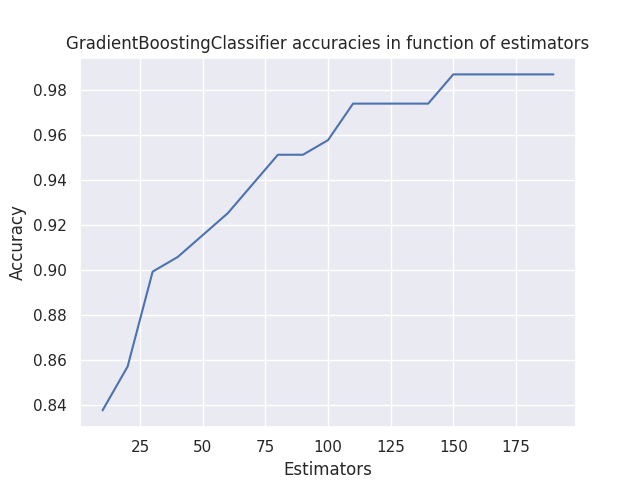


[Código completo](3_ensambles/boosting.py)

# 6. Clustering

## 6.1 Estrategias de Clustering

Los [algoritmos de clustering](https://es.wikipedia.org/wiki/An%C3%A1lisis_de_grupos) son las estrategias que podemos usar para agrupar los datos de tal manera que todos los datos pertenecientes a un grupo sean lo más similares que sea posible entre sí, y lo más diferentes a los de otros grupos.

Cada circulo corresponde a un elemento, sus coordenadas representan sus características, los colores son el resultado del agrupamiento, que en este caso identificó 3 grupos.


### Casos de aplicación de clustering

1. No conocemos con anterioridad las etiquetas de nuestros datos (Aprendizaje no supervisado).
2. Queremos descubrir patrones ocultos a simple vista.
3. Queremos identificar datos atípicos.

### Casos de uso de aplicación:

**Cuando sabemos cuántos grupos “k” queremos en nuestro resultado**.
- Si es el caso, por ejemplo en una empresa de marketing y sabemos que los segmentos de clientes es bajo, medio alto, en este caso es recomendable usar k-means, o bien, spectral clustering.

**Cuando queremos que el algoritmo descubra la cantidad de grupos “k” óptima según los datos que tenemos**.
- Por otro lado si no conocemos cuantos grupos o cuantas categories tenemos y solo queremos experimenter, la solución puede ser Meanshift, clustering jerárquico o DBScan.

## 6.2 Implementación de Batch K-Means

Utilizaremos el dataset de [candi](datasets/candy.csv). Este nos dice las características de diferentes caramelos. Podemos conocer más el dataset en el su [readme](datasets/readme_candy_dataset.pdf).

Podemos resaltar las siguientes tres features:

1. sugar percent: El percentil de azúcar en el que recae dentro del mismo dataset. 
2. price percent: El percentil de precio por unidad dentro del que se encuentra respecto
al dataset. 
3. win percent: Porcentaje de victorias de acuerdo a 269.000 emparejamientos al azar.

Usamos la implementación [Mini Batch K-Means](https://scikit-learn.org/stable/modules/clustering.html#mini-batch-kmeans). Esta es una variante del algoritmo K-Means que usa mini batches (lotes) que reduce el tiempo de computo. La unica diferencia es que la calidad de los resultados es reducida.

Documentation: [sklearn.cluster.MiniBatchKMeans](https://scikit-learn.org/stable/modules/generated/sklearn.cluster.MiniBatchKMeans.html)

No implementamos el método del codo, al conocerse el datasets utilizamos la cantidad de cluster adecuada, aunque el método de selección de estos no fue el adecuado, ya que debe usarse el metodo de codo u otro.

> ### Método del codo
> La idea básica de los algoritmos de clustering es la minimización de la varianza intra-cluster y la maximización de la varianza inter-cluster. Es decir, queremos que cada observación se encuentre muy cerca a las de su mismo grupo y los grupos lo más lejos posible entre ellos.
> El método del codo utiliza la distancia media de las observaciones a su centroide. Es decir, se fija en las distancias intra-cluster. Cuanto más grande es el número de clusters k, la varianza intra-cluster tiende a disminuir. Cuanto menor es la distancia intra-cluster mejor, ya que significa que los clústers son más compactos. El método del codo busca el valor k que satisfaga que un incremento de k, no mejore sustancialmente la distancia media intra-cluster.

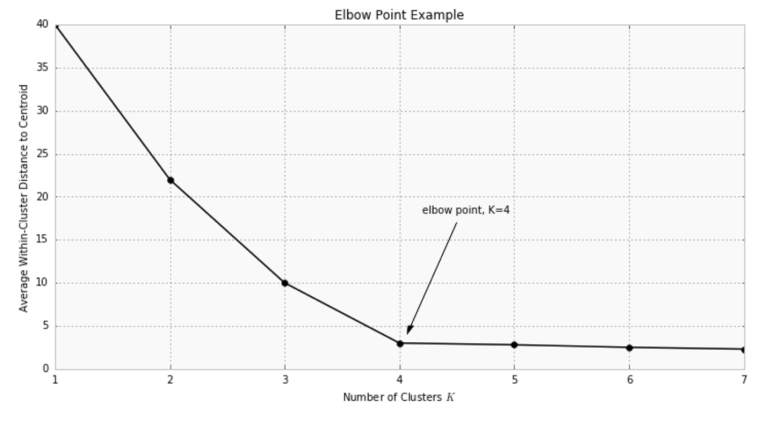

> El método del codo es a veces ambiguo, una alternativa es el análisis de la silueta, que es más objetivo que el método del codo.

Implementación en código.

Importando librerías:

```python
import pandas as pd
from sklearn.cluster import MiniBatchKMeans
import seaborn as sns
import matplotlib.pyplot as plt
import warnings
warnings.filterwarnings("ignore")
```

Abriendo el dataset de candy:

```python
dataset = pd.read_csv('../datasets/candy.csv')
print(dataset.head())
```
Valor esperado:
```
  competitorname  chocolate  fruity  ...  sugarpercent  pricepercent  winpercent
0      100 Grand          1       0  ...         0.732         0.860   66.971725
1   3 Musketeers          1       0  ...         0.604         0.511   67.602936
2       One dime          0       0  ...         0.011         0.116   32.261086
3    One quarter          0       0  ...         0.011         0.511   46.116505
4      Air Heads          0       1  ...         0.906         0.511   52.341465

[5 rows x 13 columns]
```

Entrenamiento del modelo: En este punto debemos decidir cuántos clusters proponemos que debe encontrar
el algoritmo de kmeans, adicionalmente al usar mini batches debemos indicar de cuál será el tamaño del batch.

```python
# al ser aprendizaje no supervisado, no separamos nuestro datasets en partes
# eliminaremos los nombres de los caramelos, ya que eso no nos sirve para el algoritmo
X = dataset.drop('competitorname', axis=1)
kmeans = MiniBatchKMeans(n_clusters=4, batch_size=8)
kmeans.fit(X)
print('Total de centros: ', len(kmeans.cluster_centers_))
print('=' * 64)
col_name = "clusters"
dataset[col_name] = kmeans.predict(X)
print(dataset)
```

Valor esperado:
```
Total de centros:  4
# Esto confirma que nuestra seleccion de 4 centros pudo ser cumplida 
====================================================================
                competitorname  chocolate  ...  winpercent  clusters
0                    100 Grand          1  ...   66.971725         1
1                 3 Musketeers          1  ...   67.602936         1
2                     One dime          0  ...   32.261086         0
3                  One quarter          0  ...   46.116505         3
4                    Air Heads          0  ...   52.341465         2
..                         ...        ...  ...         ...       ...
80                   Twizzlers          0  ...   45.466282         3
81                    Warheads          0  ...   39.011898         3
82        WelchÕs Fruit Snacks          0  ...   44.375519         3
83  WertherÕs Original Caramel          0  ...   41.904308         3
84                    Whoppers          1  ...   49.524113         2
```

Gráfica de pares:

```python
sns.pairplot(dataset[['sugarpercent', 'pricepercent', 'winpercent', col_name]], hue=col_name, palette='colorblind')
plt.savefig("pares.png")
plt.show()
plt.close()
```

Valor esperado:


> Se observan los 4 diferentes colores, ya que se eligieron 4 clusters. Se puede observar una clara clusterizacion cuando se compara respecto a winpercent las variables pricepercent, sugarpercent.

[Código Completo](4_clustering/k_means.py)

## 6.3 Implementación de Mean-Shift

Puede suceder que lo que necesitemos sea simplemente dejar que el algoritmo decida cuantas categorías requiere. Esto lo podremos hacer con el algoritmo [Mean-Shift](https://scikit-learn.org/stable/modules/clustering.html#mean-shift). El algoritmo de la clustering tiene como objetivo descubrir manchas en una densidad uniforme de muestras. O sea, diferenciar y clusterizar. Documentación oficial en [sklearn.cluster.MeanShift](https://scikit-learn.org/stable/modules/generated/sklearn.cluster.MeanShift.html).

### ¿Cómo funciona mean-shift?
Piensa que cada punto tiene un peso y todo el espacio se curva con ese peso, por lo que lugares con muchos puntos tienen
se hunden más haciendo un hueco, después lanzas un montón de bolitas en lugares aleatorios y en donde se acumulen ahi estarán los clusters.

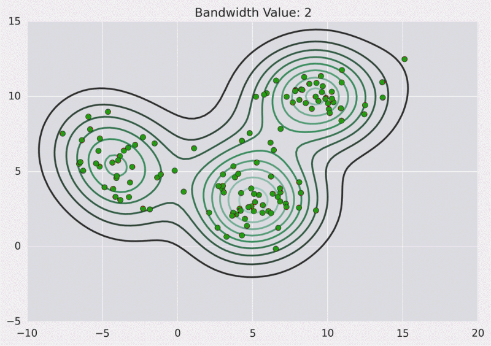

El código en esencia es el mismo que el de la clase anterior pero con una biblioteca diferente:

```python
import pandas as pd
from sklearn.cluster import MeanShift
import seaborn as sns
import matplotlib.pyplot as plt
import warnings
warnings.filterwarnings("ignore")
```

Obtención de cluster:

```python
dataset = pd.read_csv('../datasets/candy.csv')
X = dataset.drop('competitorname', axis=1)
meanshift = MeanShift(bandwidth=None)
meanshift.fit(X)
print(meanshift.labels_)
# Aquí el algoritmo nos devolvió 3 clusters, porque le pareció que esa era la cantidad
# correcta teniendo en cuenta como se distrubuye la densidad de nuestros datos
print(max(meanshift.labels_))
print('=' * 64)
# Imprimamos la ubicación de los centros que puso sobre nuestros datos.
# Hay que recordar que estos algoritmos crean un centro y
# a partir de ahí se ajustan a todos los datos que lo rodean
print(meanshift.cluster_centers_)
cname = "meanshift"
dataset[cname] = meanshift.labels_
print('=' * 64)
print(dataset.head())
```
Valor esperado:
```
  competitorname  chocolate  fruity  ...  pricepercent  winpercent  meanshift
0      100 Grand          1       0  ...         0.860   66.971725          2
1   3 Musketeers          1       0  ...         0.511   67.602936          2
2       One dime          0       0  ...         0.116   32.261086          0
3    One quarter          0       0  ...         0.511   46.116505          0
4      Air Heads          0       1  ...         0.511   52.341465          1

[5 rows x 14 columns]
```

Gráfica de pares:

```python
sns.pairplot(dataset[['sugarpercent', 'pricepercent', 'winpercent', cname]], hue=cname, palette='colorblind')
plt.savefig("meanshift.png")
plt.show()
```

Valor esperado:

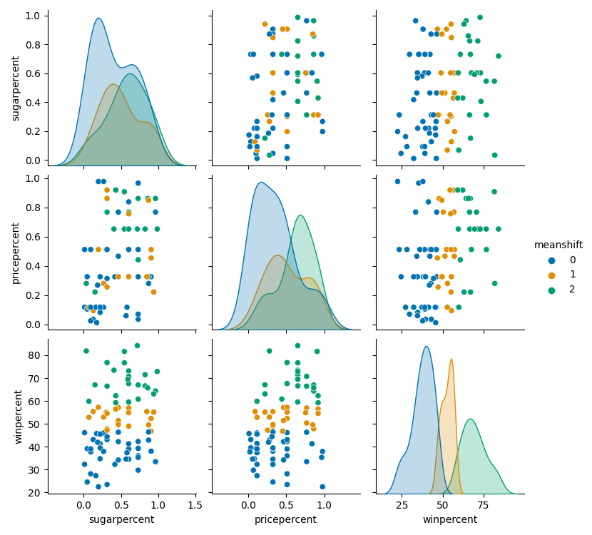

El algoritmo nos devolvió 3 clusters, porque le pareció que esa era la cantidad correcta teniendo en cuenta como se distrubuye la densidad de nuestros datos. Podemos ver eso mismo en el gráfico anterior.

> Se observan los 3 diferentes colores, clusters generados automáticamente por el algoritmo MeanShift. Se puede observar una clara clusterizacion cuando se compara respecto a winpercent las variables pricepercent, sugarpercent.

> **NOTA**: En la [documentación (en Scalability)](https://scikit-learn.org/stable/modules/generated/sklearn.cluster.MeanShift.html) se advierte que el algoritmo tiene una complejidad algorítmica que escala a **O(T*n^2)** a medida que el número de registros aumenta.

[Código Completo](4_clustering/meanshift.py)


# 7. Optimización paramétrica

### Resumen del curso hasta el momento:

Hasta ahora hemos estudiado y hecho:

-
- Aprender a lidiar con Features antes de mandarlo al entrenamiento.
- Aprender modelos específicos para resolver problemas de gran complejidad.

Ahora nos toca la etapa final del proceso de Machine Learning, esto es:

- Validación de lo que se ha hecho. Scikit Learn nos ofrece realizar este tipo de tareas de una manera casi automatizada.

## 7.1 Validación de nuestro modelo usando Cross Validation

- **La última palabra siempre la van a tener los datos.**
  - Todas nuestras intuiciones no tiene nada que hacer frente a lo que digan los datos y las matemáticas que aplicamos sobre estos datos. Por eso es importante siempre tener rigurosidad a la hora de evaluar los resultados que estamos recibiendo.

- **Necesitamos mentalidad de testeo.**
  - No se trata solamente de probar un poco al principio y un poco al final, sino que tendremos que probar constantemente durante todo el proceso, para poder encontrar cuál es la solución óptima que realmente nos soluciona el problema que tenemos pendiente, todo esto:
    - con varias formas
    - con varios conjuntos de datos
    - con varias configuraciones de parámetros
    - con varias distribuciones de nuestros datos

- **Todos los modelos son malos, solamente algunos son útiles.**
  - Todos los modelos que nosotros hacemos en últimas son una sobre simplificación de lo que pasa realmente. Entonces nunca nuestros modelos van a corresponder con la realidad al cien por ciento. Si jugamos lo suficiente y si somos lo suficientemente hábiles para configurar, vamos a llegar a un punto donde el modelo que estamos trabajando va a ser útil para ciertos casos específicos dentro del mundo real.

### Tipos de validación

#### Hold-Out

Se trata de dividir nuestros datos entrenamiento/pruebas, básicamente consiste en usar porcentajes fijos, por lo regular 70% de entrenamiento y 30% de pruebas.

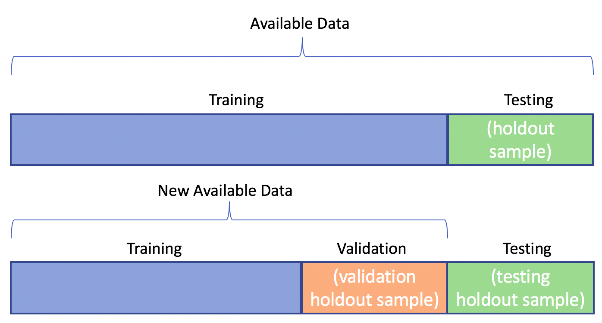
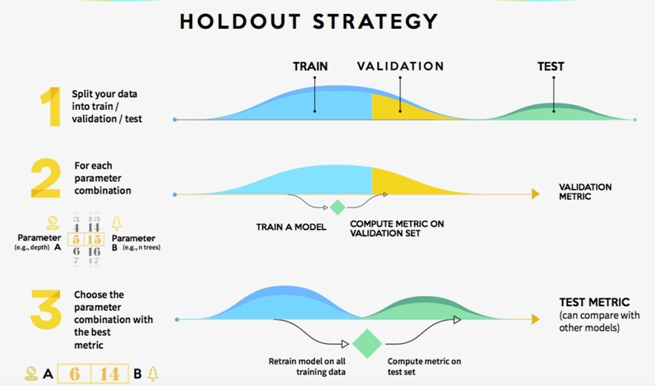

**¿Cuándo utilizar Hold-out?**

- Se requiere un prototipado rápido.
- No se tiene mucho conocimiento en ML.
- No se cuenta con abundante poder de cómputo.

#### K-Folds

Usar validación cursada K-Fold, aquí vamos a plegar nuestros datos k veces, el k es un parámetro que nosotros definimos y en esos pliegues vamos a utilizar diferentes partes de nuestro dataset como entrenamiento y como test, de tal manera que intentemos cubrir todos los datos de entrenamiento y de test, al finalizar el proceso.

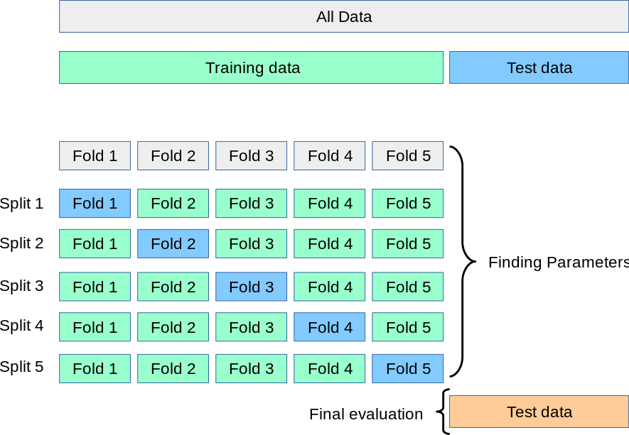
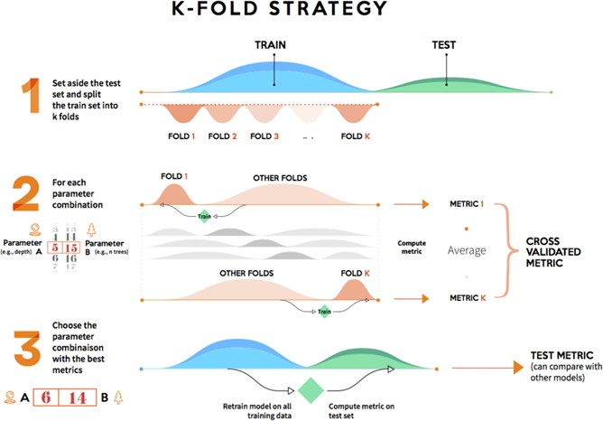

**¿Cuándo utilizar K-Folds?**

- Recomendable en la mayoría de los casos.
- Se cuenta con un equipo suficiente para desarrollar ML.
- Se require la integración con técnicas de optimización paramétrica.
- Se tiene más tiempo para las pruebas.

#### LOOCV

Validación cruzada LOOCV, Leave One Out Cross Validation. Este es el método más intensivo, ya que haremos una partición entre entrenamiento y pruebas, porque vamos a hacer entrenamiento con todos los datos, salvo 1 y vamos a repetir este proceso tantas veces hasta que todos los datos hayan sido probados.

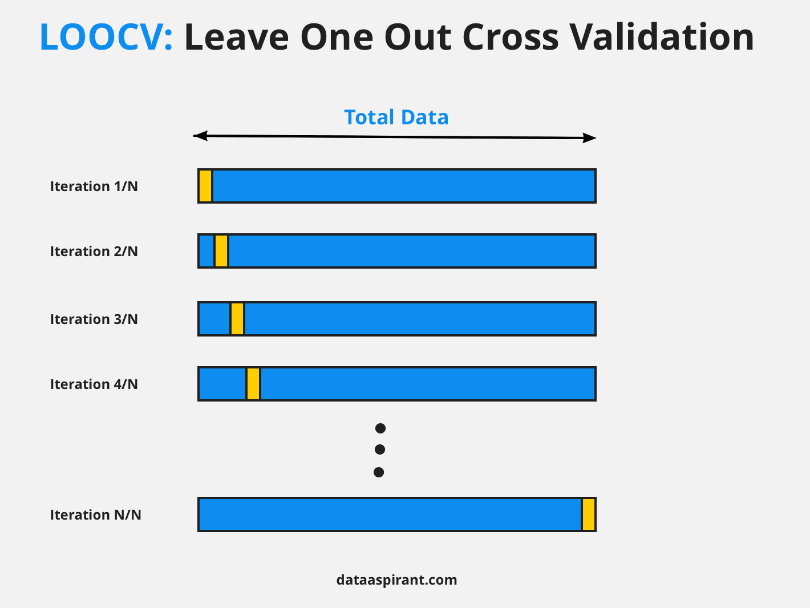

**¿Cuándo utilizar LOOCV?**

- Se tiene gran poder de computo
- Se cuetan con pocos datos para poder dividir por Train/Test
- Cuando se quiere probar todos los casos posibles (para personas con TOC)

## 7.2 Implementación de K-folds cross validation

[Cross-validation: evaluating estimator performance](https://scikit-learn.org/stable/modules/cross_validation.html#k-fold)

**[sklearn.model_selection.cross_val_score](https://scikit-learn.org/stable/modules/generated/sklearn.model_selection.cross_val_score.html#sklearn.model_selection.cross_val_score)**

Se hizo una implementacion básica de Cross validation para calcular un score.

- Determinamos en cuantas partes queremos dividir nuestro dataset.
- De cada uno obtenemos una lista de scores, estos son errores medios cuadraticos de cada split.
- Sacamos la media de esos errores
- Obtenemos el valor final real sacando su valor absoluto.

Importamos librerías

```python
import pandas as pd
import numpy as np
from sklearn.tree import DecisionTreeRegressor
from sklearn.model_selection import cross_val_score, KFold
from sklearn.metrics import mean_squared_error
```

Cargamos datos:

```python
dataset = pd.read_csv("../datasets/happiness.csv")
data = dataset.drop(["country", "score", "rank"], axis=1)
target = dataset["score"]
```

Implementación básica:

```python
models = {"DecisionTreeRegressor": DecisionTreeRegressor()}
print('---- Easy Implementation ----')
for name, model in models.items():
    score = cross_val_score(model, data, target, cv=3, scoring='neg_mean_squared_error')
    print("Scores:", score)
    print("Mean score: ", np.abs(np.mean(score)))
print("=" * 64)
```
Valor esperado:
```
---- Easy Implementation ----
Scores: [-0.90295869 -0.15596612 -0.96539173]
Mean score:  0.6747721782423848
==============================================
```
**[sklearn.model_selection.KFold](https://scikit-learn.org/stable/modules/generated/sklearn.model_selection.KFold.html?highlight=kfold#sklearn.model_selection.KFold)**

Se hizo una implementación más sofisticada de K Fold Cross validation para calcular separar los datos en sus respectivos dataset y poder entrenar a nuestro modelo manualmente.

```python
kf = KFold(n_splits=3, shuffle=True, random_state=42)
scores = []
print('---- Full Implementation ----')
for name, model in models.items():
    print(f"I'm evaluating: {name}")
    for n_fold, (train, test) in enumerate(kf.split(data)):
        print(f"\t-I'm running fold {n_fold + 1}")
        x_train, x_test, y_train, y_test = train_test_split_kf(data.values, target.values, train, test)
        score = evaluate_model(model, mean_squared_error, x_train, x_test, y_train, y_test)
        print("\t\t-score:", score)
        scores.append(score)
    print("="*64)
    print("Scores:", scores)
    print("Mean score: ", np.mean(scores))
```

Valor esperado:

```
---- Full Implementation ----
I'm evaluating: DecisionTreeRegressor
	-I'm running fold 1
		-score: 0.00958793915130767
	-I'm running fold 2
		-score: 0.0057687057336853675
	-I'm running fold 3
		-score: 0.006056309885328279
==========================================================================
Scores: [0.00958793915130767, 0.0057687057336853675, 0.006056309885328279]
Mean score:  0.007137651590107105
```

[Código completo](5_cross_validation/cross_validation.py)


## 7.3 Optimización paramétrica

Familiarizados con el concepto de Cross Validation vamos a utilizar este mismo principio de fondo para lograr automatizar un poco la selección y optimización de nuestros modelos.

**Problema**: Parece que encontramos un modelo de aprendizaje que parece funcionar, pero esto puede implicar que ahora tenemos que **encontrar la optimización de cada uno de los parámetros de este modelo**, encontrar el que mejor se ajuste y el que mejor resultado nos de.

1. Es facil perderse entre los conceptos de tantos parámetros. Tenemos flexibilidad para algoritmos básicos de Machine Learning, pero facil perderse.
2. Es difícil medir la sensibilidad de los mismos manualmente.
3. Es COSTOSO, en tiempo humano y computacionalmente.

Scikit Learn nos ofrece enfoques para automatizar el proceso de optimización paramétrica. Existen 3 enfoques principales, estos son:

1. Optimización manual
2. Optimizacion por grilla de parámetros | GridSearchCV
3. Optimizacion por búsqueda aleatorizada | RandomizedSearchCV

### Optimización manual

1. Escoger el modelo que queremos ajustar.
2. Buscar en la documentación de Scikit-Learn
3. Identificar parámetros y ajustes. Parámetros que vamos a necesitar y cuáles son los posibles ajustes que vamos a requerir para cada uno de estos parámetros.
4. Probar combinaciones una por una iterando a través de listas.

### Optimización por grilla de parámetros | GridSearchCV

Es una forma organizada, exhaustiva y sistematica de probar todos los parametros que le digamos que tenga que probar, con los respectivos rangos de valores que le aportemos.

1. Definir una o varias métricas que queremos optimizar.
2. Identificar los posibles valores que pueden tener los parámetros.
3. Crear un diccionario de parámetros.
4. Usar Cross Validation.
5. Entrenar el modelo (e ir por un café)

La grilla de parámetros nos define GRUPOS DE PARÁMETROS que serán probados en todas sus combinaciones (Un grupo a la vez)

Ejemplo:

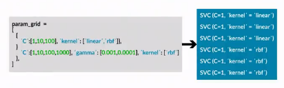

### Optimizacion por búsqueda aleatorizada | RandomizedSearchCV

Si no tenemos tanto tiempo para una prueba tan exhaustiva o queremos combinaciones aleatorias usaremos este metodo. Es lo mismo que el caso anterior, pero busca de forma aleatoria los parametros y Scikit Learn selecciona los mejores de las combinaciones aleatorias que se hicieron.

En este método, definimos escalas de valores para cada uno de los parámetros seleccionados, el sistema probará varias iteraciones (Configurables según los recursos) y mostrará la mejor combinación encontrada.

Ejemplo:

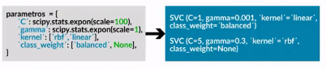


### GridSearchCV vs RandomizedSearchCV

- [**GridSearchCV**](https://scikit-learn.org/stable/modules/generated/sklearn.model_selection.GridSearchCV.html)
  - Cuando se quiera realizar un estudio a fondo sobre las implicaciones de los parámetros.
  - Se tenga tiempo.
  - Se tenga poder de procesamiento.

- [**RandomizedSearchCV**](https://scikit-learn.org/stable/modules/generated/sklearn.model_selection.RandomizedSearchCV.html)
  - Cuando se quiera explorar posibles optimizaciones.
  - Haya poco tiempo.
  - Haya poco poder de procesamiento.

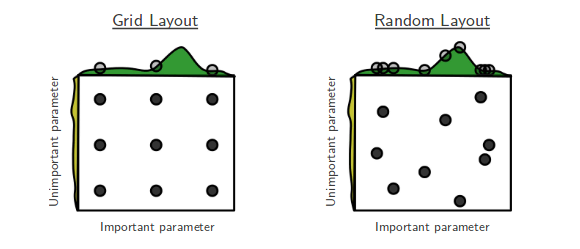

Alternativas [HalvingGridSearch y HalvingRandomSearch.](https://towardsdatascience.com/11-times-faster-hyperparameter-tuning-with-halvinggridsearch-232ed0160155)

## 7.4 Implementación de Randomized

Lo importante para la implementación en código de [**RandomizedSearchCV**](https://scikit-learn.org/stable/modules/generated/sklearn.model_selection.RandomizedSearchCV.html)
es que cuando elijamos un modelo a optimizar, en este caso [**RandomForestRegressor**](https://scikit-learn.org/stable/modules/generated/sklearn.ensemble.RandomForestRegressor.html)
vayamos a su documentación y observemos todos sus parámetros configurables:

> ### **Parameters:**
> n_estimatorsint, default=100 
>
> criterion{“squared_error”, “absolute_error”, “friedman_mse”, “poisson”}, default=”squared_error” 
>
> max_depthint, default=None 
>
> min_samples_splitint or float, default=2
> 
> ETC

Con base en estos parámetros ajustables podemos crear nuestra grilla de combinaciones:

```python
parameters = {
        'n_estimators': range(4, 16),  # cuantos arboles compondrán mi arbol
        'criterion': ['friedman_mse', 'squared_error', 'poisson', 'absolute_error'],
        'max_depth': range(2, 11)
    }
```
Y finalmente entrenar a nuestro metaclasificador utilizando RandomizedSerachCV

```python
reg = RandomForestRegressor()
rand_est = RandomizedSearchCV(reg, parameters, n_iter=10, cv=3, scoring='neg_mean_absolute_error', random_state=17)
rand_est.fit(data, target)
```

Valor esperado:

```
================================================================
Mejores estimadores
----------------------------------------------------------------
RandomForestRegressor(criterion='absolute_error', max_depth=6, n_estimators=4)
================================================================
Mejores parámetros
----------------------------------------------------------------
{'n_estimators': 4, 'max_depth': 6, 'criterion': 'absolute_error'}
================================================================
Pruebas
----------------------------------------------------------------
Predict: 7.497000098
Real:    7.537000179
================================================================
```
[código completo](5_cross_validation/randomized.py)

## 7.5 Bonus: Auto Machine Learning

Scikit-learn nos permite semi-automatizar la optimización de nuestros modelos con GridSearchCV y RandomizedSearchCV, ¿Cuál es el límite de esta automatización? Haciendonos esta pregunta nace un nuevo concepto Automated Machine Learning.

> **Automated Machine Learning (AutoML)**, es un concepto que en general pretende la completa automatización de todo el proceso de Machine Learning, desde la extracción de los datos hasta su publicación final de cara a los usuarios.

Sin embargo, este ideal aún está en desarrollo en la mayoría de las etapas del proceso de Machine Learning y aún se depende bastante de la intervención humana.

Podemos encontrar más información leyendo el siguiente enlace: [Qué es Automated Machine Learning: la próxima generación de inteligencia artificial](https://itmastersmag.com/noticias-analisis/que-es-automated-machine-learning-la-proxima-generacion-de-inteligencia-artificial/)

Existe una implementación de este concepto utilizando Scikit Learn llamado auto-sklearn. Esto nos ayudará a llevar un paso más lejos nuestro proceso de selección y optimización de modelos de machine learning. Dado que automáticamente prueba diferentes modelos predefinidos y configuraciones de parámetros comunes hasta encontrar la que más se ajuste según los datos que le pasemos como entrada. Con esta herramienta podrás entrenar modelos tanto de clasificación como de regresión por igual.

[Lista de los clasificadores disponibles](https://github.com/automl/auto-sklearn/tree/master/autosklearn/pipeline/components/classification)

[Lista de los regresores disponibles](https://github.com/automl/auto-sklearn/tree/master/autosklearn/pipeline/components/regression)

Se puede añadir modelos personalizados al proceso siguiendo los pasos descritos en la documentación.

### auto-sklearn

Esta herramienta es una librería basada en los algoritmos de scikit-learn, aunque hay que tener presente que es una librería externa y se debe instalar siempre por aparte. En todo caso al ser una librería de Python se puede combinar sin ningún problema con el resto de nuestro código desarrollado para scikit-learn, incluso permitiendo la exportación de modelos ya entrenados para su posterior uso.

[Documentación de auto-sklearn](https://automl.github.io/auto-sklearn/master/index.html)

La forma de hacer funcionar nuestro algoritmo no podría ser más fácil. Nos resultará bastante familiar a estas alturas después de haber trabajado tanto con sklearn.

Guía de instalación para Ubuntu:

### System requirements
auto-sklearn has the following system requirements:

- Linux operating system (for example Ubuntu) ([get Linux here](https://www.wikihow.com/Install-Linux))

- Python (>=3.7) ([get Python here](https://www.python.org/downloads/)),

- C++ compiler (with C++11 supports) ([get GCC here](https://www.tutorialspoint.com/How-to-Install-Cplusplus-Compiler-on-Linux)).

To provide Python 3, a C++11 building environment and the latest SWIG version on Ubuntu, run:

```bash
sudo apt-get install build-essential swig python3-dev

```

Se debe crear y tener un entorno virtual activado véase: [como configurar venv](#2-iniciar-un-proyecto-con-sklearn): 

Instalamos la librería de [auto-sklearn](https://automl.github.io/auto-sklearn/master/installation.html)

```bash
pip install auto-sklearn
```


[leer la documentación completa](https://automl.github.io/auto-sklearn/master/index.html)


Código de Autosklearn:

```python
from autosklearn.classification AutoSklearnClassifier
cls = AutoSklearnClassifier(time_left_for_this_task=120, n_jobs=4, seed=5, per_run_time_limit=30)
cls.fit(X_train, y_train)
predictions = cls.predict(X_test)
```

Ejemplo real de implementación [aquí](5_cross_validation/auto_sk.py)

Valor esperado: 

```
          rank  ensemble_weight                 type      cost   duration
model_id                                                                 
2            1             0.04        random_forest  0.042194   1.575469
18           3             0.02    gradient_boosting  0.042194   1.533511
21           2             0.04          extra_trees  0.042194   1.574728
47           4             0.02    gradient_boosting  0.050633   2.261632
11           5             0.02    gradient_boosting  0.054852   1.173174
33           6             0.02  k_nearest_neighbors  0.054852   1.879181
3            7             0.04    gradient_boosting  0.059072   1.418526
15           8             0.16                  mlp  0.063291   3.093189
16           9             0.02          extra_trees  0.067511   2.205926
13          10             0.02        random_forest  0.088608  10.945232
12          11             0.02             adaboost  0.113924   1.787503
39          12             0.02    gradient_boosting  0.113924   1.992045
14          13             0.02                  mlp  0.147679   1.898323
5           14             0.04             adaboost  0.164557   1.426467
6           16             0.16   passive_aggressive  0.172996   0.828161
31          15             0.08             adaboost  0.172996   2.799388
37          17             0.06   passive_aggressive  0.202532   2.236975
24          18             0.10          gaussian_nb  0.206751   0.841711
41          19             0.10                  lda  0.316456   1.652267

```

Ejemplo de configuracion de clasificadores encontrados:

```
{
    2: {   'balancing': Balancing(random_state=5),
           'classifier': <autosklearn.pipeline.components.classification.ClassifierChoice object at 0x7fbd7f202650>,
           'cost': 0.04219409282700426,
           'data_preprocessor': <autosklearn.pipeline.components.data_preprocessing.DataPreprocessorChoice object at 0x7fbd7f213dc0>,
           'ensemble_weight': 0.04,
           'feature_preprocessor': <autosklearn.pipeline.components.feature_preprocessing.FeaturePreprocessorChoice object at 0x7fbd7f2018d0>,
           'model_id': 2,
           'rank': 1,
           'sklearn_classifier': RandomForestClassifier(max_features=3, n_estimators=512, n_jobs=1,
                       random_state=5, warm_start=True)},
    3: {   'balancing': Balancing(random_state=5, strategy='weighting'),
           'classifier': <autosklearn.pipeline.components.classification.ClassifierChoice object at 0x7fbd67873100>,
           'cost': 0.05907172995780585,
           'data_preprocessor': <autosklearn.pipeline.components.data_preprocessing.DataPreprocessorChoice object at 0x7fbd80475060>,
           'ensemble_weight': 0.04,
           'feature_preprocessor': <autosklearn.pipeline.components.feature_preprocessing.FeaturePreprocessorChoice object at 0x7fbd678715a0>,
           'model_id': 3,
           'rank': 2,
           'sklearn_classifier': HistGradientBoostingClassifier(early_stopping=False,
                               l2_regularization=4.821686883442146e-05,
                               learning_rate=0.10161621495242192, max_iter=512,
                               max_leaf_nodes=535, min_samples_leaf=10,
                               n_iter_no_change=0, random_state=5,
                               validation_fraction=None, warm_start=True)}
}    
```

Resultados finales:
```
Accuracy score: 0.9837662337662337
AUC: 0.9839285714285715
```

# 8. Salida a producción

## 8.1 Revisión de nuestra arquitectura de código

Ahora vamos a convertir los scripts que tenemos en un código que sea modular y extensible con facilidad para que nuestra arquitectura pueda salir a producción de una manera exitosa.

Una estructura de carpetas que sea organizada para poder gestionar todo lo que vas a necesitar en cualquier proceso de Machine Learning.

Carpetas:

- [core](6_production/core): Carpeta de programación que tendrá la lógica de la creación del modelo de machine learning.
- [data](6_production/data): Carpeta que contendrá los datos utilizados para entrenar nuestro modelo de machine learning.
- [models](6_production/models): Carpeta que contendrá a los modelos ya entrenados listos para clasificar nuevas entradas.

Archivos:
Cada clase será un archivo que tenga su propia responsabilidad y se encargue específicamente de una tarea concreta.

- [core/models.py](6_production/core/models.py) - Archivo que se encarga de seleccionar y entrenar al mejor modelo de clasificación.
- [core/utils.py](6_production/core/utils.py) - Archivo que contendrá funciones prácticas como cargar/salvar modelos.
- [main.py](6_production/main.py) - Archivo encargado de crear al modelo de clasificación.
- [app.py](6_production/app.py) - Archivo que crea un servidor local para nuestra API utilizando FLASK
- [resquest_test.py](6_production/request_test.py) - Código de ejemplo de cómo consumir nuestro endpoint.


### Explicación de la creación del clasificador:

Para variar lo visto en el curso de Platzi, este repositorio contiene un clasificador [heart disease](datasets/readme_heart_disease_dataset.pdf)

El modelo contiene 13 features de entrada:

1. **age**: Edad en años del paciente
2. **sex**: 1 - Hombre, 2 - Mujer
3. **cp**: Tipo de valor en el pecho entre 4 posibles valores. ( 1 - Angina típica, 2 - Angina
atípica, 3 - Dolor no-anginoso, 4 - Dolor asintomático)
4. **trestbps**: Presión sanguínea en reposo
5. **chol**: Medición del colesterol
6. **fbs**: Azúcar en la sangre en ayunas
7. **restcg**: Resultados electrocardiográficos en reposo
8. **thalach**: Frecuencia cardiaca máxima alcanzada
9. **exang**: ¿Se presentó angina de pecho después de hacer ejercicio?
10. **oldpeak**: Depresión ST inducida por ejercicio respecto al reposo (Más información
aquí. https://litfl.com/st-segment-ecg-library/​)
11. **slope**: Pendiente del pico del segmento ST
12. **ca**: Número de vasos sanguíneos mayores coloreados por la fluoros
13. **thal**: Talasemia: 1 - Normal, 2 - Defecto fijo, 3 - Defecto reversible

Y tiene como objetivo el predecir un Heart disease

> target: Presencia de patología cardiaca 1 o 0.

Utilizaremos algunas de las técnicas vistas en este curso, incluyendo [Bagging](#Bagging) y [GridSearchCV](#Optimización-manual)

Empecemos ubicándonos en [core/models.py](6_production/core/models.py)

Librerías a utilizar:

```python
from sklearn.tree import DecisionTreeClassifier
from sklearn.neighbors import KNeighborsClassifier
from sklearn.ensemble import BaggingClassifier
from sklearn.ensemble import RandomForestClassifier
from sklearn.model_selection import GridSearchCV
import warnings
warnings.filterwarnings("ignore")
```

Crearemos una clase `Models` dónde declararemos los modelos a utilizar:

```python
class Models:

    def __init__(self):
        self.classifiers = {"DecisionTree": DecisionTreeClassifier(),
                            "RandomForest": RandomForestClassifier(),
                            "Bagging_KNN": BaggingClassifier(base_estimator=KNeighborsClassifier(),
                                                             n_jobs=-1, n_estimators=30)
                            }
        self.classifiers_params = {
            "DecisionTree": {"criterion": ["gini", "entropy", "log_loss"],
                             "splitter": ["best", "random"]},
            "RandomForest": {"n_estimators": [50, 100, 150],
                             "criterion": ["gini", "entropy", "log_loss"],
                             "n_jobs": [-1]},
            "Bagging_KNN": {"base_estimator__n_neighbors": [5, 10, 15]}
        }
        self.cv = 3
```

Como vamos a utilizar GridSearcCV es importante que el nombre de nuestro clasificador corresponda con el nombre de
los parámetros que utilizaremos para tunear al mismo. 

> ### Nota importante:
> 
> Dado que KNN será utilizando dentro del algoritmo de Bagging entonces los parámetros que debe buscar gridsearch son los de KNN
> no los de bagging, es por ello que en "self.classifiers_params", los parámetros de "Bagging_KNN" van precedidos de
> "base_estimator__" es muy importante poner el "__" pues esto indica que el parámetro "n_neighbors" corresponde al estimador base
> en este caso KNN

Ahora hagamos un método que se encargue de obtener el mejor modelo dentro de los modelos propuestos y con los parámetros establecidos:

```python
    def get_best_model(self, x, y):
        # Al inicio el mejor score es 0 
        best_score = 0
        best_model = None
        for name, model in self.classifiers.items():
            print(f"Im evaluating {name}")
            grid_model = GridSearchCV(model, self.classifiers_params[name], cv=self.cv, scoring='roc_auc')
            grid_model.fit(x, y)
            score = grid_model.best_score_
            # si el score actual es > el último mejor score entonces ->
            if score > best_score:
                # actualizo el mejor score con el score actual
                best_score = score
                best_model = grid_model.best_estimator_
            print(score, grid_model.best_estimator_)
        return best_model, best_score
```

## 8.2 Importar y exportar modelos con Sklearn

Empecemos ubicándonos en [core/utils.py](6_production/core/utils.py)

Importamos las librerías a utilizar:

```python
import pandas as pd
import joblib
```

Y crearemos una clase llamada `Utils` la cuál contendrá métodos estáticos puesto que no necesitan de un objeto para ser llamados:

```python
class Utils:

    @staticmethod
    def load_from_csv(path):
        return pd.read_csv(path)

    @staticmethod
    def load_from_mysql():
        pass

    @staticmethod
    def feature_target(dataset, drop_cols, y):
        X = dataset.drop(drop_cols, axis=1)
        y = dataset[y]
        return X.values, y.values

    @staticmethod
    def model_export(clf, score, path):
        print('Score: ', score)
        score = round(score, 3)
        joblib.dump(clf, f'{path}/best_model_{score}.pkl')

    @staticmethod
    def load_model(path):
        return joblib.load(path)
```

Los métodos `model_export` y `load_model` utilizan el tipo de formato [pickle](https://www.datacamp.com/tutorial/pickle-python-tutorial)
para poder guardar y cargar a nuestro modelo de machine learning.

Creemos nuestro mejor modelo y guardémoslo en la carpeta [models](6_production/models)

Revisemos el archivo [main.py](6_production/main.py)

Su función es leer el dataset [heart.csv](datasets/heart.csv) separar las columnas de entrada y salida.
Obtener el mejor modelo de ML posible utilizando gridsearchcv y finalmente guardarlo en formato pkl dentro de la carpeta `models`
```python
from core.utils import Utils
from core.models import Models


def main():
    model = Models()
    df = Utils.load_from_csv("data/heart.csv")
    data, target = Utils.feature_target(dataset=df, drop_cols=["target"], y="target")
    best_model, score = model.get_best_model(x=data, y=target)
    print(best_model, score)
    Utils.model_export(clf=best_model, score=score, path="models")


if __name__ == '__main__':
    main()
```


## 8.3 Creación de una API con Flask para el modelo

Para terminar crearemos un servidor para crear un API de predicción de `heart disease` utilizando nuestros 13 parámetros de entrada definidos
por el dataset.

primero instalamos [flask](https://flask.palletsprojects.com/en/2.2.x/)

```
pip install flask
```

Y ahora en el archivo [app.py](6_production/app.py)

Creamos una simple API que con el método POST regrese una clasificación del modelo de ML.

```python
import numpy as np
from flask import Flask, app, request, jsonify
from core.utils import Utils

app = Flask(__name__)

@app.route('/predict', methods=['POST'])
def predict():
    # Convertimos la entrada del método post en un formato entendible por el clasificador ML
    args = dict(request.get_json())
    values = np.array(list(args.values()))
    values = values.reshape(1, -1)
    # Clasificamos los valores de entrada
    y_pred = model.predict(values)[0]
    # Convertimos la clasificación númerica en una palabra
    y_pred = "presente" if y_pred else "ausente"
    # Regresamos la respuesta de nuestra API en formato JSON
    return jsonify({"patologia_cardiaca": y_pred})


if __name__ == "__main__":
    # Cargamos neustro mejor modelo de ML
    model = Utils.load_model("models/best_model_0.992.pkl")
    app.run(port=8080, debug=True)
```

Ejecutamos nuestro código python

```
python app.py
```

Y probamos el funcionamiento de nuestra API con el código de [request_test.py](6_production/request_test.py)

```python
import requests

url = "http://127.0.0.1:8080/predict"
obj = {"age": 52, "sex": 1, "cp": 0, "trestbps": 125, "chol": 212, "fbs": 0, "restecg": 1, "thalach": 168,
       "exang": 0, "oldpeak": 1, "slope": 2, "ca": 2, "thal": 3}
x = requests.post(url, json=obj)

print(x.text)
```

Ejecutamos el request:

```
python request_test.py
```

Finalmente, nuestro endpoint regresa:

```
{
  "patologia_cardiaca": "ausente"
}
```

Así podemos entonces ver un ejemplo de cómo podríamos salir a producción.

Ya el JSON tendríamos que tratarlo, si estamos desarrollando una aplicación móvil o una plataforma web, podríamos trabajarlo con JavaScript o desde Android sin importar la naturaleza lo que estemos haciendo.

Con esto ya tenemos las predicciones y tenemos un sistema que se conecta a nuestro modelo y nos trae los resultados de una manera extensible, modular, fácil de utilizar y que podemos convertir en la solución que estamos buscando.

Así damos por finalizado la construcción de la arquitectura para salir a producción de nuestro modelo Inteligencia artificial.

# 9 Cierre del curso

Con esto terminamos el curso de Machine Learning con SkLearn

Pasando por las diferentes etapas de:

- [Optimización de features](#3-optimización-de-features) - En el curso aprendimos cómo tratar con nuestro features y como seleccionarlos para extraer la información más importante. Esto es optimización de features a través de PCA, IPCA, KPCA. También Regularización e implementación de Lasso y Ridge
- [Regresiones robustas](#4-regresiones-robustas) - Estudiamos sobre Regresiones robustas y como implementarlas para evitar valores atípicos.
- [Métodos de ensamble aplicados a clasificación](#5-métodos-de-ensamble-aplicados-a-clasificación) - Estudiamos métodos de ensamble aplicados a clasificación, preparamos datos e implementamos Bagging y Boosting.
- [Clustering](#6-clustering) - Estudiamos estrategias de Clustering y como implementar Batch K-Means y Mean-Shift
- [Optimización paramétrica](#7-optimización-paramétrica) - Se le dedicó un módulo completo a como validar nuestros modelos. Conocimos en profundidad los tipos de validación (Hold-Out, K-Folds, LOOCV). Esto se lo conoce como Cross Validation.
- [Salida a producción](#8-salida-a-producción) - Finalmente, cómo sacarlos a producción a través de una API rest. Formamos una arquitectura de archivos y carpetas para nuestro código, importar y exportar modelos con Sklearn y creamos una API rest con Flask para el modelo.
Luego en el mismo módulo conocimos y estudiamos sobre Optimización paramétrica o Hyperparameter Optimization. Implementamos GridSearchCV y RandomizedSearchCV

# 10 Material adicional para consultar

El canal de StatQuest con Josh Starmer (Inglés):

https://www.youtube.com/channel/UCtYLUTtgS3k1Fg4y5tAhLbw

El canal de SentDex (Inglés):

https://www.youtube.com/user/sentdex

Un blog especializado en Data Science (Inglés)

https://towardsdatascience.com/

Libro gratuito: The art of data science (Inglés)

https://bookdown.org/rdpeng/artofdatascience/

Canal AMP Tech: (Español)

https://www.youtube.com/channel/UCG4H4Qf-ZU9Ycr_PQ4egqDQ

Tensorflow Coding (Español):

https://www.youtube.com/watch?v=ZMkYL942RBw&list=PLQY2H8rRoyvz3rEFpW2I3gPSru5xm8Bf7

Canal de 3Blue1Brown (Subtitulado):

https://www.youtube.com/watch?v=aircAruvnKk

El curso de Deep Learning para PLN de Stanford: http://web.stanford.edu/class/cs224n/

El canal de Daniel Shiffman “The Coding Train”

(Está más orientado a temas de computación gráfica, pero las explicaciones que da de Inteligencia Artificial son maravillosas).

https://www.youtube.com/user/shiffman

El libro de Daniel Shiffman de introducción a la vida artificial usando P5.JS (Javascript):

https://natureofcode.com/book/

El canal de Andrew Ng. Deeplearning.ai

https://www.youtube.com/channel/UCcIXc5mJsHVYTZR1maL5l9w

Mis comunidades favoritas en facebook:
(No olvides revisar la sección de archivos cuando sea el caso)

The Data Pub:

https://www.facebook.com/thedatapub/

Machine Learning Colombia:

https://www.facebook.com/groups/1766056600304468/files/

Machine Learning en Español

https://www.facebook.com/groups/machinelearninges/

Sociedad Ecuatoriana de estadística (Español)

https://www.facebook.com/socecuest/

