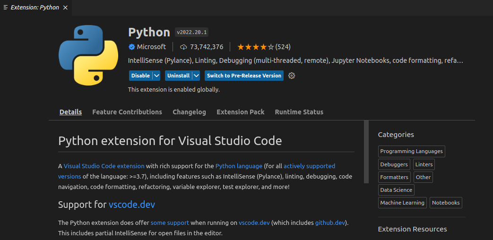
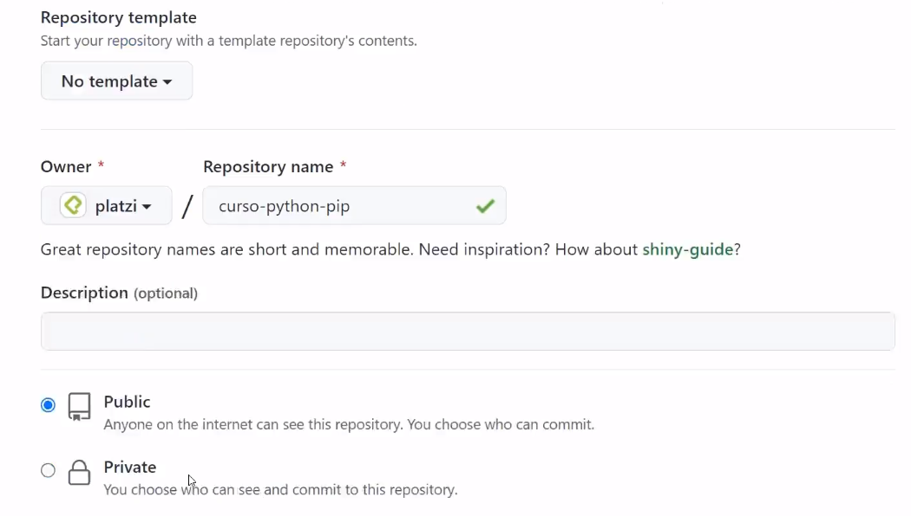
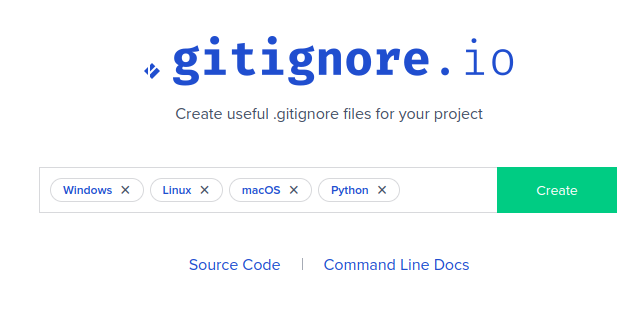

# Clase 1: Python en tu propio entorno de desarrollo local

------------------------------------


Indica nuestra ruta actual
```bash
pwd
```

Crea una carpeta llamada **c1_python_local**
```bash
mkdir c1_python_local
```
Desplegamos la lista de archivos
```bash
ll
```
Nos cambiamos a la carpeta **c1_python_local**
```bash
cd c1_python_local
```
Limpiamos la consola
```bash
clear
```

Iniciamos el proyecto en Git
```bash
git init
```
Creamos un archivo de python
```bash
touch main.py
```

# Clase 2: Instalación de Windows (WSL) y Linux

------------------------------------

### instalación de python
```bash
sudo apt update
sudo apt -y upgrade
```

### Verificar versión de python

```bash
python3 -V
```

### Inslatador de paquetes de pytho Pip

```bash
sudo apt install -y python3-pip
```

### Verificar versión de pip instalada

```bash
pip3 -V
```

### Dependencias en entorno profesional

```bash
sudo apt install -y build-essential libssl-dev libffi-dev python3-dev
```

# Clase 4: Python con VSCode

------------------------------------

Instalar VSCode
```bash
sudo snap install --classic code
```

Abrir visual estudio code desde terminal
```bash
code .
```

Instalar la extensión de python de Microsoft

  

# Clase 5: Python con Git y GitHub

------------------------------------

Paso 1: Creamos un repositorio en GitHub con un nombre de proyecto
  

Paso 2: Inicializando el repositorio de Git

```bash
git init
```

Esto crea la carpeta oculta de git para hacer tracking de los cambios *.git*

Enlazamos el repositorio externo de GitHub

```bash
git remote add origin (enlace gitgub)
```

Verificar el enlace con GitHub

```bash
git remote -v
```

Agregamos todos los cambios a Git

```bash
git add .
```

Hacemos un commit de los cambios

```bash
git commit -m "Mi primer commit"
```

Subimos los archivos del commit a GitHub

```bash
git push origin master
```

#### Creemos nuestro .gitignore con ayuda de:

https://www.toptal.com/developers/gitignore/

  

Ahora creamos un archivo Readme

```bash
touch README2.MD
```

# Clase 6: Flujo de Trabajo en Python

------------------------------------

Vamos a copiar el juego de piedra papel o tijera

```bash
mkdir c6_game
cd c6_game
touch main.py
```

Copiamos el código en main.py y ahora lo ejecutamos

```bash
cd c6_game
python3 main.py
```

El readme debe contener todo lo necesario para indicar como debe ser ejectuado el código. Incluyento instalación de dependencias por ejemplo.

# Clase 6: ¿Qué es pip?

-----------
