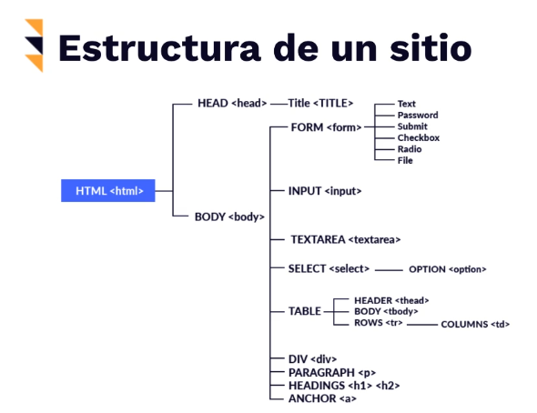
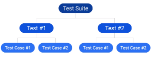

Curso de Selenium enfocado a la automatización de Procesos

Objetivos del curso:

Aprender qué es Selenium

<b>¿Qué es Selenium?</b>
Es una SUIT de herramientas para la automatización de navegadores Web.
El objetivo de Selenium NO fue para el Testing ni para el Web Scraping (aunque se puede usar para eso), por lo tanto, no es el más optimo para estas actividades.
Protocolo: WebDriver, herramienta que se conecta a un API.
Selenium WebDriver es la herramienta que utilizaremos en el curso.
-Selenium NO es un Software, ES una SUIT de Softwares.
*DDT: Data Drive Testing: Ingresar datos para que realice varias pruebas (sin intervención humana).

# Preparando SELENIUM

* pip install selenium
* pip install pyunitreport

# Unittest (PyTest)

* <b> Test Fixture: </b> Preparaciones para antes y después de la prueba
* <b> Test Case: </b> Unidad de código a probar
* <b> Test Suite: </b> Colección de Test Cases
* <b> Test Runner: </b> Orquestador de la ejecución
* <b> Test Reporte: </b> Resumen de resultados

## Estructura de un sitio
  

## Selectores

* ID
* Nombre del atributo
* Nombre de la clase
* Nombre de la etiqueta
* XPath
* Selector de CSS
* Texto del link
* Texto parcial del link

# C3: Preparar assertions y test suit

### Assertions

Métodos que permiten validar un valor esperado en la ejecución del test. Si el resultado es verdadero el test continúa,
en caso contrario "falla" y termina. 

### Test Suits

Colección de test unificados en una sola prueba, permitiendo tener resultados grupales e individuales.

  
